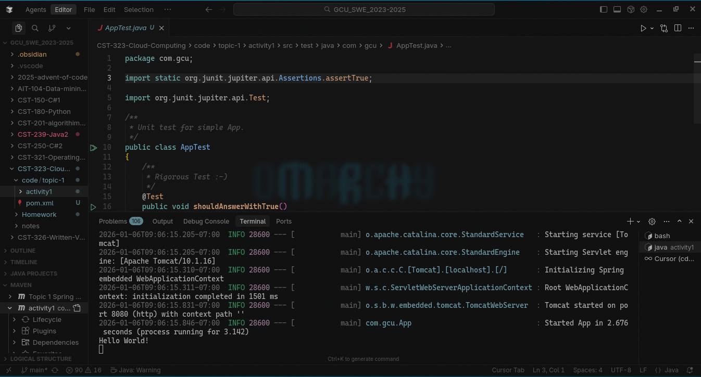
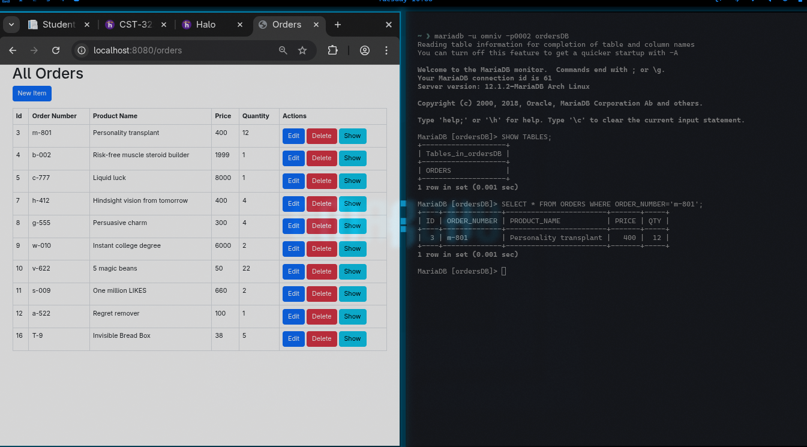
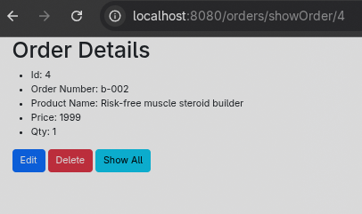
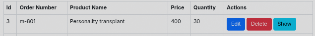
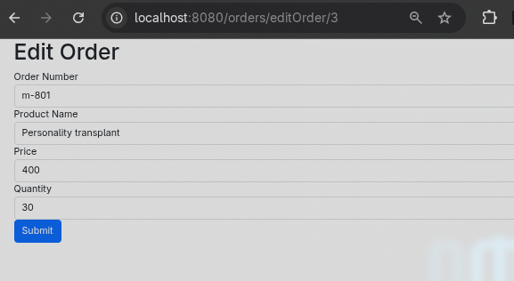
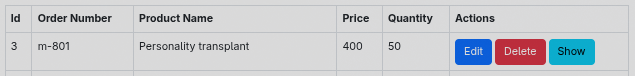
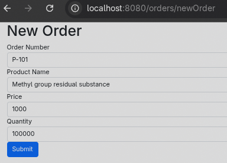
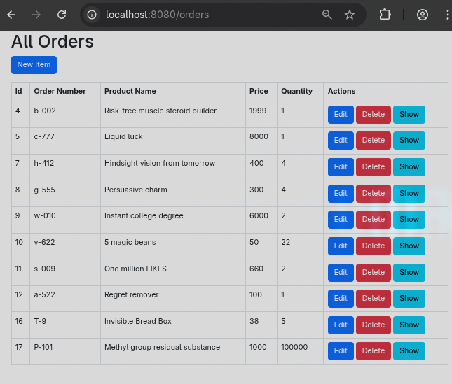
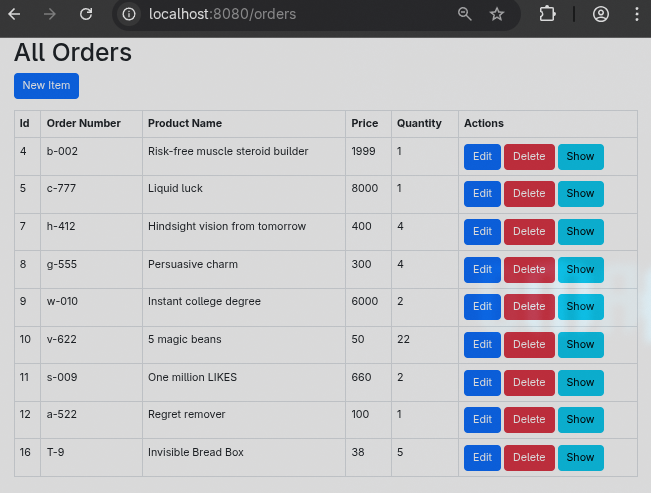

# CST-323 Activity 1 - Spring Boot Orders Application with MariaDB

***Name***: Owen Lindsey
**Course:** CST-323 Cloud Computing
**Activity:** Topic 1 - Activity 1
**Date:** January 11, 2026

---

## Project Overview

This project demonstrates a Spring Boot application that performs CRUD (Create, Read, Update, Delete) operations on an Orders database using MariaDB. 

---

## Database Setup

### Database Configuration

**Database Name:** `ordersDB`
**Table Name:** `ORDERS`
**Database Engine:** MariaDB 12.1.2

### Table Structure

```sql
CREATE TABLE `ORDERS` (
  `ID` int(11) NOT NULL AUTO_INCREMENT,
  `ORDER_NUMBER` varchar(20) NOT NULL,
  `PRODUCT_NAME` text NOT NULL,
  `PRICE` decimal(10,0) NOT NULL,
  `QTY` int(11) NOT NULL,
  PRIMARY KEY (`ID`)
) ENGINE=InnoDB DEFAULT CHARSET=utf8;
```

### Initial Data

The database was populated with 10 product records including:
1. Personality transplant
2. Risk-free muscle steroid builder
3. Liquid luck
4. Hindsight vision from tomorrow
5. Persuasive charm
6. Instant college degree
7. 5 magic beans
8. One million LIKES
9. Regret remover
10. Invisible Bread Box

**Added item**: 
11. methly group residual substance 

**Removed item**" 
1. Personality transplant

---

<div style="page-break-after: always;"></div>

## Application Architecture

### Project Structure

 ![[Pasted image 20260106114737.png]]

<div style="page-break-after: always;"></div>

## Implementation Details

### 1. Models Layer

#### OrderModel.java
The `OrderModel` class represents the business logic model with the following properties:

| OrderModel            | Description         |
| --------------------- | ------------------- |
| String order_number   | Order identifier    |
| `int id`              | Primary key         |
| `String product_name` | Product description |
| `int price`           | Product price       |
| `int quantity`        | Quantity ordered    |
Includes:
- Default constructor
- Parameterized constructor
- Getters and setters for all properties

#### OrderEntity.java
The `OrderEntity` class maps directly to the database table using Spring Data JDBC annotations:

| OrderEntity              | Description                    | Annotation            |
| ------------------------ | ------------------------------ | --------------------- |
| `@Table("ORDERS")`       | Class-level table mapping      | Maps to ORDERS table  |
| `int id`                 | Primary key field               | `@Id`, `@Column("ID")` |
| `String order_number`    | Order identifier field          | `@Column("ORDER_NUMBER")` |
| `String product_name`    | Product description field       | `@Column("PRODUCT_NAME")` |
| `int price`              | Product price field             | `@Column("PRICE")`    |
| `int quantity`           | Quantity ordered field          | `@Column("QTY")`      |

Includes:
- Default constructor
- Parameterized constructor
- Getters and setters for all properties

#### Mapper.java
Utility class providing static methods to convert between Entity and Model:

| Mapper Method                          | Description                    | Parameters              | Returns        |
| -------------------------------------- | ------------------------------ | ----------------------- | -------------- |
| `toEntity(OrderModel model)`           | Converts Model to Entity       | OrderModel              | OrderEntity    |
| `toModel(OrderEntity entity)`          | Converts Entity to Model       | OrderEntity             | OrderModel     |

This separation allows for clean abstraction between database representation and business logic.

---

<div style="page-break-after: always;"></div>

### 2. Data Access Layer

#### DataAccessInterface.java
Generic interface defining standard CRUD operations:

| Method Signature                    | Description              | Parameters | Returns      |
| ----------------------------------- | ------------------------ | ---------- | ------------ |
| `T getById(int id)`                 | Retrieve single record   | int id     | T            |
| `Iterable<T> getAll()`              | Retrieve all records     | None       | Iterable<T>  |
| `T create(T item)`                  | Create new record        | T item     | T            |
| `T update(T item)`                  | Update existing record   | T item     | T            |
| `boolean deleteById(int id)`        | Delete record            | int id     | boolean      |

#### OrdersRepository.java
Extends Spring Data's `CrudRepository<OrderEntity, Integer>` providing automatic implementation:

| OrdersRepository                     | Description                    | Inherited From         |
| ------------------------------------ | ------------------------------ | ---------------------- |
| `Optional<OrderEntity> findById(Integer id)` | Find entity by ID        | CrudRepository         |
| `Iterable<OrderEntity> findAll()`    | Find all entities              | CrudRepository         |
| `OrderEntity save(OrderEntity entity)` | Save or update entity      | CrudRepository         |
| `void deleteById(Integer id)`        | Delete entity by ID            | CrudRepository         |

#### OrdersDataService.java
Service class implementing `DataAccessInterface<OrderModel>`:

| OrdersDataService                     | Description                    | Type/Annotation        |
| ------------------------------------ | ------------------------------ | ----------------------- |
| `@Service`                           | Spring service annotation      | Class-level annotation  |
| `@Autowired OrdersRepository`        | Repository dependency          | Field injection         |
| `DataSource dataSource`              | Database connection source     | Constructor parameter   |
| `JdbcTemplate jdbcTemplate`          | JDBC template instance         | Field                   |
| `OrderModel getById(int id)`         | Retrieve single order          | Implements interface    |
| `Iterable<OrderModel> getAll()`      | Retrieve all orders            | Implements interface    |
| `OrderModel create(OrderModel item)` | Create new order               | Implements interface    |
| `OrderModel update(OrderModel item)` | Update existing order          | Implements interface    |
| `boolean deleteById(int id)`         | Delete order by ID             | Implements interface    |

---

<div style="page-break-after: always;"></div>

### 3. Controller Layer

#### OrdersController.java
Spring MVC controller handling all web requests with `@RequestMapping("/orders")`:

| OrdersController Method                    | HTTP Method | Endpoint                    | Description                    | Returns/Redirects      |
| ------------------------------------------ | ----------- | --------------------------- | ------------------------------ | ---------------------- |
| `@Controller`                              | N/A         | N/A                         | Spring MVC controller annotation | N/A                    |
| `@RequestMapping("/orders")`               | N/A         | Base path                   | Base URL mapping                | N/A                    |
| `@Autowired OrdersDataService`             | N/A         | N/A                         | Service dependency injection    | N/A                    |
| `showAllOrders(Model model)`               | GET         | `/orders`                   | Display all orders             | allOrders.html         |
| `showOrder(@PathVariable int id, Model model)` | GET    | `/orders/showOrder/{id}`    | Display single order details    | showOrder.html         |
| `editOrder(@PathVariable int id, Model model)` | GET     | `/orders/editOrder/{id}`    | Display edit form              | editOrder.html         |
| `processEditOrder(@ModelAttribute OrderModel order)` | POST | `/orders/processEditOrder` | Process edit submission         | redirect:/orders        |
| `newOrder(Model model)`                    | GET         | `/orders/newOrder`          | Display new order form         | newOrder.html          |
| `processNewOrder(@ModelAttribute OrderModel order)` | POST | `/orders/processNewOrder` | Process new order submission    | redirect:/orders       |
| `deleteOrder(@PathVariable int id)`         | GET         | `/orders/deleteOrder/{id}`  | Delete an order                | redirect:/orders       |

---

<div style="page-break-after: always;"></div>

### 4. View Layer (Thymeleaf Templates)

All views utilize Bootstrap 5.3 for responsive styling and Thymeleaf for server-side rendering. Each template receives model attributes from the controller and uses Thymeleaf's expression language (`th:`) to dynamically render content.

#### allOrders.html

The `allOrders.html` template is the main listing page, displaying all orders in a Bootstrap-styled table format. The template receives a list of `OrderModel` objects through the `orders` model attribute and iterates through them using Thymeleaf's `th:each`.

| Component              | Thymeleaf Syntax                    | Description                    |
| ---------------------- | ----------------------------------- | ------------------------------ |
| Page Title             | `th:text="${title}"`                | Dynamic title from controller  |
| New Item Button        | `th:href="@{/orders/newOrder}"`     | Link to create new order       |
| Table Iteration        | `th:each="order : ${orders}"`       | Loop through order collection  |
| Order ID               | `th:text="${order.id}"`              | Display order ID               |
| Order Number           | `th:text="${order.order_number}"`    | Display order number           |
| Product Name           | `th:text="${order.product_name}"`   | Display product name           |
| Price                  | `th:text="${order.price}"`          | Display price                  |
| Quantity               | `th:text="${order.quantity}"`       | Display quantity               |
| Edit Link              | `th:href="@{/orders/editOrder/{id}(id=${order.id})}"` | Edit button with path variable |
| Delete Link            | `th:href="@{/orders/deleteOrder/{id}(id=${order.id})}"` | Delete button with path variable |
| Show Link              | `th:href="@{/orders/showOrder/{id}(id=${order.id})}"` | Show details button            |

The table structure includes six columns: **Id**, **Order Number**, **Product Name**, **Price**, **Quantity**, and **Actions**. Each row in the Actions column contains three buttons: a primary "Edit" button, a danger-styled "Delete" button, and a "Show" button. A "New Item" button appears above the table, allowing users to navigate to the order creation form.

#### showOrder.html

The `showOrder.html` template presents information for a single order in an unordered list format. This template receives a single `OrderModel` object through the `order` model attribute and displays all order properties using Thymeleaf's `th:text` expressions.

| Property Display       | Thymeleaf Syntax                    | Description                    |
| ---------------------- | ----------------------------------- | ------------------------------ |
| Order ID               | `th:text="${order.id}"`              | Display order ID               |
| Order Number           | `th:text="${order.order_number}"`    | Display order number           |
| Product Name           | `th:text="${order.product_name}"`   | Display product name           |
| Price                  | `th:text="${order.price}"`          | Display price                  |
| Quantity               | `th:text="${order.quantity}"`       | Display quantity               |

The template provides three action buttons below the order details: **Edit** (navigates to edit form), **Delete** (removes the order), and **Show All** (returns to the main listing page). Each button uses Bootstrap classes for consistent styling and Thymeleaf URL expressions for dynamic routing.

#### editOrder.html

The `editOrder.html` template provides a form interface for modifying existing order records. The form uses Thymeleaf's object binding syntax (`th:object="${order}"`) to bind form fields directly to the `OrderModel` properties.

| Form Element           | Thymeleaf Syntax                    | Description                    |
| ---------------------- | ----------------------------------- | ------------------------------ |
| Form Action            | `th:action="@{/orders/processEditOrder}"` | POST endpoint for form submission |
| Object Binding         | `th:object="${order}"`               | Bind form to OrderModel        |
| Hidden ID Field        | `th:field="*{id}"`                  | Preserve record identity       |
| Order Number Input     | `th:field="*{order_number}"`        | Bind to order_number property  |
| Product Name Input     | `th:field="*{product_name}"`        | Bind to product_name property  |
| Price Input            | `th:field="*{price}"`                | Bind to price property         |
| Quantity Input         | `th:field="*{quantity}"`            | Bind to quantity property      |

The form includes a hidden input field for the order ID, ensuring the record identity is maintained during the update operation. Four visible input fields capture **Order Number**, **Product Name**, **Price**, and **Quantity**, each with Bootstrap form-control styling and placeholder text. The form submits via POST to `/orders/processEditOrder`, where the controller processes the updated data and redirects back to the orders listing.

#### newOrder.html

The `newOrder.html` template provides a form interface for creating new order records. Similar to the edit form, it uses Thymeleaf object binding, but operates on an empty `OrderModel` instance created by the controller.

| Form Element           | Thymeleaf Syntax                    | Description                    |
| ---------------------- | ----------------------------------- | ------------------------------ |
| Form Action            | `th:action="@{/orders/processNewOrder}"` | POST endpoint for form submission |
| Object Binding         | `th:object="${order}"`               | Bind form to empty OrderModel |
| Order Number Input     | `th:field="*{order_number}"`        | Bind to order_number property  |
| Product Name Input     | `th:field="*{product_name}"`        | Bind to product_name property  |
| Price Input            | `th:field="*{price}"`                | Bind to price property         |
| Quantity Input         | `th:field="*{quantity}"`            | Bind to quantity property      |

The form structure mirrors the edit form but omits the hidden ID field since new records receive auto-generated IDs from the database. All four input fields (**Order Number**, **Product Name**, **Price**, and **Quantity**) use Bootstrap styling and Thymeleaf field binding. Upon submission, the form posts to `/orders/processNewOrder`, where the controller creates a new database record and redirects to the orders listing page.

---

<div style="page-break-after: always;"></div>

## Configuration

### pom.xml Dependencies

```xml
<dependencies>
    <!-- Thymeleaf template engine -->
    <dependency>
        <groupId>org.springframework.boot</groupId>
        <artifactId>spring-boot-starter-thymeleaf</artifactId>
    </dependency>

    <!-- Spring Web MVC -->
    <dependency>
        <groupId>org.springframework.boot</groupId>
        <artifactId>spring-boot-starter-web</artifactId>
    </dependency>

    <!-- DevTools for hot reload -->
    <dependency>
        <groupId>org.springframework.boot</groupId>
        <artifactId>spring-boot-devtools</artifactId>
    </dependency>

    <!-- Spring Data JDBC -->
    <dependency>
        <groupId>org.springframework.boot</groupId>
        <artifactId>spring-boot-starter-data-jdbc</artifactId>
    </dependency>

    <!-- MySQL Connector -->
    <dependency>
        <groupId>com.mysql</groupId>
        <artifactId>mysql-connector-j</artifactId>
    </dependency>

    <!-- Validation -->
    <dependency>
        <groupId>org.springframework.boot</groupId>
        <artifactId>spring-boot-starter-validation</artifactId>
    </dependency>

    <!-- Thymeleaf Layout Dialect -->
    <dependency>
        <groupId>nz.net.ultraq.thymeleaf</groupId>
        <artifactId>thymeleaf-layout-dialect</artifactId>
    </dependency>
</dependencies>
```

### application.properties

```properties
spring.datasource.url=jdbc:mysql://localhost:3306/ordersDB
spring.datasource.username=omniv
spring.datasource.password= < Enter Password here >
spring.datasource.driver-class-name=com.mysql.cj.jdbc.Driver
```

---

<div style="page-break-after: always;"></div>

## Screenshots and Demonstrations

### 1. Application Running - All Orders Page



**Caption:** This screenshot demonstrates the Spring Boot application successfully running on localhost:8080/orders. The page displays all orders from the MariaDB database in a Bootstrap-styled table format. Each row shows the order ID, order number, product name, price, and quantity. The "New Item" button at the top allows users to add new orders, and each row has Edit, Delete, and Show action buttons.

---

### 2. Database and Frontend Integration



**Caption:** This screenshot shows the successful integration between the Spring Boot frontend and MariaDB backend. The browser displays the orders from the database, demonstrating that the OrdersDataService is correctly querying the database through the OrdersRepository, converting OrderEntity objects to OrderModel objects using the Mapper class, and passing them to the Thymeleaf template for rendering.

---

<div style="page-break-after: always;"></div>

### 3. Show Order Details Page



**Caption:** This screenshot demonstrates the "Show Order" functionality accessed via /orders/showOrder/{id}. The page displays detailed information for a single order in a list format, including ID, Order Number, Product Name, Price, and Quantity. The controller retrieves the specific order using ordersDataService.getById(id) and passes it to the showOrder.html template. Action buttons allow the user to Edit, Delete, or return to Show All orders.

---

### 4. Item to Edit - Before Editing



**Caption:** This screenshot shows the all orders table with the item highlighted that will be edited in the next step. This demonstrates the current state of the data before modification, allowing for verification that the edit operation works correctly.

---

### 5. Edit Order Form Page



**Caption:** This screenshot demonstrates the edit functionality accessed via /orders/editOrder/{id}. The form is pre-populated with the existing order data retrieved from the database. The controller method editOrder() fetches the OrderModel using ordersDataService.getById(id) and passes it to editOrder.html. Thymeleaf's th:field attribute binds the form inputs to the OrderModel properties. When submitted, the form posts to /orders/processEditOrder.

---

<div style="page-break-after: always;"></div>

### 6. Item Edited - After Update



**Caption:** This screenshot shows the all orders table after the edit operation has been successfully processed. The processEditOrder() controller method received the updated OrderModel from the form, called ordersDataService.update(order) which used the OrdersRepository to save the changes to the database. The page was redirected back to /orders showing the updated data, confirming the edit operation completed successfully.

---

### 7. Add New Item Form Page



**Caption:** This screenshot demonstrates the new order form accessed via /orders/newOrder. The controller creates an empty OrderModel object and passes it to newOrder.html. The form includes input fields for Order Number, Product Name, Price, and Quantity. When submitted, the form posts to /orders/processNewOrder which calls ordersDataService.create(order) to insert the new record into the database.

---

### 8. Item Added to Orders Table



**Caption:** This screenshot shows the all orders table after a new item has been successfully added to the database. The processNewOrder() controller method received the new OrderModel from the form, called ordersDataService.create(order), which converted it to an OrderEntity using Mapper.toEntity(), saved it using OrdersRepository.save(), and redirected back to /orders. The new item appears in the table with an auto-generated ID, confirming successful database insertion.

---

<div style="page-break-after: always;"></div>

### 9. Removed Item - After Deletion



**Caption:** This screenshot demonstrates the delete functionality after an item has been removed from the database. The deleteOrder() controller method was called via /orders/deleteOrder/{id}, which invoked ordersDataService.deleteById(id). This called OrdersRepository.deleteById() to remove the record from the MariaDB database. The page shows the updated list without the deleted item, confirming the delete operation was successful.

---

<div style="page-break-after: always;"></div>

## Key Concepts Summary

Through building this application, I learned and applied several important software engineering principles. The first concept I implemented was **separation of concerns** by organizing the code into distinct layers, creating `OrderModel.java` to represent business logic, `OrderEntity.java` to handle database representation using Spring Data JDBC annotations like `@Table`, `@Id`, and `@Column`, `OrdersDataService.java` to coordinate CRUD operations, `OrdersController.java` to handle HTTP requests, and Thymeleaf templates (`allOrders.html`, `showOrder.html`, `editOrder.html`, `newOrder.html`) for the presentation layer with Bootstrap 5.3 styling. I also gained experience with **dependency injection** using Spring's IoC container, where I used `@Autowired` in `OrdersController` to inject `OrdersDataService`, and learned that `OrdersDataService` can use both constructor injection (for the `DataSource` parameter) and field injection (for the `OrdersRepository`), marked with the `@Service` annotation for Spring management. Another important pattern I implemented was the **Repository pattern** to abstract data access operations, creating a generic `DataAccessInterface<T>` that defines CRUD contracts and having `OrdersRepository` extend Spring Data's `CrudRepository<OrderEntity, Integer>`, which was particularly interesting because Spring Data JDBC automatically generates SQL operations without manual queries. The application follows the **MVC architecture**, which helped me understand how to separate the Model layer (using `OrderModel` and `OrderEntity`), the View layer (Thymeleaf templates with `th:each` and `th:text` for data binding), and the Controller layer (`OrdersController` that routes requests to services and returns template names). Finally, I implemented **data mapping** using a `Mapper` utility class with `toEntity()` and `toModel()` methods to convert between `OrderEntity` objects (with database annotations like `@Column("QTY")`) and `OrderModel` objects (used for business logic and views), ensuring that database schema changes only affect the entity layer while maintaining flexibility throughout the application. Overall, this project helped me understand how these concepts work together to create a well-structured, maintainable Spring Boot application.

---

<div style="page-break-after: always;"></div>

## Technologies Used

- **Spring Boot 3.2.0** - Application framework
- **Spring Data JDBC** - Data access layer
- **Thymeleaf** - Server-side template engine
- **Bootstrap 5.3** - CSS framework
- **MariaDB 12.1.2** - Relational database
- **Maven** - Build and dependency management
- **Java 17** - Programming language

---

## Running the Application

### Prerequisites
- Java 17 or higher
- MariaDB installed and running
- Maven installed

### Steps to Run

1. **Start MariaDB service:**
   ```bash
   sudo systemctl start mariadb
   ```

2. **Create database and user:**
   ```bash
   sudo mariadb -e "CREATE DATABASE IF NOT EXISTS ordersDB;"
   sudo mariadb -e "CREATE USER 'omniv'@'localhost' IDENTIFIED BY '0002';"
   sudo mariadb -e "GRANT ALL PRIVILEGES ON *.* TO 'omniv'@'localhost';"
   ```

3. **Import database schema:**
   ```bash
   mariadb -u omniv -p0002 < setup_ordersDB.sql
   ```

4. **Navigate to project directory:**
   ```bash
   cd /home/omniv/Work/GCU_SWE_2023-2025/CST-323-Cloud-Computing/code/topic-1/activity1
   ```

5. **Run the application:**
   ```bash
   mvn spring-boot:run
   ```

6. **Access the application:**
   - Open browser to: http://localhost:8080/orders

---
