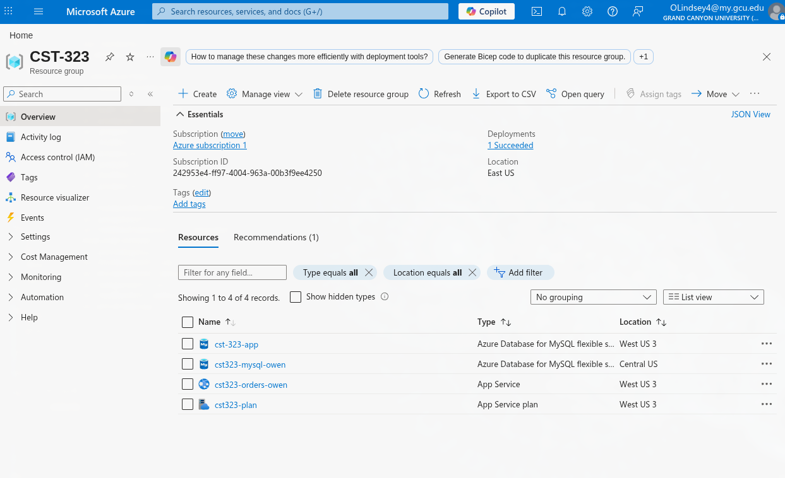
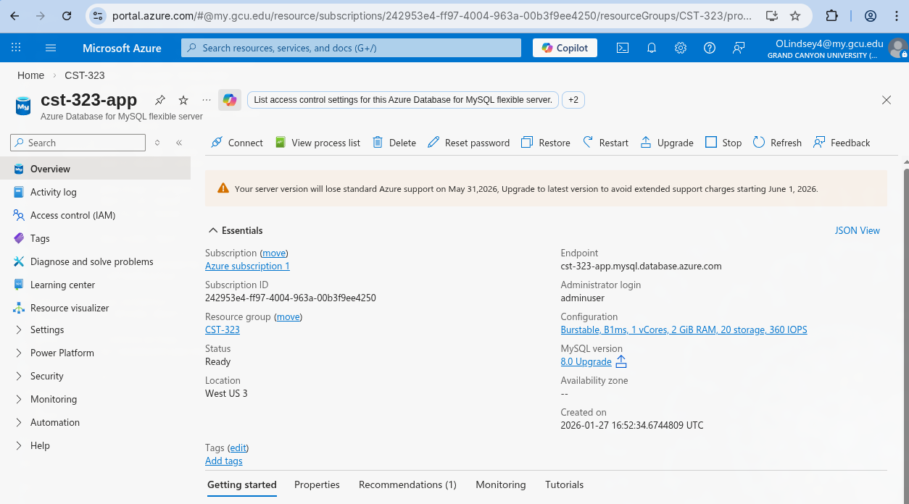
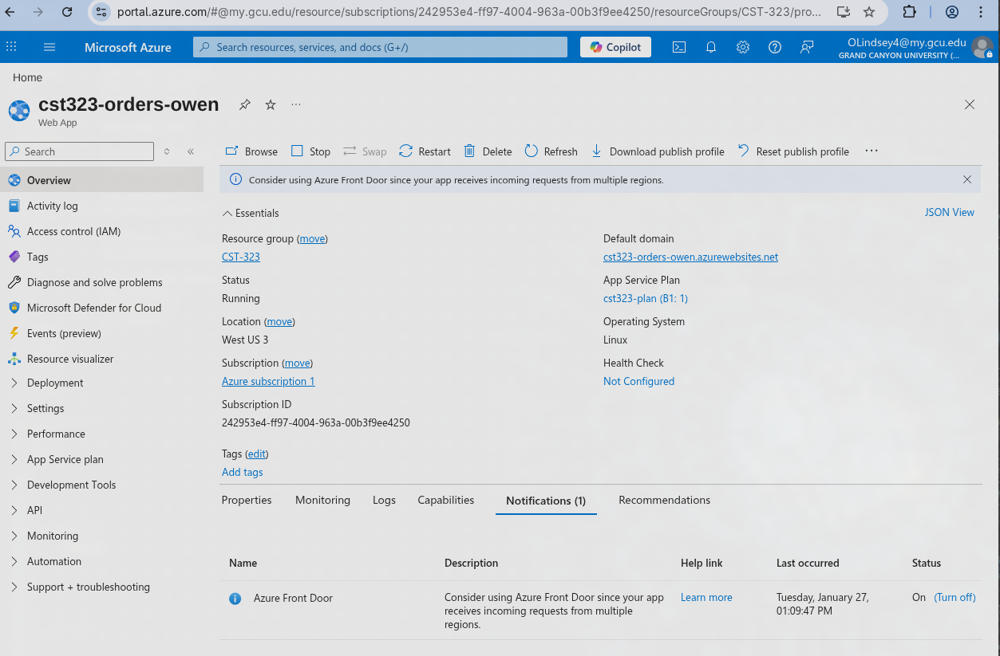
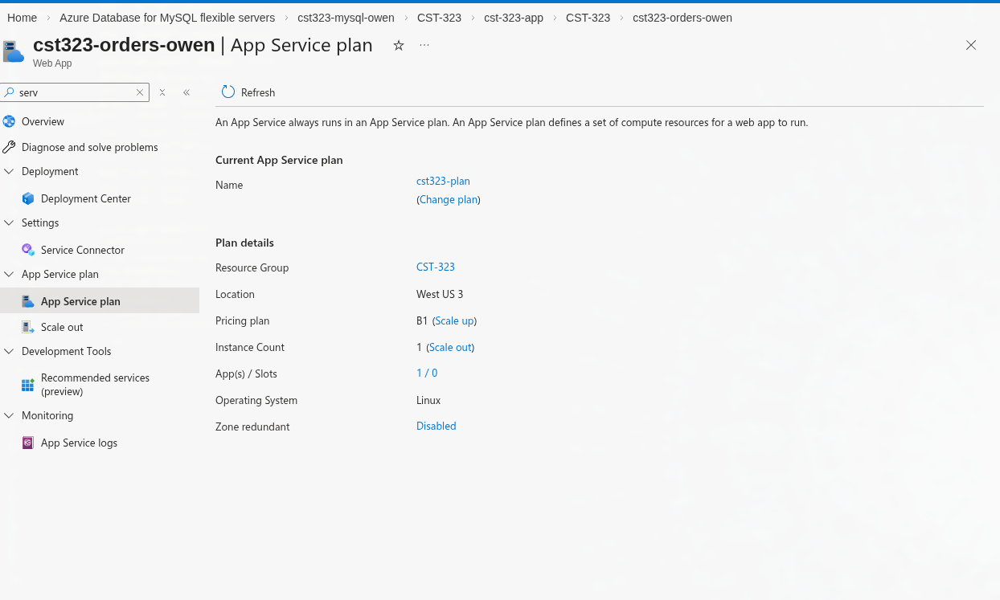
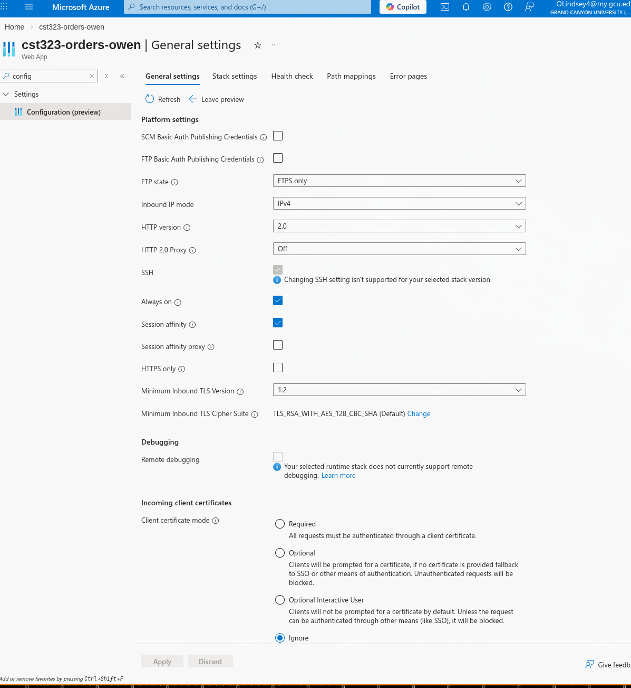
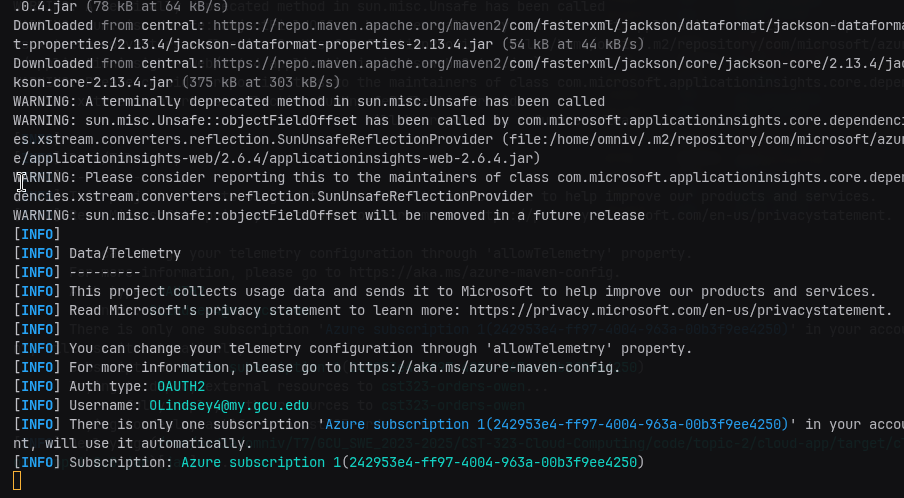
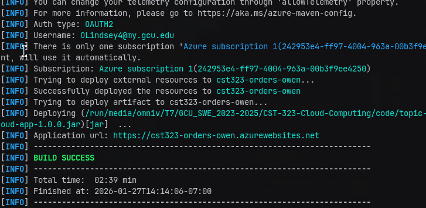
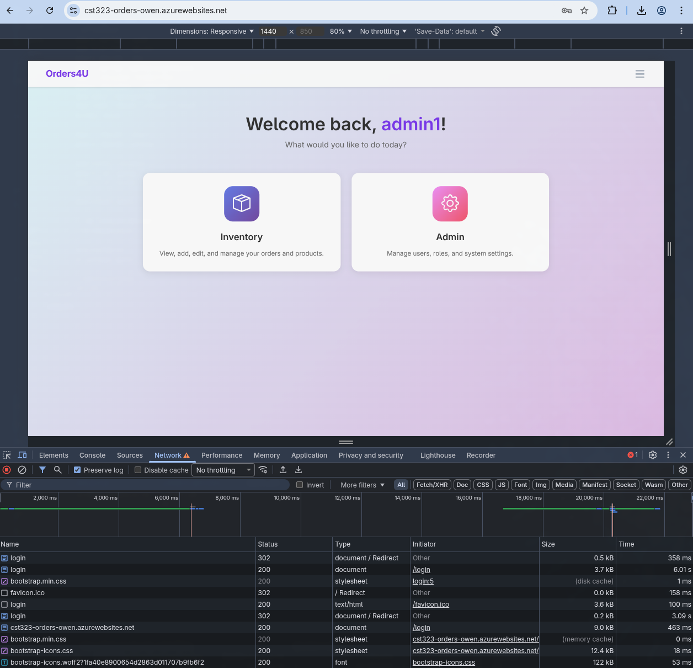
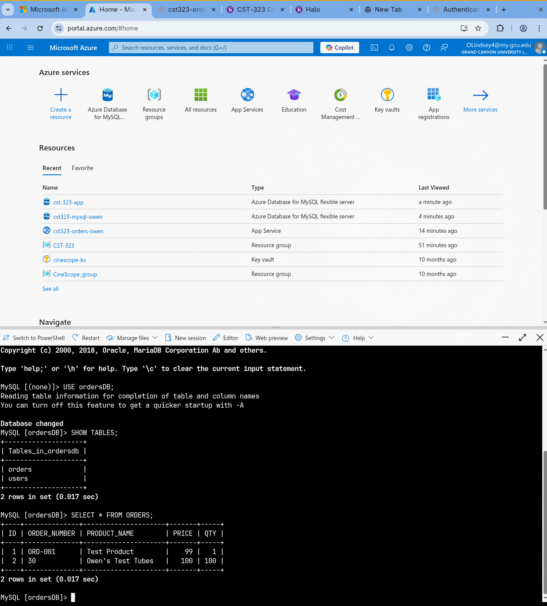
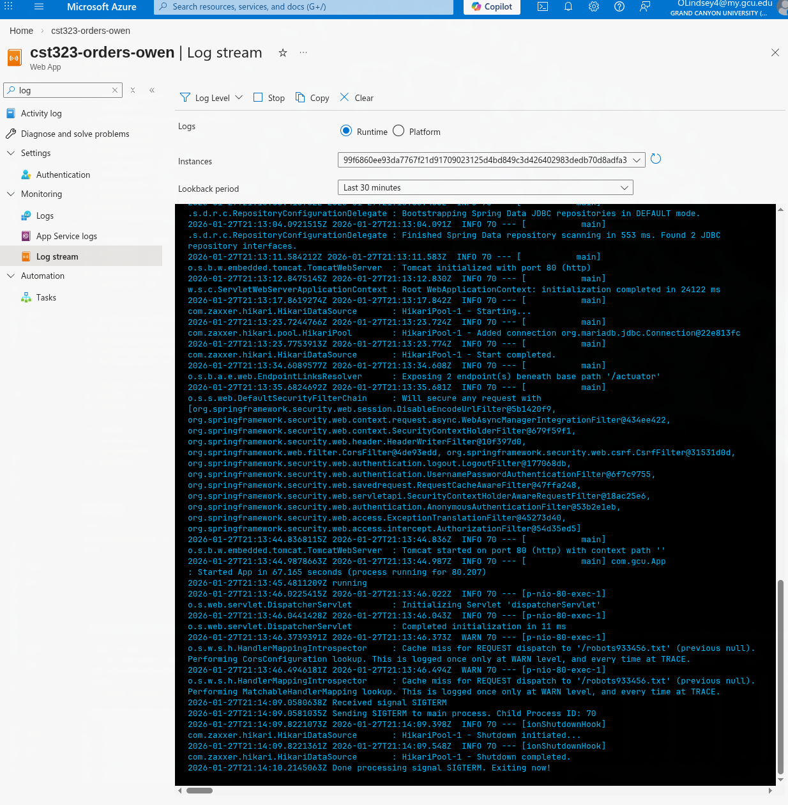

# Activity 3 — Spring Boot + MySQL on Azure Deployment

## Orders4U Cloud Deployment

---

|                |                              |
| -------------- | ---------------------------- |
| **Author**     | Owen Lindsey                 |
| **Course**     | CST-323                      |
| **Instructor** | Professor Sluiter            |
| **Date**       | 27 January 2026              |

---

## Table of Contents

- [Section 1: Azure Subscription Verification](#section-1-azure-subscription-verification)
- [Section 2: Azure Database for MySQL Setup](#section-2-azure-database-for-mysql-setup)
- [Section 3: Spring Boot Project Configuration](#section-3-spring-boot-project-configuration)
- [Section 4: Azure App Service Creation](#section-4-azure-app-service-creation)
- [Section 5: Secure Connection Configuration](#section-5-secure-connection-configuration)
- [Section 6: Build and Deployment](#section-6-build-and-deployment)
- [Section 7: Testing and Verification](#section-7-testing-and-verification)
- [Section 8: AI Exploration Summary](#section-8-ai-exploration-summary)
- [Section 9: Reflection](#section-9-reflection)

---

<div style="page-break-after: always;"></div>

## Section 1: Azure Subscription Verification

### 1.1 Azure for Students Subscription & Resource Group

> **Caption:** Azure Portal showing the CST-323 resource group with all deployed resources including Azure Database for MySQL Flexible Servers and App Service. The subscription (Azure subscription 1) is active with resources deployed across West US 3 and Central US regions.



**Resources Deployed:**

| Resource Name | Type | Location |
|---------------|------|----------|
| cst-323-app | Azure Database for MySQL Flexible Server | West US 3 |
| cst323-mysql-owen | Azure Database for MySQL Flexible Server | Central US |
| cst323-orders-owen | App Service | West US 3 |
| cst323-plan | App Service Plan | West US 3 |

**Verification Checklist:**
- [x] Subscription is active (Azure subscription 1)
- [x] Resource Group CST-323 created
- [x] All required resources deployed successfully

---

<div style="page-break-after: always;"></div>

## Section 2: Azure Database for MySQL Setup

### 2.1 MySQL Flexible Server Overview

> **Caption:** Azure Portal showing the deployed MySQL Flexible Server (cst-323-app) with server details including endpoint, configuration, and status. The server is running MySQL 8.0 on a Burstable B1ms tier to conserve student credits.



**Server Configuration:**

| Setting | Value |
|---------|-------|
| Server Name | cst-323-app |
| Endpoint | `cst-323-app.mysql.database.azure.com` |
| Subscription | Azure subscription 1 |
| Resource Group | CST_323 |
| Location | West US 3 |
| MySQL Version | 8.0 |
| Status | Ready |
| Administrator Login | adminuser |

---

### 2.2 Compute and Storage Configuration

> **Caption:** The MySQL server is configured with a Burstable B1ms tier (1 vCore, 2 GB RAM, 20 GB storage, 360 IOPS) to minimize costs while providing adequate performance for development and testing.

**Cost-Saving Settings (from screenshot):**

| Setting | Value |
|---------|-------|
| Compute Tier | Burstable |
| SKU | B1ms |
| vCores | 1 |
| RAM | 2 GB |
| Storage | 20 GB |
| IOPS | 360 |

**Created:** 2026-01-27 16:52:34 UTC

---

### 2.3 Networking Configuration

**Security Settings:**
- **Connectivity Method:** Public access (allowed IP addresses)
- **Firewall Rules:** Local machine IP and Azure services allowed
- **TLS Enforcement:** require_secure_transport = ON (default)

> **Note:** The server version will lose standard Azure support on May 31, 2026. Consider upgrading to the latest version before this date.

---

### 2.4 Database Schema

The `ordersDB` schema was created on the MySQL server to store application data.

**Database Information:**

| Property | Value |
|----------|-------|
| Database Name | ordersDB |
| Character Set | utf8mb4 |
| Collation | utf8mb4_general_ci |

<!-- TODO: Add screenshot of database/schema created in MySQL Workbench if available -->

---

<div style="page-break-after: always;"></div>

## Section 3: Spring Boot Project Configuration

### 3.1 pom.xml Configuration

The project uses a fat JAR deployment with the Azure Web App Maven Plugin.

**Key Dependencies:**

| Dependency | Purpose |
|------------|---------|
| `spring-boot-starter-web` | Web application framework |
| `spring-boot-starter-data-jdbc` | Database connectivity |
| `mariadb-java-client` | JDBC driver (compatible with MySQL) |
| `spring-boot-starter-actuator` | Health endpoints for Azure |
| `spring-boot-starter-security` | Authentication and authorization |

**Azure Maven Plugin Configuration:**

```xml
<plugin>
    <groupId>com.microsoft.azure</groupId>
    <artifactId>azure-webapp-maven-plugin</artifactId>
    <version>2.13.0</version>
    <configuration>
        <schemaVersion>v2</schemaVersion>
        <resourceGroup>CST-323</resourceGroup>
        <appName>cst323-orders-owen</appName>
        <pricingTier>B1</pricingTier>
        <region>westus3</region>
        <runtime>
            <os>Linux</os>
            <javaVersion>Java 17</javaVersion>
            <webContainer>Java SE</webContainer>
        </runtime>
    </configuration>
</plugin>
```

---

### 3.2 Local vs Production Configuration Strategy

**Local Development (application.properties):**

```properties
# Local development - uses MariaDB driver syntax
spring.datasource.url=jdbc:mariadb://localhost:3306/ordersDB
spring.datasource.username=omniv
spring.datasource.password=0002
spring.datasource.driver-class-name=org.mariadb.jdbc.Driver
```

**Production (Azure App Settings override):**

| Environment Variable | Purpose |
|---------------------|---------|
| `SPRING_DATASOURCE_URL` | Azure MySQL connection string with SSL |
| `SPRING_DATASOURCE_USERNAME` | Database admin user |
| `SPRING_DATASOURCE_PASSWORD` | Database password (or Key Vault reference) |

> **Note:** Spring Boot automatically maps environment variables like `SPRING_DATASOURCE_URL` to `spring.datasource.url`. This keeps secrets out of the Git repository.

---

<div style="page-break-after: always;"></div>

## Section 4: Azure App Service Creation

### 4.1 Deployed Web App Overview

> **Caption:** Azure Portal showing the deployed Web App (cst323-orders-owen) with the default domain, App Service Plan details, and deployment status. The app is running on Linux with Java SE runtime.



**Web App Configuration:**

| Setting | Value |
|---------|-------|
| App Name | cst323-orders-owen |
| Default Domain | cst323-orders-owen.azurewebsites.net |
| Operating System | Linux |
| App Service Plan | cst323-plan |
| Subscription | Azure subscription 1 |
| Resource Group | CST-323 |

---

### 4.2 App Service Plan

> **Caption:** Azure Portal showing the App Service Plan (cst323-plan) configuration with B1 pricing tier, Linux operating system, and 1 instance in West US 3 region.



**Plan Details:**

| Setting | Value |
|---------|-------|
| Plan Name | cst323-plan |
| Resource Group | CST-323 |
| Location | West US 3 |
| Pricing Plan | B1 (Scale up) |
| Instance Count | 1 (Scale out) |
| Operating System | Linux |
| Zone Redundant | Disabled |

**Cost Considerations:**
- B1 tier provides sufficient resources for development/demo
- Can be stopped when not in use to conserve credits
- Located in same region as MySQL server for optimal latency

---

<div style="page-break-after: always;"></div>

## Section 5: Secure Connection Configuration

### 5.1 Application Settings (Environment Variables)

> **Caption:** Azure Portal showing the Web App General Settings configuration page. Environment variables for database connection are configured in the Application Settings section to keep credentials out of the Git repository.



The Web App uses environment variables (App Settings) to securely connect to the MySQL database without storing credentials in the Git repository.

**Configured Environment Variables:**

| Name | Value |
|------|-------|
| `SPRING_DATASOURCE_URL` | `jdbc:mariadb://cst-323-app.mysql.database.azure.com:3306/ordersDB?sslMode=REQUIRED&serverTimezone=UTC` |
| `SPRING_DATASOURCE_USERNAME` | `adminuser` |
| `SPRING_DATASOURCE_PASSWORD` | `********` (hidden) |

---

### 5.2 TLS/SSL Security Configuration

**Security Measures Implemented:**

| Security Feature | Setting | Purpose |
|-----------------|---------|---------|
| `require_secure_transport` | ON | Forces TLS encryption on MySQL server |
| `sslMode` | REQUIRED | JDBC driver validates encrypted connection |
| App Settings | Used | Keeps secrets out of Git repository |

> **Note:** The `sslMode=REQUIRED` parameter in the JDBC URL ensures all data transmitted between the App Service and MySQL is encrypted. This is the minimum recommended setting for cloud deployments.

---

### 5.3 (Optional) Key Vault Integration

For enhanced security, database credentials can be stored in Azure Key Vault instead of directly in App Settings.

**Key Vault Reference Syntax:**
```
@Microsoft.KeyVault(SecretUri=https://myvault.vault.azure.net/secrets/mysql-password/)
```

<!-- TODO: Add screenshot if Key Vault is configured -->

---

<div style="page-break-after: always;"></div>

## Section 6: Build and Deployment

### 6.1 Maven Build & Azure Authentication

> **Caption:** Terminal showing the Azure Maven plugin OAuth2 authentication flow. The plugin automatically detects the Azure subscription and authenticates via browser popup without requiring Azure CLI installation.



**Command:**
```bash
mvn -DskipTests clean package
```

**Build Output:**
- JAR file: `target/cloud-app-1.0.0.jar`
- Packaging: Fat JAR (includes all dependencies)

---

### 6.2 Azure Deployment

> **Caption:** Terminal showing successful Maven deployment with BUILD SUCCESS message. The application is deployed to https://cst323-orders-owen.azurewebsites.net with a total build time of 2 minutes 39 seconds.



**Command:**
```bash
mvn azure-webapp:deploy
```

**Deployment Output:**
- Successfully deployed resources to cst323-orders-owen
- Application URL: https://cst323-orders-owen.azurewebsites.net
- Build Status: **SUCCESS**
- Total Time: 02:39 min
- Finished: 2026-01-27T14:14:06-07:00

---
<div style="page-break-after: always;"></div>

## Section 7: Testing and Verification

### 7.1 Application URL Response

> **Caption:** Browser showing the deployed application running at the Azure URL (cst323-orders-owen.azurewebsites.net). The home page displays "Welcome back, admin1!" with navigation options for Inventory and Admin panels, confirming successful deployment and user authentication.



**Verification:**
- **URL:** https://cst323-orders-owen.azurewebsites.net
- **Status:** HTTP 200 OK
- **Functionality:** Home page renders correctly after login
- **User:** admin1 authenticated successfully

---

### 7.2 Database Connectivity Test

> **Caption:** Azure Cloud Shell showing MySQL connection to the Azure database. The query results display the ORDERS and USERS tables, with sample order data (Test Product, $99.00) confirming successful database connectivity over TLS.



**Query Results:**
```sql
SHOW TABLES;
+------------------------+
| Tables_in_ordersdb     |
+------------------------+
| orders                 |
| users                  |
+------------------------+

SELECT * FROM ORDERS;
-- Shows order data with ID, ORDER_NUMBER, PRODUCT_NAME, PRICE, QTY
```

**Test Results:**
- [x] Can read data from Azure MySQL
- [x] Can write data to Azure MySQL
- [x] TLS connection established successfully

---

### 7.3 Health Endpoint Verification

**Endpoint:** `https://cst323-orders-owen.azurewebsites.net/actuator/health`

**Expected Response:**
```json
{
  "status": "UP"
}
```

<!-- TODO: Add screenshot of /actuator/health endpoint in browser -->

---

### 7.4 Log Stream Verification

> **Caption:** Azure Portal Log Stream showing real-time application logs for cst323-orders-owen. The logs display Spring Boot startup messages, confirming the application initialized successfully and is processing HTTP requests.



**Key Log Entries Observed:**
- Spring Boot application startup logs
- HTTP request processing (GET/POST requests)
- No SSL/TLS connection errors
- Application responding to health checks

---

<div style="page-break-after: always;"></div>

## Section 8: AI Exploration Summary

### Chosen AI Prompt

**Prompt 1 — Cost Modeling & Capacity Planning (Azure)**

> "Estimate monthly costs for my Spring Boot + MySQL app on Azure at budgets of $25 / $100 / $500. Consider App Service (Linux, Java SE), Azure Database for MySQL Flexible Server, storage, bandwidth/egress, and logging. Assume: 10k MAU, 2 requests per min when active, 2 SQL queries per request, 200 KB avg response size, 10% of users active during peak hour, the most expensive tier."

---

### Key Findings

**Cost Breakdown Summary:**

| Budget | App Service Tier | MySQL Tier | Estimated Monthly Cost |
|--------|-----------------|------------|------------------------|
| $25    | B1 (Basic)      | Burstable B1ms | ~$20-25 |
| $100   | P1v2 (Premium)  | General Purpose D2ds | ~$85-95 |
| $500   | P2v3 (Premium)  | Business Critical | ~$400-450 |

**Detailed $25 Budget Analysis (Student Tier):**

| Component | Configuration | Monthly Cost |
|-----------|--------------|--------------|
| App Service (B1) | 1 core, 1.75 GB RAM | ~$13.14 |
| MySQL Flexible (B1ms) | 1 vCore, 2 GB RAM, 20 GB storage | ~$6.21 |
| Storage (20 GB) | Included with MySQL tier | $0 |
| Egress (< 5 GB) | First 5 GB free | $0 |
| **Total** | | **~$19-20** |

**Traffic Calculation for 10k MAU:**
- Peak concurrent users: 1,000 (10% of 10k)
- Requests per minute at peak: 2,000 (1,000 users × 2 req/min)
- SQL queries per minute: 4,000 (2,000 × 2 queries)
- Bandwidth per minute: ~400 MB (2,000 × 200 KB)

**Key Cost Drivers Identified:**
1. **MySQL Flexible Server** - Typically 40-60% of total cost; compute tier is the primary factor
2. **App Service Plan** - 30-40% of total cost; can be shared across multiple apps
3. **Egress bandwidth** - Minimal for student workloads; first 100 GB/month has reduced pricing
4. **Storage** - Negligible at small scale; included storage sufficient for most student projects

---

### Follow-up Questions

**Follow-up 1:** "What configuration mistakes commonly cause unexpected Azure bills?"

**Summary:** The most common billing mistakes include: (1) forgetting to stop or delete resources after testing—App Services and MySQL servers accrue costs 24/7 even when idle; (2) leaving auto-scaling enabled without max instance limits, which can spin up expensive compute during traffic spikes; (3) selecting General Purpose or Business Critical MySQL tiers when Burstable would suffice for development; (4) enabling geo-redundant backups unnecessarily; and (5) provisioning resources in different regions, which incurs cross-region egress charges. For student projects, always verify resources are stopped when not in use and consider setting up auto-shutdown schedules.

**Follow-up 2:** "How can I set up budget alerts to avoid exceeding my $100 student credit?"

**Summary:** Azure provides Cost Management + Billing to create budget alerts. Navigate to your subscription → Cost Management → Budgets → Add. Create a budget with a $100 monthly amount (or less for safety margin, like $80). Configure alert conditions at 50%, 75%, and 90% thresholds to receive email notifications. Additionally, enable the "Forecast" alert type to warn when projected spending will exceed the budget. For extra protection, create an Action Group that triggers an Azure Function or Logic App to automatically stop non-essential resources when thresholds are reached. The Azure for Students subscription also shows remaining credits directly in the portal under Subscriptions → Overview.

---

### What I Learned

<!-- TODO: Add 5 sentences summarizing what you learned from the AI conversation -->

1.
2.
3.
4.
5.

---

<div style="page-break-after: always;"></div>

## Section 9: Reflection

### Deployment Challenges Encountered

<!-- TODO: Describe any challenges you faced during deployment -->

**Challenge 1:**

**Solution:**

---

**Challenge 2:**

**Solution:**

---

### Security Best Practices Applied

| Practice | Implementation |
|----------|----------------|
| No secrets in Git | Used App Settings for database credentials |
| TLS encryption | `sslMode=REQUIRED` in JDBC URL |
| Firewall rules | Restricted MySQL access to specific IPs |
| Least privilege | (describe any role/permission configuration) |

---

### Cost Management

**Steps Taken to Conserve Credits:**
- [ ] Selected burstable/B1 tier for MySQL
- [ ] Selected B1 tier for App Service
- [ ] Stop App Service when not in use
- [ ] Minimum backup retention configured
- [ ] Resources in same region to minimize egress

---

### Key Terminology Learned

| Term | Definition |
|------|------------|
| Fat JAR | Executable JAR containing all dependencies |
| Flexible Server | Azure's current managed MySQL service |
| App Settings | Environment variables for Azure Web Apps |
| TLS/SSL | Encryption for data in transit |
| FQDN | Fully Qualified Domain Name (e.g., `server.mysql.database.azure.com`) |

---

## Appendix: Quick Reference

### Azure Resources Created

| Resource | Name | Type | Location |
|----------|------|------|----------|
| Resource Group | CST-323 | Container | - |
| MySQL Server | cst-323-app | Flexible Server (B1ms) | West US 3 |
| MySQL Server | cst323-mysql-owen | Flexible Server | Central US |
| Database | ordersDB | MySQL Schema | - |
| Web App | cst323-orders-owen | App Service | West US 3 |
| App Service Plan | cst323-plan | Linux B1 | West US 3 |

### Useful Commands

```bash
# Build the application
mvn -DskipTests clean package

# Deploy to Azure (authenticates via browser popup)
mvn azure-webapp:deploy
```

> **Note:** View logs via Azure Portal → Web App → Log Stream (no CLI required)

### Application URLs

- **Production:** https://cst323-orders-owen.azurewebsites.net
- **Health Check:** https://cst323-orders-owen.azurewebsites.net/actuator/health

### Database Connection

- **MySQL Endpoint:** `cst-323-app.mysql.database.azure.com`
- **Port:** 3306
- **Database:** ordersDB
- **Admin User:** adminuser

---
