# Activity 4 — Spring Boot + MySQL on AWS Deployment

## Orders4U AWS Cloud Deployment

---

|                |                                                                                                                  |
| -------------- | ---------------------------------------------------------------------------------------------------------------- |
| **Author**     | Owen Lindsey                                                                                                     |
| **Course**     | CST-323 Cloud Computing                                                                                          |
| **Instructor** | Professor Sluiter                                                                                                |
| **Date**       | 17 February 2026                                                                                                 |
| **Links**      | Application URLs<br><br>- **Production:** http://orders-env.eba-edxntuky.us-west-1.elasticbeanstalk.com<br> |

---

## Table of Contents

- [Section 1: AWS Account Setup](#section-1-aws-account-setup)
- [Section 2: Amazon RDS MySQL Database Setup](#section-2-amazon-rds-mysql-database-setup)
- [Section 3: MySQL Workbench Connection & Schema](#section-3-mysql-workbench-connection--schema)
- [Section 4: Spring Boot Project Configuration](#section-4-spring-boot-project-configuration)
- [Section 5: Elastic Beanstalk Deployment](#section-5-elastic-beanstalk-deployment)
- [Section 6: Testing and Verification](#section-6-testing-and-verification)
- [Section 7: AI Exploration Summary](#section-7-ai-exploration-summary)
- [Section 8: Reflection](#section-8-reflection)

---

<div style="page-break-after: always;"></div>

## Section 1: AWS Account Setup

### 1.1 AWS Free Tier Verification

An AWS account was created using the standard Free Tier option. The Free Tier provides 12 months of free usage for qualifying services, including 750 hours/month of db.t3.micro or db.t4g.micro RDS instances and small Elastic Beanstalk environments.

**Verification Checklist:**
- [x] AWS account created and active
- [x] Free Tier eligibility confirmed
- [x] Billing Dashboard verified — no unexpected charges
- [x] Region selected: **us-west-1** (N. California)

---

<div style="page-break-after: always;"></div>

## Section 2: Amazon RDS MySQL Database Setup

### 2.1 RDS Dashboard — Database Instance

> **Caption:** Amazon RDS dashboard showing the `cloud-computing` database instance with status "Available." The instance is running MySQL Community engine on a db.t4g.micro instance class in the us-west-1a Availability Zone — all within the AWS Free Tier.

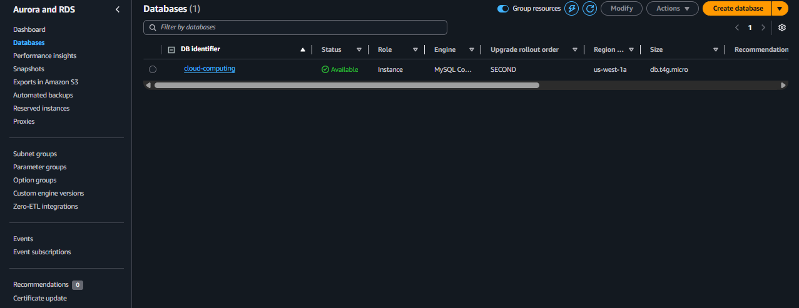

**RDS Instance Overview:**

| Setting          | Value              |
| ---------------- | ------------------ |
| DB Identifier    | cloud-computing    |
| Status           | Available          |
| Role             | Instance           |
| Engine           | MySQL Community    |
| Region & AZ      | us-west-1a         |
| Instance Class   | db.t4g.micro       |

---

### 2.2 RDS Instance Configuration

> **Caption:** The Configuration tab of the `cloud-computing` RDS instance showing MySQL 8.4.7 engine, db.t4g.micro class (2 vCPU, 1 GB RAM), 20 GiB General Purpose SSD (gp2) storage with encryption enabled, and Enhanced Monitoring turned on. RDS Extended Support is disabled to avoid additional charges.

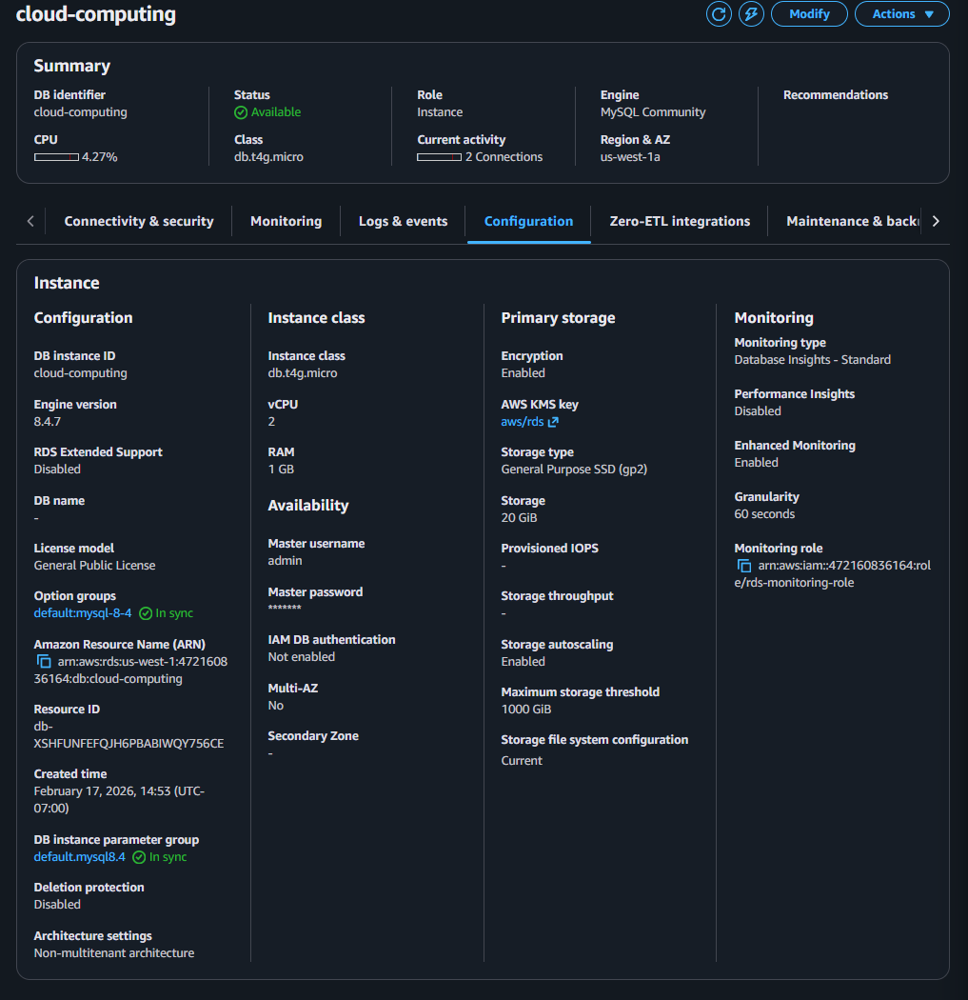

**Instance Configuration:**

| Setting                 | Value                          |
| ----------------------- | ------------------------------ |
| DB Instance ID          | cloud-computing                |
| Engine Version          | 8.4.7                          |
| Instance Class          | db.t4g.micro                   |
| vCPU                    | 2                              |
| RAM                     | 1 GB                           |
| Storage Type            | General Purpose SSD (gp2)      |
| Storage Size            | 20 GiB                         |
| Encryption              | Enabled (aws/rds KMS key)      |
| Multi-AZ                | No                             |
| RDS Extended Support    | Disabled                       |
| Master Username         | admin                          |
| Created                 | February 17, 2026, 14:53 UTC-7 |

**Cost-Saving Settings:**
- db.t4g.micro is Free Tier eligible (750 hours/month for 12 months)
- 20 GiB storage stays within the Free Tier 20 GB limit
- Multi-AZ disabled (only needed for production HA)
- RDS Extended Support disabled (no extra cost)

---

### 2.3 Connectivity & Security

> **Caption:** The Connectivity & Security tab showing the RDS endpoint, connection instructions, security group rules, and replication status. Three security group rules are configured: an EC2 Security Group inbound rule, a CIDR/IP inbound rule allowing the developer's IP (174.73.233.95/32) for MySQL Workbench access, and an outbound rule allowing all traffic.

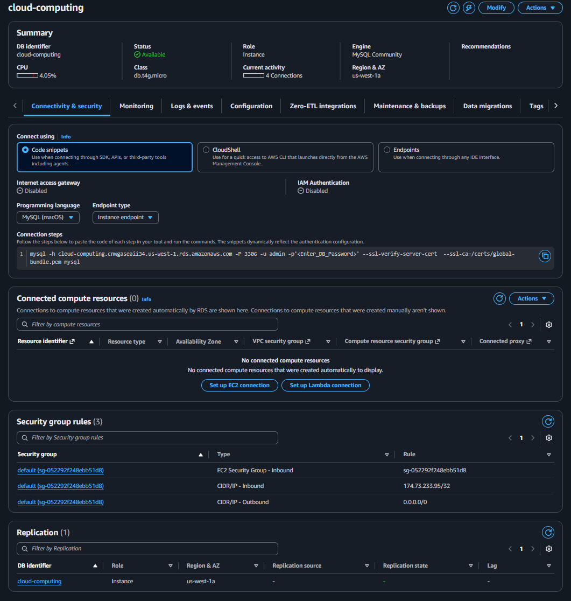

**Connectivity Configuration:**

| Setting               | Value                                                                     |
| --------------------- | ------------------------------------------------------------------------- |
| Endpoint              | `cloud-computing.cnwgaseali34.us-west-1.rds.amazonaws.com`               |
| Port                  | 3306                                                                      |
| Public Access         | Yes (for class simplicity)                                                |
| VPC                   | Default VPC                                                               |
| Internet Access GW    | Disabled                                                                  |
| IAM DB Authentication | Disabled                                                                  |

**Security Group Rules:**

| Security Group             | Type                     | Rule                       |
| -------------------------- | ------------------------ | -------------------------- |
| default (sg-052292f248...) | EC2 Security Group - Inbound | sg-052292f248ebb51d8    |
| default (sg-052292f248...) | CIDR/IP - Inbound        | 174.73.233.95/32           |
| default (sg-052292f248...) | CIDR/IP - Outbound       | 0.0.0.0/0                  |

> **Note:** The inbound CIDR/IP rule restricts MySQL access to the developer's laptop IP. In production, this should be further restricted to only the Elastic Beanstalk security group.

---

### 2.4 RDS Logs & Events

> **Caption:** The Logs & Events tab for the `cloud-computing` RDS instance. Recent events show the DB instance was created at 14:53, restarted, monitoring interval set to 60 seconds, a backup was performed, and the DB parameter group was updated — all on February 17, 2026. Four log files are listed including MySQL error logs.

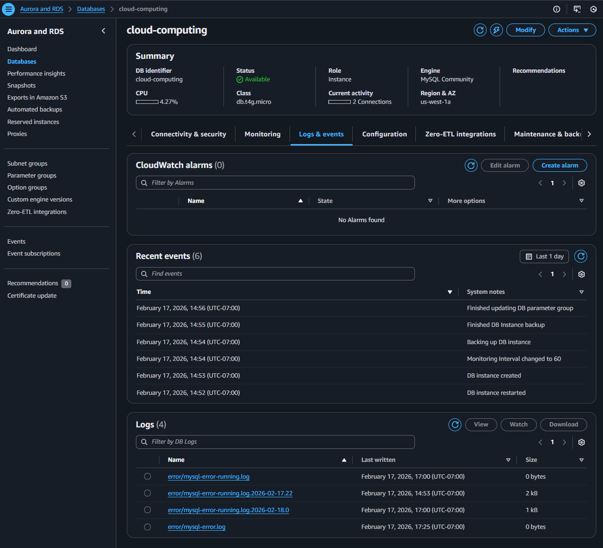

**Recent Events (February 17, 2026):**

| Time  | Event                                 |
| ----- | ------------------------------------- |
| 14:52 | DB instance restarted                 |
| 14:53 | DB instance created                   |
| 14:54 | Monitoring interval changed to 60     |
| 14:54 | Backing up DB instance                |
| 14:55 | Finished DB instance backup           |
| 14:56 | Finished updating DB parameter group  |

**Verification:**
- [x] RDS instance created successfully
- [x] Instance is Available with active connections
- [x] No error alarms (CloudWatch Alarms: 0)
- [x] Backup completed automatically

---

<div style="page-break-after: always;"></div>

## Section 3: MySQL Workbench Connection & Schema

### 3.1 Workbench Connection Configuration

> **Caption:** MySQL Workbench "Manage Server Connections" dialog showing the `cloud-computing` connection configured with the RDS endpoint hostname, port 3306, and admin username. The connection uses Standard (TCP/IP) method. The RDS endpoint is visible in the bottom-left panel confirming a successful connection to the AWS server.

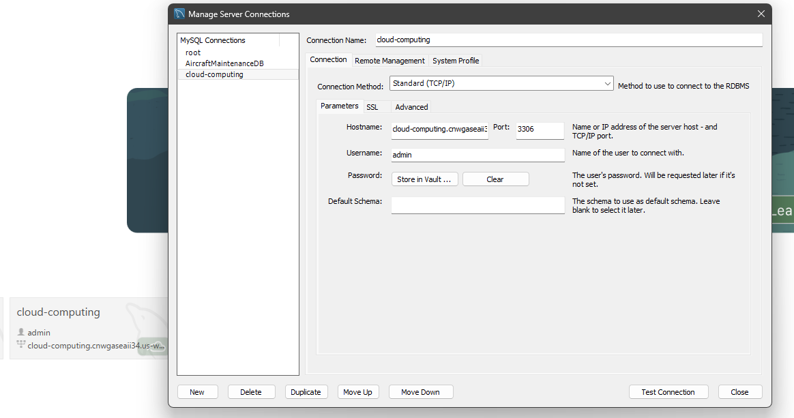

**Connection Settings:**

| Setting           | Value                                                        |
| ----------------- | ------------------------------------------------------------ |
| Connection Name   | cloud-computing                                              |
| Connection Method | Standard (TCP/IP)                                            |
| Hostname          | `cloud-computing.cnwgaseali34.us-west-1.rds.amazonaws.com`  |
| Port              | 3306                                                         |
| Username          | admin                                                        |
| SSL Mode          | Require                                                      |

---

### 3.2 Schema & Data Verification

> **Caption:** MySQL Workbench connected to the RDS instance showing the `ordersapp` schema with ORDERS and USERS tables. A `SELECT * FROM ordersapp.ORDERS` query returns 10 rows of product data including order numbers, product names, prices, and quantities — confirming the DDL/DML scripts were successfully imported into the AWS database.

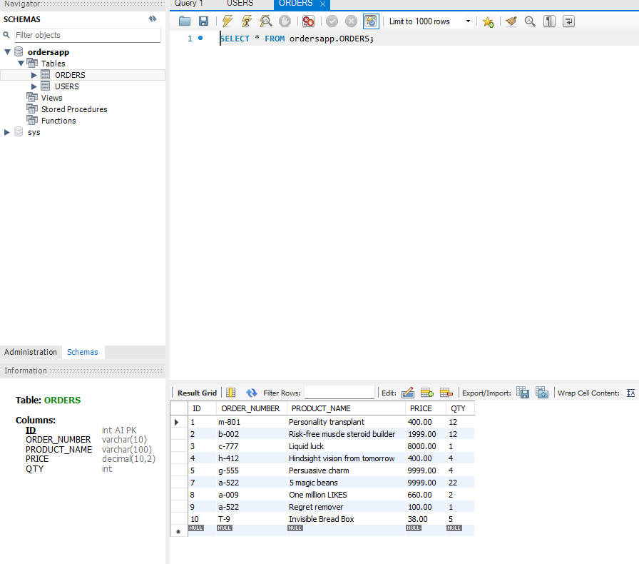

**Database Schema:**

| Property       | Value             |
| -------------- | ----------------- |
| Schema Name    | ordersapp         |
| Tables         | ORDERS, USERS     |

**ORDERS Table Structure:**

| Column       | Type           |
| ------------ | -------------- |
| ID           | int AI PK      |
| ORDER_NUMBER | varchar(10)    |
| PRODUCT_NAME | varchar(100)   |
| PRICE        | decimal(10,2)  |
| QTY          | int            |

**Sample Data (10 rows imported):**

| ID | ORDER_NUMBER | PRODUCT_NAME                     | PRICE    | QTY |
| -- | ------------ | -------------------------------- | -------- | --- |
| 1  | m-801        | Personality transplant           | 400.00   | 12  |
| 2  | b-002        | Risk-free muscle steroid builder | 1999.00  | 12  |
| 3  | c-777        | Liquid luck                      | 8000.00  | 1   |
| 4  | h-412        | Hindsight vision from tomorrow   | 400.00   | 4   |
| 5  | g-555        | Persuasive charm                 | 9999.00  | 4   |
| 6  | a-522        | 5 magic beans                    | 9999.00  | 22  |
| 7  | a-009        | One million LIKES                | 660.00   | 2   |
| 8  | a-522        | Regret remover                   | 100.00   | 1   |
| 9  | T-9          | Invisible Bread Box              | 38.00    | 5   |

**Verification Checklist:**
- [x] Connected to RDS from MySQL Workbench over TLS
- [x] `ordersapp` schema created successfully
- [x] ORDERS table populated with 10 rows
- [x] USERS table created for Spring Security authentication
- [x] Data matches the localhost export

---

### 3.3 USERS Table — Spring Security Authentication

> **Caption:** MySQL Workbench showing the `ordersapp.USERS` table with two registered users. Passwords are stored as BCrypt hashes (`$2a$10$...`), confirming the `BCryptPasswordEncoder` in `SecurityConfig.java` is hashing credentials before persisting to RDS. The `admin` user has `ROLE_ADMIN` and the `owen` user has `ROLE_USER`, both with `enabled = 1`.

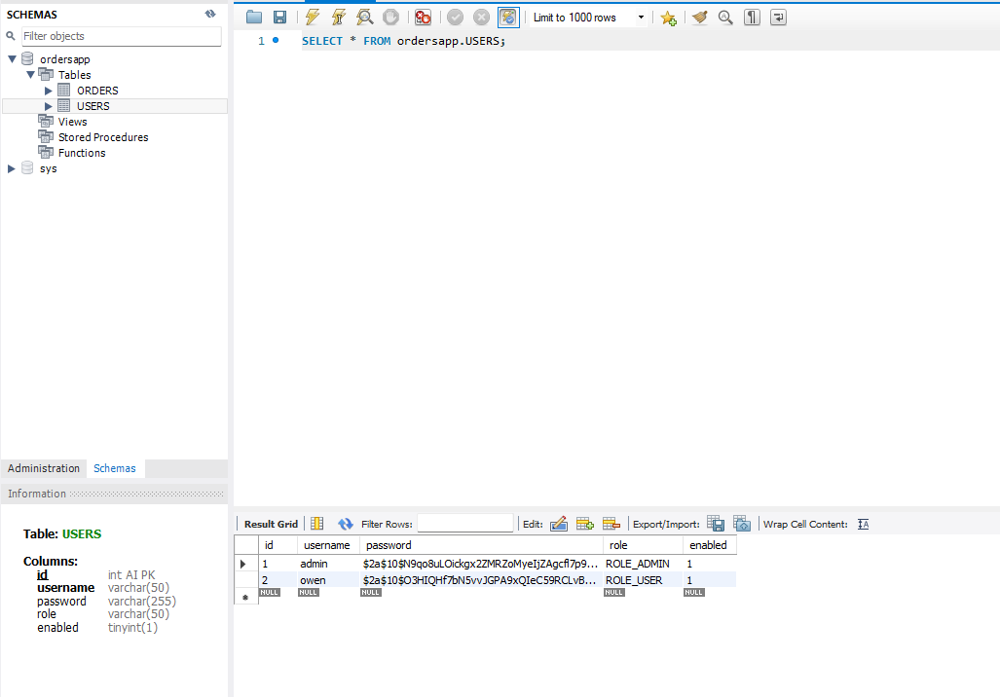

**USERS Table Structure:**

| Column   | Type          |
| -------- | ------------- |
| id       | int AI PK     |
| username | varchar(50)   |
| password | varchar(255)  |
| role     | varchar(50)   |
| enabled  | tinyint(1)    |

**Registered Users:**

| id | username | password        | role       | enabled |
| -- | -------- | --------------- | ---------- | ------- |
| 1  | admin    | `$2a$10$...` (BCrypt hash) | ROLE_ADMIN | 1       |
| 2  | owen     | `$2a$10$...` (BCrypt hash) | ROLE_USER  | 1       |

**Security Notes:**
- Passwords are never stored in plaintext — BCrypt with cost factor 10 (`$2a$10$`)
- `ROLE_ADMIN` grants access to `/admin/**` endpoints via Spring Security
- `ROLE_USER` grants access to standard order management pages
- `enabled = 1` means both accounts are active

---

<div style="page-break-after: always;"></div>

## Section 4: Spring Boot Project Configuration

### 4.1 pom.xml — Key Dependencies

| Dependency                       | Purpose                              |
| -------------------------------- | ------------------------------------ |
| `spring-boot-starter-web`        | Web application framework            |
| `spring-boot-starter-data-jdbc`  | Database connectivity                |
| `mysql-connector-j`              | MySQL JDBC driver (runtime)          |
| `spring-boot-starter-security`   | Authentication and authorization     |
| `spring-boot-starter-thymeleaf`  | Server-side HTML templating          |

### 4.2 application.properties — Environment Variable Strategy

The application uses Spring Boot's environment variable override mechanism. Local development values serve as defaults, while Elastic Beanstalk environment properties override them in production.

```properties
# Server — EB sets PORT=5000
server.port=${PORT:5000}

# DataSource — EB env vars override local defaults
spring.datasource.url=${SPRING_DATASOURCE_URL:jdbc:mysql://localhost:3306/ordersdb?sslMode=DISABLED&serverTimezone=UTC}
spring.datasource.username=${SPRING_DATASOURCE_USERNAME:root}
spring.datasource.password=${SPRING_DATASOURCE_PASSWORD:root}
spring.datasource.driver-class-name=com.mysql.cj.jdbc.Driver

# JPA / Hibernate
spring.jpa.hibernate.ddl-auto=${SPRING_JPA_HIBERNATE_DDL_AUTO:update}
spring.jpa.database-platform=${SPRING_JPA_DATABASE_PLATFORM:org.hibernate.dialect.MySQLDialect}
spring.jpa.open-in-view=false

# Hikari Connection Pool
spring.datasource.hikari.maximum-pool-size=${DB_POOL_MAX:10}
spring.datasource.hikari.minimum-idle=${DB_POOL_MIN:2}
spring.datasource.hikari.connection-timeout=30000
spring.datasource.hikari.validation-timeout=5000
```

> **Note:** Spring Boot automatically maps environment variables like `SPRING_DATASOURCE_URL` to `spring.datasource.url`. This keeps secrets out of the Git repository while allowing seamless local development.

### 4.3 Build Command

```bash
mvn clean package -DskipTests
```

**Build Output:**
- JAR file: `target/cloud-app-1.0.0.jar`
- Packaging: Fat JAR (Spring Boot repackaged, includes all dependencies)

---

<div style="page-break-after: always;"></div>

## Section 5: Elastic Beanstalk Deployment

### 5.1 Elastic Beanstalk Environments Dashboard

> **Caption:** The Elastic Beanstalk Environments page showing `Orders-env` with Health status "Ok" (green). The environment is running on the Corretto 25 platform (Amazon's OpenJDK distribution) with the application name "orders" at version 2-3. The environment domain is `Orders-env.eba-edxntuky.us-west-1.elasticbeanstalk.com`.

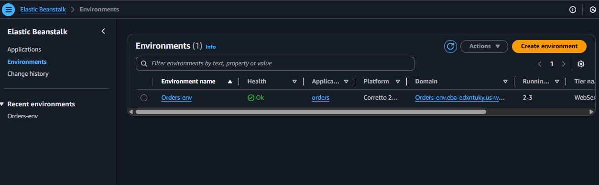

**Environment Summary:**

| Setting          | Value                                                      |
| ---------------- | ---------------------------------------------------------- |
| Environment Name | Orders-env                                                 |
| Health           | Ok (green)                                                 |
| Application      | orders                                                     |
| Platform         | Corretto 25 on 64bit Amazon Linux 2023/4.8.4               |
| Running Version  | 2-3                                                        |
| Tier             | WebServer                                                  |
| Domain           | `Orders-env.eba-edxntuky.us-west-1.elasticbeanstalk.com`  |

---

### 5.2 Environment Overview & Events

> **Caption:** The Orders-env environment overview showing Health "Ok," Environment ID `e-2l2xww2mnz`, and the Corretto 25 platform. The Events tab shows a successful deployment timeline: the JAR was detected at 17:09:58, the Procfile generated at 17:09:59, instance deployment completed at 17:10:05, and the environment health transitioned to "Ok" at 17:11:39 — a total deployment time of about 51 seconds.

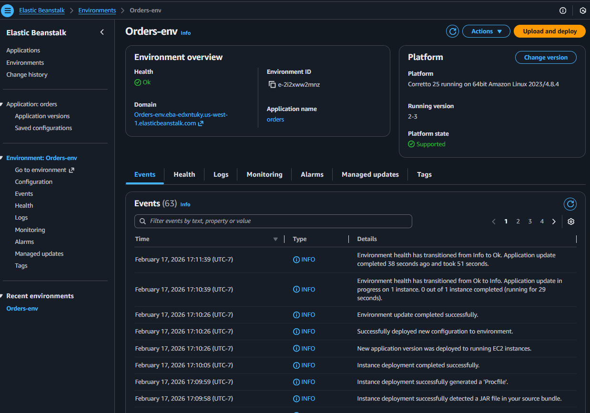

**Deployment Events (February 17, 2026):**

| Time     | Event                                                                    |
| -------- | ------------------------------------------------------------------------ |
| 17:09:58 | Instance deployment detected a JAR file in source bundle                 |
| 17:09:59 | Instance successfully generated a 'Procfile'                             |
| 17:10:05 | Instance deployment completed successfully                               |
| 17:10:26 | New application version deployed to running EC2 instances                |
| 17:10:26 | Successfully deployed new configuration to environment                   |
| 17:10:26 | Environment update completed successfully                                |
| 17:10:39 | Environment health transitioned from Ok to Info (update in progress)     |
| 17:11:39 | Environment health transitioned from Info to Ok (took 51 seconds)        |

---

### 5.3 Environment Configuration & Properties

> **Caption:** The full Elastic Beanstalk Configuration page showing service access roles, networking settings, instance traffic and scaling (Single Instance, t3.micro/t3.small), monitoring and logging settings (enhanced, log streaming enabled), and the critical Environment Properties at the bottom. The four Spring Boot environment variables (`SPRING_DATASOURCE_PASSWORD`, `SPRING_DATASOURCE_URL`, `SPRING_DATASOURCE_USERNAME`, `SPRING_JPA_HIBERNATE_DDL_AUTO`) are configured to connect the app to the RDS instance.

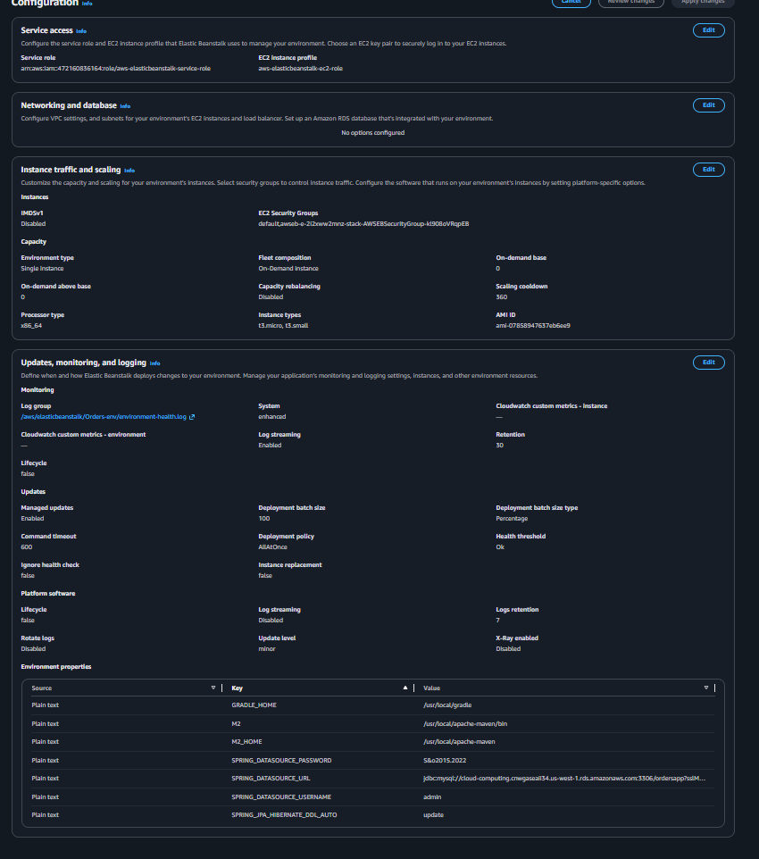

**Service Access:**

| Setting              | Value                                        |
| -------------------- | -------------------------------------------- |
| Service Role         | aws-elasticbeanstalk-service-role             |
| EC2 Instance Profile | aws-elasticbeanstalk-ec2-role                 |

**Instance & Scaling:**

| Setting           | Value               |
| ----------------- | ------------------- |
| Environment Type  | Single Instance      |
| Instance Types    | t3.micro, t3.small   |
| Processor Type    | x86_64               |
| Scaling Cooldown  | 360 seconds          |

**Monitoring & Logging:**

| Setting            | Value       |
| ------------------ | ----------- |
| System             | Enhanced    |
| Log Streaming      | Enabled     |
| Retention          | 30 days     |

**Environment Properties (overriding application.properties):**

| Key                            | Value                                                                                                          |
| ------------------------------ | -------------------------------------------------------------------------------------------------------------- |
| `SPRING_DATASOURCE_PASSWORD`   | `********` (hidden)                                                                                            |
| `SPRING_DATASOURCE_URL`        | `jdbc:mysql://cloud-computing.cnwgaseali34.us-west-1.rds.amazonaws.com:3306/ordersapp?sslM...`                |
| `SPRING_DATASOURCE_USERNAME`   | `admin`                                                                                                        |
| `SPRING_JPA_HIBERNATE_DDL_AUTO`| `update`                                                                                                       |

> **Note:** The JDBC URL includes `sslMode=REQUIRED` to enforce TLS encryption between the Elastic Beanstalk EC2 instance and the RDS MySQL server. Environment properties keep database credentials out of the Git repository.

---

### 5.4 Application Log Stream

> **Caption:** CloudWatch log stream output from `/var/log/web.stdout.log` showing application runtime logs. The stack trace visible here is from an early deployment that encountered a `BadSqlGrammarException` related to the USERS table query — this was resolved by ensuring the DDL script was properly imported into the RDS schema. Logs like these were essential for diagnosing connectivity and schema issues during deployment.

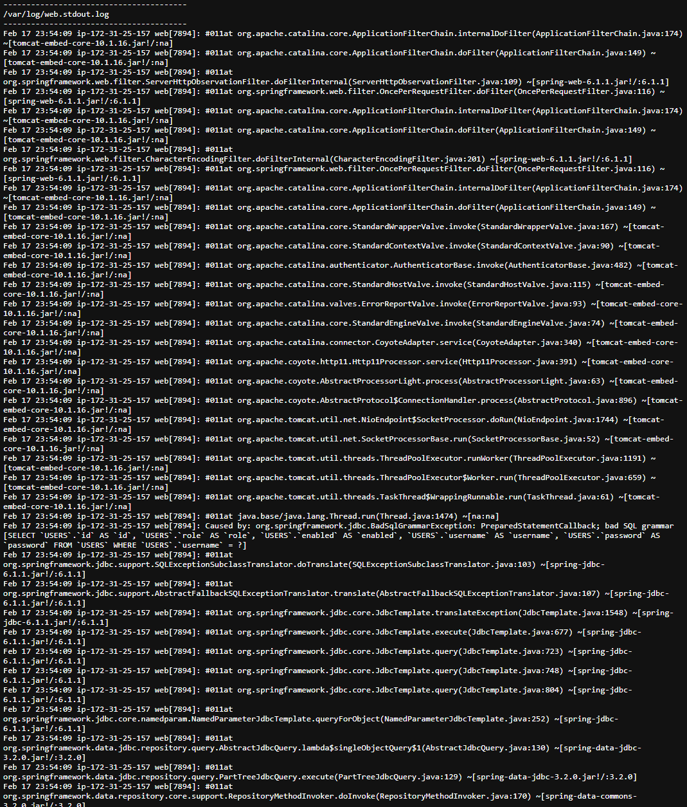

**Troubleshooting Notes:**
- Initial deployment produced a `BadSqlGrammarException` on the USERS table SELECT query
- Root cause: the DDL script needed adjustments for MySQL 8 compatibility on RDS
- Resolution: re-imported the schema with corrected column quoting and re-deployed
- CloudWatch log streaming (enabled in EB Configuration) was critical for diagnosing this

---

<div style="page-break-after: always;"></div>

## Section 6: Testing and Verification

### 6.1 Login Page

> **Caption:** The Orders4U login page served from the Elastic Beanstalk URL (`orders-env.eba-edxntuky.us-west-1.elasticbeanstalk.com`). The Spring Security login form prompts for Username and Password with a "Sign In" button and a "Create one" link for new account registration. This confirms the application is running and the Spring Security filter chain is active.

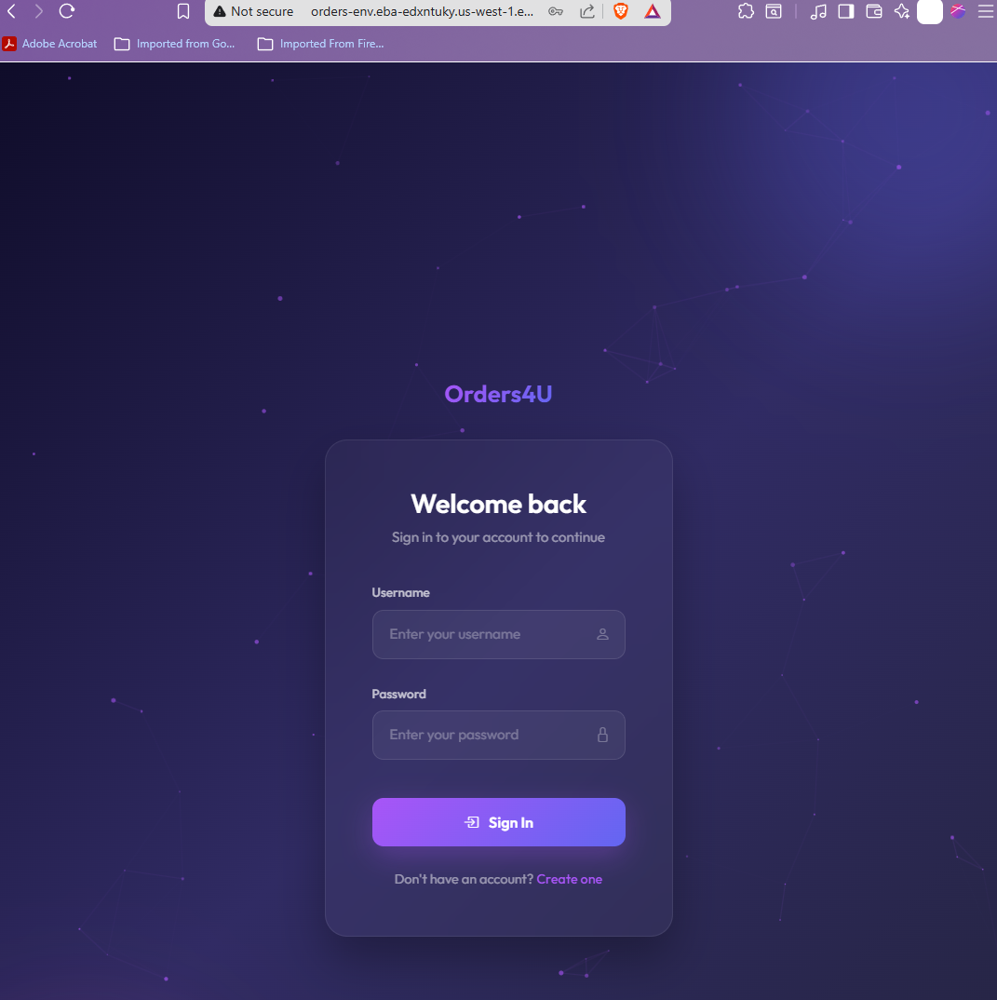

---

### 6.2 User Registration

> **Caption:** The "Create Account" page on the live AWS deployment. New users can register with a username, password, and password confirmation. Input validation is enforced (no special characters, minimum 8-character password, confirmation must match). This demonstrates the full registration flow working against the RDS-hosted USERS table.

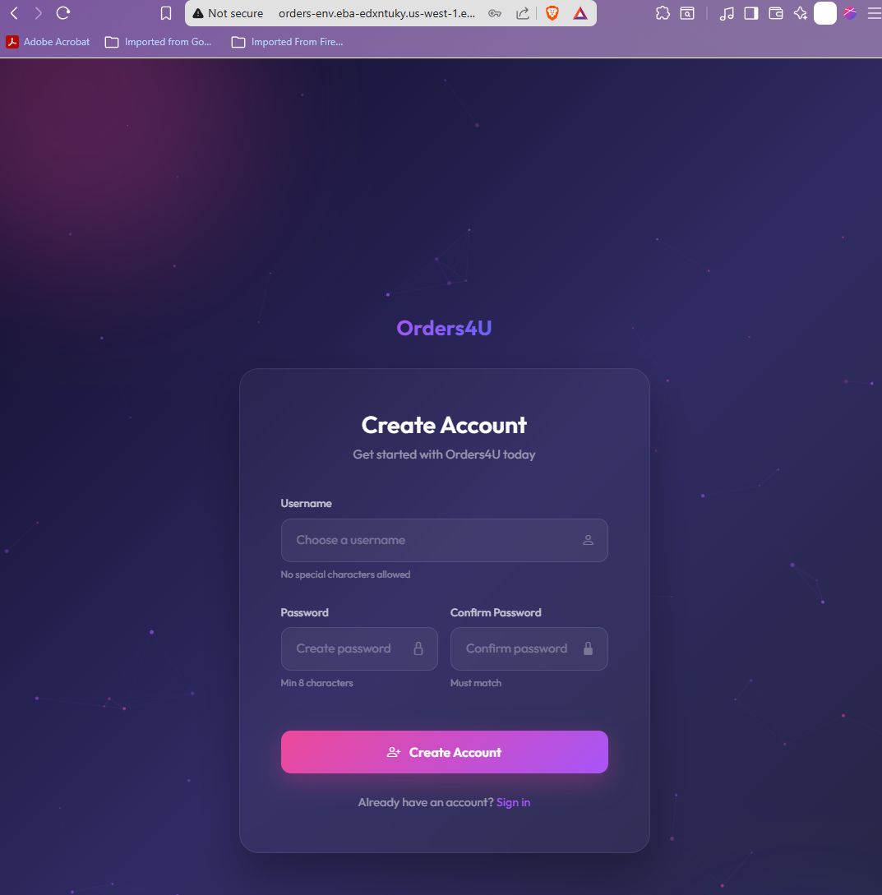

---

### 6.3 Home Page — Authenticated User

> **Caption:** The Orders4U home page after successful login, displaying "Welcome back, owen." The home page highlights the cloud-powered platform with 24/7 Availability, Azure Hosted, and Secure Platform badges, along with a navigation card to the Inventory management section. The authenticated session confirms Spring Security is properly wired to the RDS-backed `UsersDetailsService`.

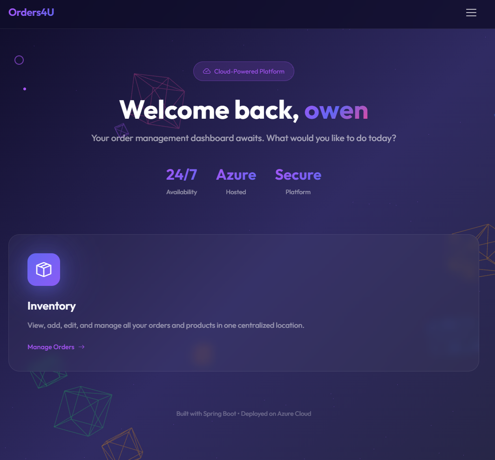

**Verification:**
- **URL:** http://orders-env.eba-edxntuky.us-west-1.elasticbeanstalk.com
- **Status:** HTTP 200 OK
- **User:** `owen` authenticated successfully
- **Session:** Spring Security session established

---

### 6.4 Inventory Dashboard — Database Read

> **Caption:** The Inventory page showing all orders loaded from the RDS MySQL database. Nine product cards are displayed (Personality transplant, Risk-free muscle steroid builder, Liquid luck, Hindsight vision from tomorrow, Persuasive charm, 5 magic beans, One million LIKES, Regret remover, Invisible Bread Box) plus a "New Order" card. A "Favorite Orders" section shows four starred items. This confirms successful database READ operations from the AWS-hosted MySQL instance.

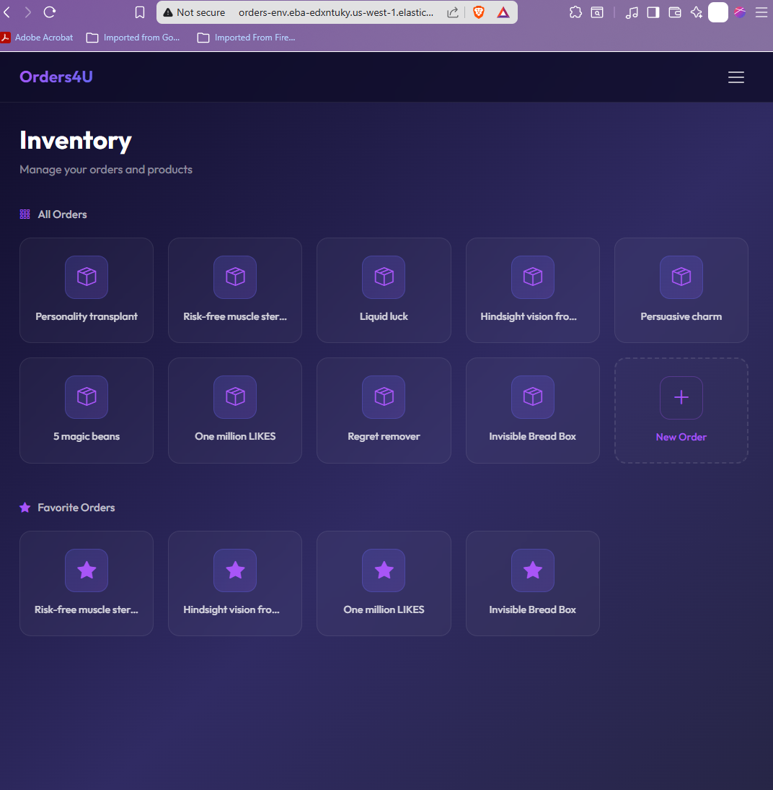

**Verification:**
- [x] All 9 orders from RDS ORDERS table rendered correctly
- [x] Product names, icons, and layout match expected data
- [x] Favorite Orders section populated
- [x] "New Order" card available for CREATE operations

---

### 6.5 Order Detail View — Single Record Read

> **Caption:** The order detail view for order m-801 ("Personality transplant") showing Order Number, Product Name, Price ($400), and Quantity (12) with Edit, Delete, and Back action buttons. This confirms the application can query individual records from the RDS database.

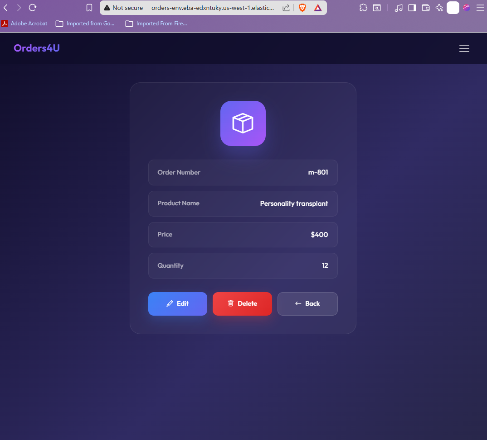

---

### 6.6 Edit Order — Database Update

> **Caption (Before):** The Edit Order form pre-populated with the "Invisible Bread Box" order (T-9, Price: 38, Quantity: 5). The user can modify any field and click "Update Order" to save changes.

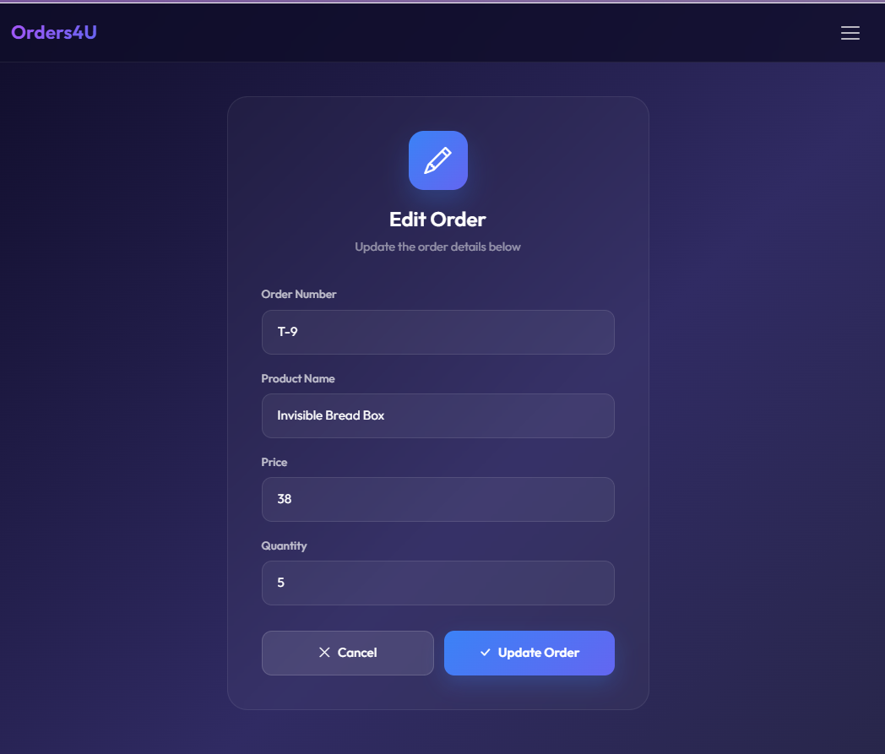

> **Caption (After):** The order detail view after a successful UPDATE operation. The "Invisible Bread Box" (T-9) now shows a Quantity of 500 (changed from 5), confirming the database write was committed to the RDS instance.

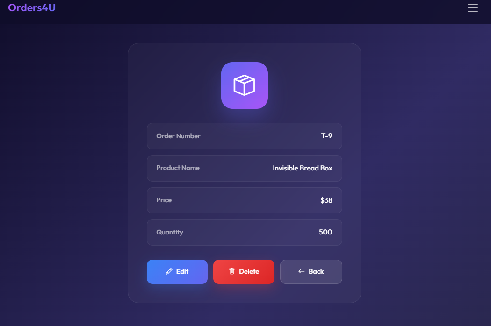

**Verification:**
- [x] Edit form loads with current database values
- [x] Update persists to RDS MySQL
- [x] Detail view reflects the changed quantity (5 → 500)

---

### 6.7 Delete Order — Database Delete

> **Caption (Confirmation):** A JavaScript confirmation dialog ("Are you sure you want to delete this order?") triggered from the order detail page for "Personality transplant" (m-801). The dialog originates from the Elastic Beanstalk domain, confirming the app is running on AWS.

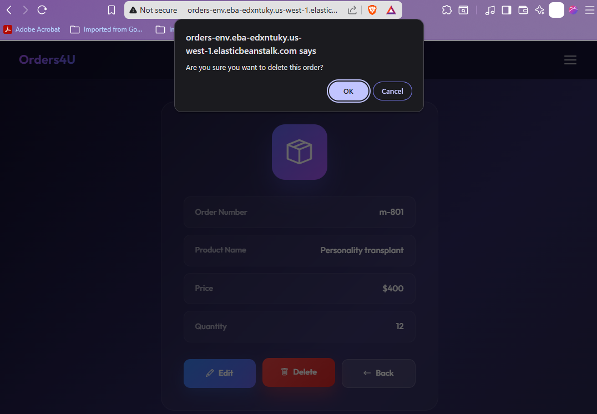

> **Caption (Result):** The Inventory page after the "Personality transplant" order has been deleted. The grid now shows 8 remaining orders (down from 9), confirming the DELETE operation was committed to the RDS database.

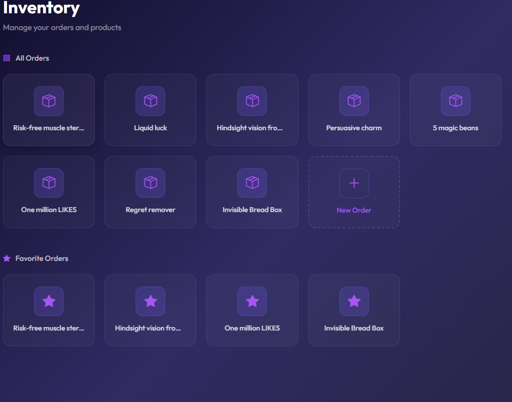

**Verification:**
- [x] Delete confirmation dialog works on production
- [x] Order removed from RDS database
- [x] Inventory refreshes with updated count (9 → 8 orders)

---

### 6.8 Full CRUD Verification Summary

| Operation | Endpoint / Action         | Result  | Evidence                        |
| --------- | ------------------------- | ------- | ------------------------------- |
| CREATE    | User registration         | Pass    | New user `owen` created         |
| READ      | Inventory dashboard       | Pass    | All 9 orders loaded from RDS    |
| READ      | Order detail (m-801)      | Pass    | Single record displayed         |
| UPDATE    | Edit order (T-9 qty)      | Pass    | Quantity changed 5 → 500        |
| DELETE    | Delete order (m-801)      | Pass    | Order removed, 8 remain         |

---

<div style="page-break-after: always;"></div>

## Section 7: AI Exploration Summary

### Chosen AI Prompt

**Prompt 3 — Scaling to 1 Million Users**

> "If this Spring Boot + MySQL app were to scale to 1 million users, do I need to design the structure of the code differently? I already use nLayer design. Does the software developer need to be concerned about replicating the database or caching for example, or does AWS do this automatically? If I need to be concerned about designing for scaling, what products or code structure ideas do I need to know about?"

---

### Key Findings

#### Does the Code Need to Change?

The nLayer architecture (Controller → Service → Data/Repository) is a solid foundation, but scaling to 1 million users requires additional design considerations:

1. **Stateless Services** — The application must not store user session data in local memory. Every instance behind a load balancer must handle any request from any user. Spring Security sessions should be externalized to a shared store (Redis via Spring Session) rather than kept in-memory on a single EC2 instance.

2. **Connection Pooling** — HikariCP (already configured) is critical, but the pool size must be tuned. With multiple EB instances, each running a pool of 10 connections, the total connection count against RDS can exceed its limits. RDS Proxy can manage connection multiplexing to prevent exhaustion.

3. **Caching Layer** — Repeated database reads for the same inventory data should be cached. AWS ElastiCache (Redis or Memcached) can sit between the Service layer and the Repository layer to reduce database load by 60-80% for read-heavy workloads.

4. **Asynchronous Processing** — Write-heavy operations (order creation, updates) can be decoupled using Amazon SQS (Simple Queue Service) to prevent request queuing during traffic spikes.

---

#### What AWS Does Automatically vs. What Developers Must Design

| Concern                     | AWS Handles Automatically                  | Developer Must Design                        |
| --------------------------- | ------------------------------------------ | -------------------------------------------- |
| Compute scaling             | EB Auto Scaling Group adds/removes EC2     | Stateless services so any instance works     |
| Load balancing              | ALB distributes traffic across instances   | Health check endpoints (`/actuator/health`)  |
| Database failover           | RDS Multi-AZ automatic failover            | Retry logic in connection pool config        |
| Database read scaling       | —                                          | Read replicas + routing in code or proxy     |
| Caching                     | —                                          | ElastiCache integration in Service layer     |
| Session management          | —                                          | Spring Session + Redis for shared sessions   |
| Database connection limits  | RDS Proxy (optional add-on)                | Connection pool sizing per instance          |

---

#### AWS Products for Scaling

| Product           | Purpose                                       | When to Add                           |
| ----------------- | --------------------------------------------- | ------------------------------------- |
| ElastiCache       | In-memory caching (Redis/Memcached)           | When DB reads become a bottleneck     |
| RDS Read Replicas | Offload SELECT queries to replica instances   | When write/read ratio exceeds 1:10    |
| RDS Proxy         | Connection pooling and multiplexing           | When multiple EB instances overwhelm DB connections |
| SQS               | Async message queue for write operations      | When order creation causes request queuing |
| CloudFront        | CDN for static assets (CSS, JS, images)       | When global latency matters           |
| Route 53          | DNS + health-check routing                    | When deploying across multiple regions |

---

### Follow-up Questions

**Follow-up 1:** "At what user count should I start adding caching and read replicas?"

**Summary:** Caching (ElastiCache) should be introduced when database CPU utilization consistently exceeds 60% or when average query latency rises above 50ms. For a typical Spring Boot CRUD app, this tends to happen around 50,000–100,000 active users. Read replicas become valuable when the write-to-read ratio exceeds 1:10 and the primary instance's IOPS are saturated. A single RDS read replica can double read throughput at roughly 1.5x the cost of one instance. Start by caching the most frequently accessed queries (e.g., the full inventory list), which can defer the need for read replicas by several months.

**Follow-up 2:** "How do I make Spring Security sessions work across multiple EB instances?"

**Summary:** By default, Spring Security stores the HTTP session in the JVM's memory — when EB scales to multiple instances, a user authenticated on Instance A will get a 403 on Instance B. The fix is Spring Session with Redis: add `spring-session-data-redis` to `pom.xml`, point it at an ElastiCache Redis cluster, and Spring automatically serializes sessions to Redis instead of local memory. Every EB instance reads from the same Redis store, so sessions are shared transparently. ALB sticky sessions are an alternative but are fragile — if the pinned instance dies, the user loses their session.

---

### What I Learned

1. **nLayer architecture is necessary but not sufficient for scale** — Clean separation of concerns makes scaling easier (you can cache at the Service layer, add read replicas at the Repository layer), but the architecture alone doesn't handle distributed state, connection limits, or async processing.

2. **Statelessness is the single most important scaling principle** — AWS can auto-scale compute trivially, but only if every instance is interchangeable. Externalizing session state to Redis transforms a monolith from "hard to scale" to "horizontally scalable" with minimal code changes.

3. **AWS provides the infrastructure, but the developer designs the topology** — Services like ElastiCache, RDS Read Replicas, and SQS are available, but they don't activate automatically. The developer must identify bottlenecks (using CloudWatch metrics) and integrate the appropriate service.

4. **Caching provides the highest ROI for read-heavy applications** — Adding a Redis cache in front of the database can reduce load by 60-80%, deferring expensive database tier upgrades and read replica provisioning.

5. **Connection pooling becomes critical at scale** — With 10 EB instances each running HikariCP pools of 10 connections, that's 100 concurrent connections to RDS. A db.t3.micro only supports ~60 connections. RDS Proxy or careful pool sizing is essential to avoid connection exhaustion errors.

---

<div style="page-break-after: always;"></div>

## Section 8: Reflection

### Deployment Challenges Encountered

**Challenge 1:** Initial Elastic Beanstalk deployment returned a `BadSqlGrammarException` when Spring Security attempted to query the USERS table. The CloudWatch log stream showed the full stack trace originating from `UsersDetailsService.loadUserByUsername()`.

**Solution:** The DDL script exported from the local MySQL 5.7 (MAMP) instance used column quoting that was incompatible with MySQL 8.4 on RDS. Re-exported the schema with MySQL 8 compatible syntax, re-imported via Workbench, and redeployed. CloudWatch log streaming was essential for diagnosing this — the EB health page only showed a generic 502.

---

**Challenge 2:** Spring Security's `AuthenticationManager` was not wired to the custom `UsersDetailsService`, causing login attempts to fail silently even after the schema issue was resolved. The default `DaoAuthenticationProvider` was not picking up the autowired service.

**Solution:** Added an explicit `AuthenticationManager` bean in `SecurityConfig.java` that registers `UsersDetailsService` with `AuthenticationManagerBuilder` and configures it with the `BCryptPasswordEncoder`. This connected the Spring Security filter chain to the RDS-backed user store.

---

**Challenge 3:** Security group misconfiguration initially blocked MySQL Workbench from connecting to the RDS instance. The connection timed out without a clear error message.

**Solution:** Navigated to the VPC Security Group attached to the RDS instance and added an inbound rule for MySQL/Aurora (port 3306) with source set to "My IP." AWS auto-detected the laptop's public IP address. After saving, the Workbench connection succeeded immediately.

---

### Security Best Practices Applied

| Practice | Implementation |
|----------|----------------|
| No secrets in Git | Used EB Environment Properties for database credentials; local dev credentials are separate from production |
| TLS encryption | `sslMode=REQUIRED` in JDBC URL ensures all database traffic is encrypted in transit |
| Security group rules | RDS inbound restricted to developer IP (174.73.233.95/32) and EB security group |
| Password hashing | BCrypt password encoder configured in SecurityConfig for user authentication |
| Role-based access | Spring Security restricts `/admin/**` endpoints to ADMIN role only |
| Environment variable overrides | `${SPRING_DATASOURCE_*}` pattern keeps production config out of application.properties |

---

### Cost Management

**Steps Taken to Stay Within Free Tier:**
- [x] Selected db.t4g.micro for RDS (Free Tier: 750 hrs/month for 12 months)
- [x] 20 GiB storage (within Free Tier 20 GB limit)
- [x] Single Instance EB environment (no load balancer cost)
- [x] t3.micro/t3.small instance types (Free Tier eligible)
- [x] Multi-AZ disabled on RDS (avoids doubled compute cost)
- [x] RDS Extended Support disabled (avoids paid add-on)
- [x] All resources in same region (us-west-1) to eliminate cross-region egress

---

### Key Terminology Learned

| Term | Definition |
|------|------------|
| RDS (Relational Database Service) | AWS managed database platform; handles patching, backups, and scaling |
| Elastic Beanstalk (EB) | PaaS for deploying web apps; provisions EC2, ALB, and Auto Scaling automatically |
| Security Group (SG) | Virtual firewall controlling inbound/outbound traffic to AWS resources |
| db.t4g.micro | Free Tier eligible RDS instance class (2 vCPU, 1 GB RAM, ARM-based Graviton) |
| Corretto | Amazon's no-cost, production-ready OpenJDK distribution |
| Environment Properties | Key-value pairs injected as environment variables into EB instances |
| Fat JAR | Executable JAR containing all dependencies; Spring Boot repackages during `mvn package` |
| CloudWatch | AWS monitoring service for metrics, alarms, and log aggregation |

---

### AWS vs. Azure — Comparative Experience

Deploying the same Spring Boot + MySQL application to AWS after having deployed it to Azure in Activity 3 provided a clear side-by-side comparison of the two major cloud platforms. The core workflow was nearly identical — provision a managed MySQL database, configure the Spring Boot application with environment variables, package a JAR, and deploy to a PaaS hosting service — but the specific tools and terminology differed significantly. Azure uses App Service with a Maven plugin for deployment (`mvn azure-webapp:deploy`), while AWS Elastic Beanstalk uses a JAR upload through the console or CLI. RDS felt slightly more manual than Azure Database for MySQL Flexible Server, particularly around security group configuration, where Azure's firewall rules are more integrated into the database setup wizard. However, EB's environment properties screen was more intuitive for configuring Spring Boot overrides than Azure's Application Settings blade. The biggest takeaway is that cloud platforms are converging on the same abstractions (managed databases, PaaS compute, environment variables for secrets), and understanding one makes learning the other dramatically faster.

**Service Equivalency Table:**

| Concept | Azure | AWS |
|---------|-------|-----|
| Managed MySQL | Azure Database for MySQL — Flexible Server | Amazon RDS (MySQL) |
| PaaS Compute | Azure App Service (Linux, Java SE) | Elastic Beanstalk (Corretto) |
| Resource Grouping | Resource Group | EB Application + Environment |
| Environment Variables | App Settings | EB Environment Properties |
| Deployment Method | `mvn azure-webapp:deploy` | Console upload or EB CLI |
| Log Streaming | Azure Log Stream | CloudWatch Logs |
| Firewall Rules | Server Firewall (integrated) | VPC Security Groups (separate) |

### How I Will Approach My Next Cloud Deployment

Knowing what I learned from both Azure and AWS deployments, I will approach my next cloud computing experience with three priorities. First, I will configure environment variables and TLS from the very beginning rather than treating them as post-deployment fixes — both deployments required troubleshooting connection issues that could have been avoided by setting `sslMode=REQUIRED` and environment overrides before the first deploy. Second, I will lean heavily on log streaming (Azure Log Stream, CloudWatch Logs) as my primary debugging tool, since both platforms surface application errors there long before they appear as user-facing error pages. Third, I will design my application to be stateless from the start, because both Azure and AWS make horizontal scaling trivial if the application doesn't depend on local state — but retrofitting statelessness into an existing app is much harder than building it in from day one.

---

## Appendix: Quick Reference

### AWS Resources Created

| Resource          | Name / Identifier        | Type                    | Region     |
| ----------------- | ------------------------ | ----------------------- | ---------- |
| RDS Instance      | cloud-computing          | MySQL 8.4.7 (db.t4g.micro) | us-west-1a |
| Database Schema   | ordersapp                | MySQL Schema            | —          |
| EB Application    | orders                   | Elastic Beanstalk App   | us-west-1  |
| EB Environment    | Orders-env               | Web Server (Corretto 25)| us-west-1  |
| Security Group    | default (sg-052292f248...) | VPC Security Group    | us-west-1  |

### Useful Commands

```bash
# Build the JAR (skip tests for faster iteration)
mvn clean package -DskipTests

# Alternative with Maven Wrapper
./mvnw clean package -DskipTests
```

> **Note:** Deployment is done via the AWS Console (EB → Upload and Deploy) or the EB CLI (`eb deploy`).

### Application URLs

- **Production:** http://orders-env.eba-edxntuky.us-west-1.elasticbeanstalk.com

### Database Connection

- **RDS Endpoint:** `cloud-computing.cnwgaseali34.us-west-1.rds.amazonaws.com`
- **Port:** 3306
- **Database:** ordersapp
- **Admin User:** admin

---
