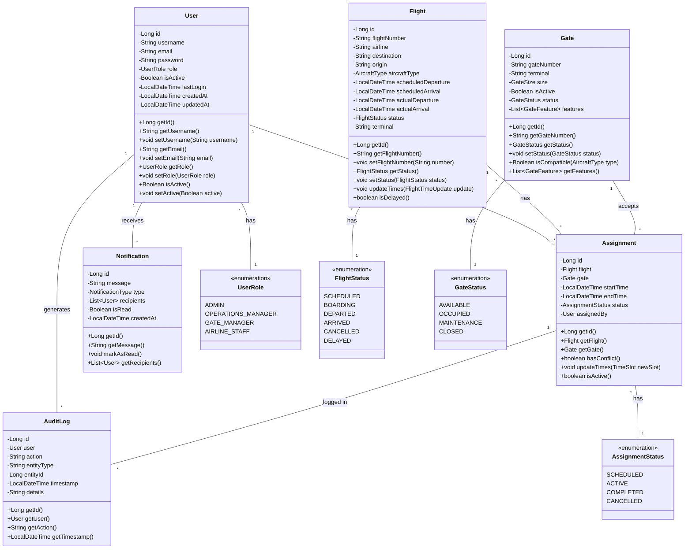
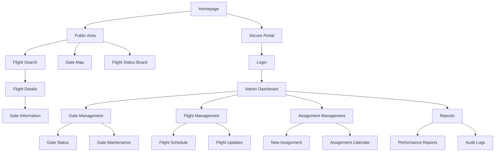

# Airport Gate Management System (AGMS)
## Design Report - Milestone 3
### CST-339: Java Enterprise Application Development

**Date:** January 29, 2025  
**Version:** 3.0  
**Author:** Owen Lindsey  
**Course:** CST-339 - Java Programming III  
**Professor:** Professor Robert Estey

---

## Completed Tasks Checklist

### Main Application Module
- ✅ Implemented root URI with landing page
- ✅ Created navigation menu system with role-based access
- ✅ Integrated Bootstrap for responsive design
- ✅ Established consistent application theme and styling
- ✅ Implemented Spring MVC architecture
- ✅ Added application branding and logo

### User Authentication & Registration
- ✅ Created user registration system with validation
- ✅ Implemented role-based registration logic
- ✅ Added authorization code system for admin roles
- ✅ Developed user model and data validation
- ✅ Implemented login functionality with session management
- ✅ Added role-based dashboard redirection

### Role-Specific Dashboards
- ✅ Admin Dashboard
  - System overview
  - User management interface
  - System health monitoring
- ✅ Operations Dashboard
  - Gate status overview
  - Assignment management
  - Real-time updates
- ✅ Gate Manager Dashboard
  - Gate maintenance scheduling
  - Status management
  - Issue reporting
- ✅ Airline Staff Dashboard
  - Flight schedules
  - Gate assignments
  - Status updates

### Technical Infrastructure
- ✅ Implemented Thymeleaf templates
- ✅ Created common layout system
- ✅ Set up Spring Boot configuration
- ✅ Integrated Bootstrap framework
- ✅ Created error handling system

### Documentation
- ✅ Updated class diagrams
- ✅ Created ER diagrams
- ✅ Updated technical documentation
- ✅ Added installation instructions
- ✅ Created user guides

## Project Links
- **GitHub Repository:** https://github.com/omniV1/CST-339/tree/main/workspaceCST-339/src/Milestone
- **Screencast Demo:** https://youtu.be/_irjMh0NmtE
- **Javadoc:** https://github.com/omniV1/CST-339/tree/main/workspaceCST-339/src/Milestone/agms/docs/apidocs
- **Testing** https://github.com/omniV1/CST-339/tree/main/workspaceCST-339/src/Milestone/agms/src/test/java/com/gcu/agms/service
## Technical Requirements
- Java 17
- Spring Boot 3.x
- Maven
- MySQL (planned)
- Bootstrap 5
- Modern web browser (Chrome, Firefox, Safari, Edge)

---


## Domain Overview

The Airport Gate Management System (AGMS) addresses the complex challenges faced by modern airports in managing their gate assignments and flight operations. Currently, many airports rely on manual processes or outdated systems that don't provide real-time updates, leading to inefficiencies in gate utilization and potential delays in flight operations. Our system aims to streamline these operations through an intuitive, web-based interface that provides real-time management of gates, flights, and resources.

## User Stories and Requirements

### Public/Customer Access

As an airline passenger or airport visitor, I need to quickly find my flight and gate information to ensure I arrive at the right location on time:

"I need to easily look up my flight by flight number or destination to find the correct terminal and gate. I should be able to see real-time updates about my flight's status, gate changes, and boarding times. The information should be clear and accessible from both mobile and desktop devices, with the option to receive notifications about changes affecting my flight."

***Key Requirements:***
- Simple, intuitive flight search
- Clear gate and terminal information
- Real-time flight status updates
- Gate location wayfinding
- Boarding time information
- Gate change notifications
- ADA-compliant interface

This public interface will be separate from the administrative system but will consume data from the same backend services. The focus is on providing clear, accurate information without the complexity of the full management system.

### Airport Operations Staff

As an airport operations manager, I need to efficiently manage gate assignments so that I can maximize airport resource utilization and minimize delays. This includes:

"I need to see a real-time dashboard of all gate assignments and their current status. When a flight is delayed, I need to be able to quickly identify available gates and reassign flights to minimize disruption to the overall schedule. The system should automatically check for conflicts and alert me before I make an invalid assignment."

***Key Requirements:***
- Real-time visibility of gate status
- Drag-and-drop interface for quick reassignments
- Automatic conflict detection
- Historical assignment data for planning

### Gate Managers

As a gate manager, I need to monitor and update the status of gates under my responsibility to ensure smooth operations. Their story:

"I need to be able to quickly mark gates as available, occupied, or under maintenance. When maintenance is scheduled, I need to block out that time in advance so no flights get assigned to that gate. I also need to record any issues or special conditions that might affect gate usage."

***Key Requirements:***
- Quick status updates
- Maintenance scheduling
- Issue reporting
- Gate history tracking

### Airline Staff

As an airline staff member, I need to view gate assignments for my airline's flights and request changes when necessary:

"I need to see all upcoming gate assignments for my airline's flights. When operational requirements change, I need to be able to request gate reassignments and receive quick approval or denial from airport operations. I also need to be notified immediately of any changes affecting our flights."

***Key Requirements:***
- Airline-specific view of assignments
- Gate change request system
- Real-time notifications
- Historical data access

## Technical Architecture

### Data Model Description
Our system's data model handles the relationships between flights, gates, and assignments in a straightforward way that keeps data accurate and easy to query. Here are the main components:

### User 
The User keeps track of who can access the system and what they can do. It stores each user's unique ID, login credentials, and what roles they have in the system. It also records when user accounts were created and last updated, and keeps track of their login sessions for security.

### Flight 
The Flight stores all the key information about each flight. This includes the flight number and airline code, when the flight is scheduled to arrive and depart, what type of aircraft is being used, and how big it is. It tracks the flight's current status, any delays, and keeps a history of which gates it has been assigned to.

### Gate 
The Gate manages information about each physical gate at the airport. Each gate has its own ID and location within a specific terminal. The system knows which types and sizes of aircraft can use each gate, whether the gate is currently available, and keeps records of past and scheduled maintenance.

### Assignment 
The Assignment connects flights to gates. It records the time period a gate is assigned to a flight, tracks the status of that assignment, and checks for any scheduling conflicts. Each assignment record shows who created it and when it was last changed, helping us track how gates are being used.

## System Architecture and Design

### Class Diagram (UML)
The following class diagram illustrates the core components of the system and their relationships:



### Business Logic Layer

The business layer implements rules for gate assignments, including:

Aircraft Compatibility Verification:
```java
public interface GateCompatibilityService {
    /**
     * Verifies if a gate can accommodate a specific aircraft type
     * considering physical dimensions and service requirements.
     *
     * @param gate The gate to verify
     * @param aircraftType The type of aircraft to check
     * @return A compatibility result with details
     */
    CompatibilityResult verifyCompatibility(Gate gate, AircraftType aircraftType);
}
```

Conflict Detection:
```java
public interface ConflictDetectionService {
    /**
     * Analyzes potential conflicts for a proposed gate assignment
     * considering existing assignments and maintenance schedules.
     *
     * @param proposedAssignment The assignment to verify
     * @return List of detected conflicts with details
     */
    List<Conflict> detectConflicts(Assignment proposedAssignment);
}
```

### User Roles and Permissions

| Feature/Action | Admin | Operations Manager | Gate Manager | Airline Staff | Public |
|----------------|-------|-------------------|--------------|---------------|---------|
| View Public Flight Info | ✓ | ✓ | ✓ | ✓ | ✓ |
| View Public Gate Info | ✓ | ✓ | ✓ | ✓ | ✓ |
| Search Flights | ✓ | ✓ | ✓ | ✓ | ✓ |
| View Admin Dashboard | ✓ | ✓ | ✓ | ✓ | - |
| View Detailed Reports | ✓ | ✓ | ✓ | ✓ | - |
| Generate Reports | ✓ | ✓ | ✓ | ✓ | - |
| Create Assignments | ✓ | ✓ | - | - | - |
| Modify Assignments | ✓ | ✓ | - | - | - |
| Delete Assignments | ✓ | ✓ | - | - | - |
| Manage Gates | ✓ | ✓ | ✓ | - | - |
| Manage Flights | ✓ | ✓ | - | ✓ | - |
| User Management | ✓ | - | - | - | - |
| System Settings | ✓ | - | - | - | - |
| View Audit Logs | ✓ | ✓ | - | - | - |


## Application Sitemap


### Overview
The interface design will focus on three core areas, each serving distinct user needs and workflows:

## Interface Wireframes

### Public Interface Wireframes

#### Flight Search Interface
.drawio.png)

The flight search interface prioritizes ease of use and intuitive flight information access for public users.

#### Gate Map Display


The gate map provides a clear visual representation of all terminal gates and their current status.

#### Status Board


The status board presents real-time flight information in an easily scannable format.

### Administrative Interface Wireframes

#### Operations Dashboard
.png)

The operations dashboard serves as the central control center for airport operations staff.

#### Gate Management Interface


The gate management interface provides comprehensive control over gate operations and maintenance.

#### Flight Management Interface


The flight management interface enables detailed control over flight operations and assignments.

#### Reports Interface


The reports interface provides detailed analytics and performance metrics for system monitoring.

#### Authentication Interface
.png)

The authentication interface ensures secure access to administrative functions.

Each interface maintains consistent design patterns including clear navigation, status indicators, and intuitive controls. The system uses color coding to indicate status:
- Green: Available/On Time
- Yellow: Warning/Potential Conflict
- Red: Unavailable/Critical Issue
- Blue: In Use/Normal Operation

## Implementation Strategy

### Feature Priority and Timeline

| Feature | Priority | Complexity | Dependencies | Timeline | Status |
|---------|----------|------------|--------------|----------|---------|
| User Authentication | P0 | Medium | None | Week 1-2 | Not Started |
| Database Setup | P0 | High | None | Week 1-2 | Not Started |
| Gate Management | P1 | Medium | Database | Week 3-4 | Not Started |
| Flight Management | P1 | Medium | Database | Week 3-4 | Not Started |
| Assignment System | P1 | High | Gates, Flights | Week 5-6 | Not Started |
| Real-time Updates | P2 | High | Assignment System | Week 7-8 | Not Started |
| Reporting | P2 | Medium | All Core Features | Week 9-10 | Not Started |
| API Integration | P3 | Medium | All Features | Week 11-12 | Not Started |

## Risk Management

Our risk management strategy focuses on identifying, assessing, and mitigating potential issues before they impact development or operations.

| Risk Area | Severity (1-5) | Likelihood (1-5) | Impact Score | Mitigation Strategy | Testing & Validation | Grade Impact |
|-----------|----------------|------------------|--------------|---------------------|---------------------|--------------|
| Development Timeline | 4 | 3 | 12 | Weekly milestone tracking with core feature prioritization | Regular requirement validation and progress assessment | Critical |
| Integration Complexity | 3 | 4 | 12 | component testing approach with detailed interface specifications | Integration test suite with user flow validation | High |
| Security Implementation | 3 | 3 | 9 | Spring Security framework with basic role management | Security unit tests and access control verification | High |
| Code Quality | 4 | 2 | 8 | Consistent code review process with documentation standards | JUnit coverage requirements and style validation | Critical |
| Real-time Updates | 2 | 3 | 6 | websocket implementation with polling fallback | Feature-specific unit testing and manual verification | Moderate |
| Database Design | 2 | 2 | 4 | schema with basic optimization | Performance testing with sample datasets | Low |

***Impact Score = Severity × Likelihood***

***Scoring Scale: Critical (>10), High (7-10), Moderate (4-6), Low (1-3)***

***Timeline Impact: Measured in expected development weeks***

***Grade Impact: Critical, High, Moderate, Low based on assignment rubric weighting***
### Development Phases

#### Phase 1: Core Infrastructure (Weeks 1-4)

| Component | Description | Deliverables | Validation Criteria |
|-----------|-------------|--------------|-------------------|
| Spring Boot Setup | Basic application configuration | - Project structure<br>- Security framework<br>- Basic endpoints | - Application runs<br>- Endpoints respond<br>- Security works |
| Database Design | Initial schema and migrations | - Schema design<br>- Migration scriptt<br>- Base repositories | - Schema validates<br>- Migrations run<br>- CRUD works |
| Authentication | User management and security | - Login system<br>- Role management<br>- User interfaces | - Users can login<br>- Roles work<br>- Interface functions |

### Phase 2: Business Logic Implementation (Weeks 5-8)

| Component              | Description                  | Deliverables                                      | Validation Criteria                               |
|------------------------|------------------------------|--------------------------------------------------|-------------------------------------------------|
| Gate Management        | Manage gate operations       | - Gate CRUD operations<br>- Gate status<br>- Maintenance scheduling | - Gates can be added, edited, deleted<br>- Status updates work<br>- Maintenance schedules save |
| Flight Management      | Manage flight operations     | - Flight CRUD operations<br>- Flight status tracking<br>- Real-time updates | - Flights can be added, edited, deleted<br>- Status updates work<br>- Updates reflect in real time |
| Assignment Management  | Allocate gates to flights    | - Assignment algorithms<br>- Conflict detection<br>- Notification system | - Assignments are accurate<br>- Conflicts are detected<br>- Notifications are sent |

### Phase 3: Interface and Integration (Weeks 9-12)

| Component              | Description                  | Deliverables                                      | Validation Criteria                               |
|------------------------|------------------------------|--------------------------------------------------|-------------------------------------------------|
| User Interface Development | Build user-friendly UI      | - Responsive dashboard<br>- Interactive gate map<br>- Reporting interfaces | - UI is responsive<br>- Gate map is interactive<br>- Reports generate accurately |
| System Integration     | Connect systems seamlessly   | - Real-time updates<br>- API endpoints<br>- External system interfaces | - Updates are real-time<br>- APIs respond correctly<br>- External integrations function |


## Testing Strategy

Our testing approach ensures comprehensive coverage across all system components:

### Unit testing

| **Testing Type**         | **Description**                                                        |
|---------------------------|------------------------------------------------------------------------|
| Unit Testing              | Tests individual components to ensure they work as expected.          |
| Service Layer Tests       | Verifies the functionality of business logic services.                |
| Repository Layer Tests    | Validates data access operations for accuracy and robustness.         |
| Utility Class Tests       | Checks helper methods and reusable utility functions for correctness. |
| Controller Tests          | Confirms that API controllers process and respond to requests appropriately. |

### Integration testing 

| **Testing Type**              | **Description**                                                                 |
|--------------------------------|---------------------------------------------------------------------------------|
| Integration Testing            | Ensures system components work together seamlessly.                            |
| API Endpoint Tests             | Validates that API endpoints return the correct responses.                     |
| Database Interaction Tests     | Tests that the application interacts with the database as intended.            |
| Security Integration Tests     | Verifies that authentication and authorization mechanisms are robust.          |
| WebSocket Functionality Tests  | Confirms real-time features operate without errors.                            |

### End-to-End Testing
| **Testing Type**          | **Description**                                                        |
|---------------------------|------------------------------------------------------------------------|
| End-to-End Testing        | Simulates real-world user scenarios to test the system end-to-end.    |
| User Workflow Tests       | Ensures users can complete typical tasks successfully.               |
| Performance Tests         | Measures application speed, scalability, and responsiveness.         |
| Security Penetration Tests| Identifies vulnerabilities in the system's security.                |
| Browser Compatibility Tests | Verifies the application works correctly across different browsers. |


## Success Criteria

The project's success will be measured against these specific criteria:

1. Functional Requirements
   - All CRUD operations working correctly
   - Real-time updates functioning
   - Conflict detection operating accurately
   - Report generation working properly

2. Performance Requirements
   - Page load times under 2 seconds
   - Real-time updates within 500ms
   - Search results returned within 1 second
   - Report generation under 5 seconds

3. Quality Requirements
   - Test coverage above 80%
   - No critical security vulnerabilities
   - All major browsers supported
  
