# Airport Gate Management System (AGMS)
## Design Report - Milestone 4
### CST-339: Java Enterprise Application Development

**Date:** March 7, 2025  
**Version:** 4.0  
**Author:** Owen Lindsey  
**Course:** CST-339 - Java Programming III  
**Professor:** Professor Robert Estey

---

## Executive Summary

This milestone represents a significant advancement in our Airport Gate Management System (AGMS) project, focusing on the implementation of Spring Data JDBC for robust data persistence. We've successfully transitioned from in-memory data storage to a fully relational database model, enabling reliable data storage, complex queries, and improved system resilience. The application now features a comprehensive data layer with clean separation of concerns, well-defined repositories, and optimized data access patterns.


## Project Links
- [GitHub Repository](https://github.com/omniV1/CST-339/tree/main/workspaceCST-339/src/Milestone)

- [Screencast Demo](https://www.youtube.com/watch?v=I3pML4eXBMM)

- [Javadoc](https://github.com/omniV1/CST-339/tree/main/workspaceCST-339/src/Milestone/agms/docs/apidocs)


## Completed Tasks Checklist

### Database Implementation
- ✅ Created comprehensive DDL scripts for all database tables
- ✅ Implemented Spring Data JDBC repositories for all entities
- ✅ Created database connection configuration
- ✅ Set up proper database environment variables
- ✅ Implemented transaction management
- ✅ Added database migration scripts
- ✅ Configured connection pooling for performance

### Data Layer Refactoring
- ✅ Refactored User service to use JDBC repository
- ✅ Implemented Flight and Aircraft repositories
- ✅ Created Gate and Assignment repositories
- ✅ Added MaintenanceRecord repository
- ✅ Implemented AuthorizationCode repository
- ✅ Created comprehensive RowMapper implementations
- ✅ Added proper error handling for data operations

### Service Layer Enhancement
- ✅ Updated all services to use repository interfaces
- ✅ Implemented proper transaction boundaries
- ✅ Added caching for frequently accessed data
- ✅ Improved error handling and validation
- ✅ Enhanced security with database-backed authentication
- ✅ Created data-driven authorization
- ✅ Implemented audit logging for data changes

### Business Logic Improvements
- ✅ Enhanced assignment conflict detection
- ✅ Improved maintenance scheduling
- ✅ Added comprehensive flight status management
- ✅ Created robust gate compatibility checking
- ✅ Implemented real-time schedule updates
- ✅ Added operational statistics calculation
- ✅ Enhanced dashboard data aggregation

### DevOps & Quality
- ✅ Updated Docker configuration for database
- ✅ Added database migration tools
- ✅ Created database backup procedures
- ✅ Implemented data integrity testing
- ✅ Enhanced integration testing for data layer
- ✅ Added performance monitoring for database operations
- ✅ Created database documentation

## Planning Documentation

### Task Schedule & Timeline

| Task | Status | Start Date | Completion Date | Owner |
|------|--------|------------|-----------------|-------|
| Database schema design | Completed | Feb 24, 2025 | Feb 26, 2025 | Owen Lindsey |
| DDL Script creation | Completed | Feb 25, 2025 | Feb 27, 2025 | Owen Lindsey |
| Database configuration | Completed | Feb 27, 2025 | Feb 28, 2025 | Owen Lindsey |
| User repository implementation | Completed | Feb 28, 2025 | Mar 1, 2025 | Owen Lindsey |
| Flight repository implementation | Completed | Mar 1, 2025 | Mar 2, 2025 | Owen Lindsey |
| Gate repository implementation | Completed | Mar 2, 2025 | Mar 3, 2025 | Owen Lindsey |
| Assignment repository implementation | Completed | Mar 3, 2025 | Mar 4, 2025 | Owen Lindsey |
| Maintenance repository implementation | Completed | Mar 4, 2025 | Mar 5, 2025 | Owen Lindsey |
| Authorization repository implementation | Completed | Mar 5, 2025 | Mar 6, 2025 | Owen Lindsey |
| Service layer refactoring | Completed | Mar 5, 2025 | Mar 6, 2025 | Owen Lindsey |
| Integration testing | Completed | Mar 6, 2025 | Mar 7, 2025 | Owen Lindsey |
| Documentation updates | Completed | Mar 7, 2025 | Mar 7, 2025 | Owen Lindsey |

## Design Documentation

### General Technical Approach

For Milestone 4, our technical approach centered on implementing robust data persistence using Spring Data JDBC. This approach offers several advantages over both pure JDBC and JPA/Hibernate:

1. **Simplicity**: Spring Data JDBC provides a clean, straightforward approach to database access without the complexity of an ORM like Hibernate.

2. **Performance**: By avoiding the overhead of complex object-relational mapping, we achieve better performance for our data-intensive operations.

3. **Control**: We maintain precise control over SQL operations while still benefiting from Spring's infrastructure support.

4. **Testability**: The repository pattern makes our data access layer more testable with clear boundaries.

Our implementation followed these core principles:

1. **Repository Pattern**: Each entity has a dedicated repository interface with standard CRUD operations and specialized queries.

2. **RowMapper Implementation**: Custom RowMappers handle the conversion between database records and domain objects, maintaining clean separation of concerns.

3. **Transaction Management**: Spring's declarative transaction management ensures data integrity across operations.

4. **Connection Pooling**: HikariCP connection pooling provides efficient database connection management.

5. **Environment Configuration**: Database connection details are externalized through environment variables for security and deployment flexibility.

This approach has allowed us to build a data layer that is robust, performant, and maintainable, providing a solid foundation for the system's business logic.

### Key Technical Decisions

#### Repository Implementation Strategy

We chose to implement our repositories using Spring JDBC over JPA/Hibernate for several reasons:

1. **Architectural Clarity**: JDBC provides a closer mapping to the relational model, making it easier to reason about the data layer.

2. **Performance Considerations**: For our read-heavy application with complex queries, the overhead of ORM can be significant.

3. **SQL Control**: Direct SQL gives us precise control over query optimization and index usage.

4. **Learning Opportunity**: Implementing JDBC repositories provides valuable insight into the database layer that higher-level abstractions might obscure.

Each repository follows a consistent pattern:

```java
public interface EntityRepository {
    // Standard CRUD operations
    List<Entity> findAll();
    Optional<Entity> findById(Long id);
    Entity save(Entity entity);
    void deleteById(Long id);
    
    // Specialized queries
    List<Entity> findBySpecificCriteria(String criteria);
}
```

The implementation classes leverage Spring's JdbcTemplate for consistent error handling, connection management, and query execution:

```java
@Repository
public class JdbcEntityRepository implements EntityRepository {
    private final JdbcTemplate jdbcTemplate;
    
    // Constructor injection
    public JdbcEntityRepository(JdbcTemplate jdbcTemplate) {
        this.jdbcTemplate = jdbcTemplate;
    }
    
    // Implementation details...
}
```

#### Data Model Design

Our database design prioritizes normalization while maintaining query performance:

1. **Third Normal Form**: All tables adhere to 3NF to minimize redundancy and anomalies.

2. **Foreign Key Constraints**: Referential integrity is enforced through foreign keys.

3. **Indexing Strategy**: Carefully chosen indexes balance lookup performance with write overhead.

4. **Audit Columns**: All tables include created_at, updated_at, and created_by columns for traceability.

5. **Soft Deletes**: Where appropriate, entities use is_active flags rather than physical deletion.

This approach gives us a robust, scalable database design that supports our current needs while allowing for future growth.

#### Transaction Management

We implemented declarative transaction management using Spring's `@Transactional` annotation:

```java
@Service
public class JdbcEntityService implements EntityService {
    private final EntityRepository repository;
    
    // Constructor injection
    public JdbcEntityService(EntityRepository repository) {
        this.repository = repository;
    }
    
    @Transactional
    public Entity createEntity(Entity entity) {
        // Business logic and validation
        return repository.save(entity);
    }
}
```

This approach ensures that:

1. Database transactions span logical business operations
2. Transactions roll back automatically on exceptions
3. The service layer controls transaction boundaries
4. The repository layer focuses on data access without transaction concerns

#### RowMapper Implementation

Our custom RowMappers handle the mapping between database rows and domain objects:

```java
private static class EntityRowMapper implements RowMapper<Entity> {
    @Override
    public Entity mapRow(ResultSet rs, int rowNum) throws SQLException {
        Entity entity = new Entity();
        entity.setId(rs.getLong("id"));
        entity.setName(rs.getString("name"));
        
        // Map other properties
        
        return entity;
    }
}
```

This approach:

1. Encapsulates database mapping details
2. Handles SQL-specific behaviors like NULL values
3. Manages type conversions consistently
4. Isolates domain objects from database concerns

### Installation & Configuration Instructions

#### Prerequisites

- Java 17 or higher
- Maven 3.8.x or higher
- MySQL 8.0 or higher
- Docker and Docker Compose (optional)

#### Database Setup

1. **Create the database**:

```sql
CREATE DATABASE agms CHARACTER SET utf8mb4 COLLATE utf8mb4_unicode_ci;
CREATE USER 'agms_user'@'localhost' IDENTIFIED BY 'your_password';
GRANT ALL PRIVILEGES ON agms.* TO 'agms_user'@'localhost';
FLUSH PRIVILEGES;
```

2. **Run the DDL scripts** (found in `src/main/resources/db/schema.sql`)

#### Application Configuration

1. **Environment Variables**:

Create a `.env` file in the project root with the following configuration:

```
# Database Configuration
SPRING_DATASOURCE_URL=jdbc:mysql://localhost:3306/agms
SPRING_DATASOURCE_USERNAME=agms_user
SPRING_DATASOURCE_PASSWORD=your_password

# Application Configuration
SERVER_PORT=8080
```

2. **Application Properties**:

The `application.properties` file is already configured to use the environment variables:

```properties
# Database Configuration
spring.datasource.url=${SPRING_DATASOURCE_URL}
spring.datasource.username=${SPRING_DATASOURCE_USERNAME}
spring.datasource.password=${SPRING_DATASOURCE_PASSWORD}
spring.datasource.driver-class-name=com.mysql.cj.jdbc.Driver

# HikariCP Configuration
spring.datasource.hikari.maximum-pool-size=10
spring.datasource.hikari.minimum-idle=5
spring.datasource.hikari.idle-timeout=300000
spring.datasource.hikari.connection-timeout=20000

# Server Configuration
server.port=${SERVER_PORT:8080}
```

#### Running the Application

1. **Using Maven**:

```bash
mvn clean package
java -jar target/agms-0.0.1-SNAPSHOT.jar
```

2. **Using Docker**:

```bash
docker-compose up -d
```

3. **Application Access**:

Once running, the application will be available at `http://localhost:8080`

### Known Issues & Risks

#### Known Issues

1. **Database Migration**: No automated migration system is in place yet. Schema changes require manual updates.

2. **Connection Pooling**: Default HikariCP settings may need tuning for production environments.

3. **Error Handling**: Some repository methods could use more robust error handling, particularly for constraint violations.

4. **Test Coverage**: While unit tests exist, integration tests for repositories are still being developed.

5. **Transaction Isolation**: Default isolation level may not be optimal for all scenarios.

#### Risks

| Risk | Severity | Likelihood | Mitigation |
|------|----------|------------|------------|
| Database performance under load | Medium | Medium | Implement monitoring and tuning plan |
| Connection leaks | High | Low | Add connection validation and leak detection |
| SQL injection vulnerabilities | High | Low | Use parameterized queries and validate inputs |
| Data integrity issues | High | Low | Add constraints and validation at both DB and application layers |
| Schema evolution complexity | Medium | Medium | Implement Flyway or Liquibase for migrations |

### Diagrams

#### Entity-Relationship Diagram


#### Database Schema (DDL Scripts)

Below are the key DDL scripts for our database tables:

**users Table**
```sql
CREATE TABLE users (
    id BIGINT AUTO_INCREMENT PRIMARY KEY,
    username VARCHAR(32) NOT NULL UNIQUE,
    password VARCHAR(255) NOT NULL,
    email VARCHAR(100) NOT NULL,
    first_name VARCHAR(50) NOT NULL,
    last_name VARCHAR(50) NOT NULL,
    phone_number VARCHAR(20) NOT NULL,
    role VARCHAR(20) NOT NULL,
    is_active BOOLEAN DEFAULT TRUE,
    is_enabled BOOLEAN DEFAULT TRUE,
    last_login DATETIME,
    created_at DATETIME NOT NULL,
    updated_at DATETIME NOT NULL,
    INDEX idx_users_username (username),
    INDEX idx_users_email (email),
    INDEX idx_users_role (role)
);
```

**aircraft Table**
```sql
CREATE TABLE aircraft (
    id BIGINT AUTO_INCREMENT PRIMARY KEY,
    registration_number VARCHAR(20) NOT NULL UNIQUE,
    model VARCHAR(50) NOT NULL,
    type VARCHAR(20) NOT NULL,
    status VARCHAR(20) NOT NULL,
    current_location VARCHAR(50),
    next_maintenance_due DATETIME,
    created_at DATETIME NOT NULL,
    updated_at DATETIME NOT NULL,
    INDEX idx_aircraft_registration (registration_number),
    INDEX idx_aircraft_status (status)
);
```

**flight Table**
```sql
CREATE TABLE flight (
    id BIGINT AUTO_INCREMENT PRIMARY KEY,
    flight_number VARCHAR(10) NOT NULL,
    airline_code VARCHAR(3) NOT NULL,
    origin VARCHAR(5) NOT NULL,
    destination VARCHAR(5) NOT NULL,
    scheduled_departure DATETIME NOT NULL,
    scheduled_arrival DATETIME NOT NULL,
    actual_departure DATETIME,
    actual_arrival DATETIME,
    assigned_aircraft VARCHAR(20),
    current_location VARCHAR(50),
    status VARCHAR(20) NOT NULL,
    departure_gate VARCHAR(10),
    arrival_gate VARCHAR(10),
    route VARCHAR(255),
    passenger_count INT,
    remarks VARCHAR(255),
    created_at DATETIME NOT NULL,
    updated_at DATETIME NOT NULL,
    INDEX idx_flight_number (flight_number),
    INDEX idx_flight_status (status),
    INDEX idx_flight_schedule (scheduled_departure, scheduled_arrival),
    INDEX idx_flight_aircraft (assigned_aircraft),
    CONSTRAINT fk_flight_aircraft FOREIGN KEY (assigned_aircraft) 
        REFERENCES aircraft(registration_number) ON DELETE SET NULL
);
```

**gate Table**
```sql
CREATE TABLE gate (
    id BIGINT AUTO_INCREMENT PRIMARY KEY,
    gate_id VARCHAR(10) NOT NULL UNIQUE,
    terminal VARCHAR(5) NOT NULL,
    gate_number VARCHAR(5) NOT NULL,
    gate_type VARCHAR(20) NOT NULL,
    gate_size VARCHAR(20) NOT NULL,
    status VARCHAR(20) NOT NULL,
    is_active BOOLEAN DEFAULT TRUE,
    has_jet_bridge BOOLEAN DEFAULT TRUE,
    capacity INT NOT NULL,
    created_at DATETIME NOT NULL,
    updated_at DATETIME NOT NULL,
    INDEX idx_gate_id (gate_id),
    INDEX idx_gate_terminal (terminal),
    INDEX idx_gate_status (status)
);
```

**assignment Table**
```sql
CREATE TABLE assignment (
    id BIGINT AUTO_INCREMENT PRIMARY KEY,
    gate_id VARCHAR(10) NOT NULL,
    flight_number VARCHAR(10) NOT NULL,
    start_time DATETIME NOT NULL,
    end_time DATETIME NOT NULL,
    status VARCHAR(20) NOT NULL,
    assigned_by VARCHAR(32) NOT NULL,
    created_by VARCHAR(32),
    created_at DATETIME NOT NULL,
    updated_at DATETIME NOT NULL,
    is_cancelled BOOLEAN DEFAULT FALSE,
    INDEX idx_assignment_gate (gate_id),
    INDEX idx_assignment_flight (flight_number),
    INDEX idx_assignment_time (start_time, end_time),
    INDEX idx_assignment_status (status),
    CONSTRAINT fk_assignment_gate FOREIGN KEY (gate_id) 
        REFERENCES gate(gate_id) ON DELETE CASCADE,
    CONSTRAINT fk_assignment_flight FOREIGN KEY (flight_number) 
        REFERENCES flight(flight_number) ON DELETE CASCADE
);
```

**maintenance_record Table**
```sql
CREATE TABLE maintenance_record (
    id BIGINT AUTO_INCREMENT PRIMARY KEY,
    record_id VARCHAR(36) NOT NULL UNIQUE,
    registration_number VARCHAR(20) NOT NULL,
    scheduled_date DATETIME NOT NULL,
    type VARCHAR(20) NOT NULL,
    status VARCHAR(20) NOT NULL,
    technician VARCHAR(50),
    description VARCHAR(255) NOT NULL,
    completion_date DATETIME,
    notes TEXT,
    created_at DATETIME NOT NULL,
    updated_at DATETIME NOT NULL,
    INDEX idx_maintenance_record_id (record_id),
    INDEX idx_maintenance_aircraft (registration_number),
    INDEX idx_maintenance_status (status),
    INDEX idx_maintenance_date (scheduled_date),
    CONSTRAINT fk_maintenance_aircraft FOREIGN KEY (registration_number) 
        REFERENCES aircraft(registration_number) ON DELETE CASCADE
);
```

**authorization_codes Table**
```sql
CREATE TABLE authorization_codes (
    id BIGINT AUTO_INCREMENT PRIMARY KEY,
    code VARCHAR(8) NOT NULL UNIQUE,
    role VARCHAR(20) NOT NULL,
    is_active BOOLEAN DEFAULT TRUE,
    description VARCHAR(255),
    created_at DATETIME NOT NULL,
    used_by BIGINT,
    used_at DATETIME,
    expires_at DATETIME,
    INDEX idx_auth_code (code),
    INDEX idx_auth_role (role),
    INDEX idx_auth_active (is_active),
    CONSTRAINT fk_auth_user FOREIGN KEY (used_by) 
        REFERENCES users(id) ON DELETE SET NULL
);
```

#### Class Diagrams

Below are the class diagrams for our key components:

**Repository Interfaces**


**Repository Implementations**

```mermaid
classDiagram
    JdbcUserRepository --|> UserRepository : implements
    JdbcGateRepository --|> GateRepository : implements
    JdbcFlightRepository --|> FlightRepository : implements
    JdbcAssignmentRepository --|> AssignmentRepository : implements
    JdbcAircraftRepository --|> AircraftRepository : implements
    JdbcMaintenanceRecordRepository --|> MaintenanceRecordRepository : implements
    JdbcAuthorizationCodeRepository --|> AuthorizationCodeRepository : implements
    
    class JdbcUserRepository {
        -JdbcTemplate jdbcTemplate
        +JdbcUserRepository(JdbcTemplate jdbcTemplate)
        +findAll() List~UserModel~
        +findById(Long id) Optional~UserModel~
        +findByUsername(String username) Optional~UserModel~
        +existsByUsername(String username) boolean
        +save(UserModel user) UserModel
        +deleteById(Long id) void
        +updateLastLogin(Long userId, LocalDateTime lastLogin) void
        -insertUser(UserModel user) UserModel
        -updateUser(UserModel user) UserModel
        -UserRowMapper class
    }
    
    class JdbcGateRepository {
        -JdbcTemplate jdbcTemplate
        +JdbcGateRepository(JdbcTemplate jdbcTemplate)
        +findAll() List~GateModel~
        +findById(Long id) Optional~GateModel~
        +findByGateId(String gateId) Optional~GateModel~
        +findByTerminal(String terminal) List~GateModel~
        +findByStatus(String status) List~GateModel~
        +save(GateModel gate) GateModel
        +deleteById(Long id) void
        +existsByGateId(String gateId) boolean
        +countByStatus(String status) int
        +countAll() int
        -insertGate(GateModel gate) GateModel
        -updateGate(GateModel gate) GateModel
        -GateRowMapper class
    }
    
    class JdbcFlightRepository {
        -JdbcTemplate jdbcTemplate
        +JdbcFlightRepository(JdbcTemplate jdbcTemplate)
        +findAll() List~FlightModel~
        +findById(Long id) Optional~FlightModel~
        +findByFlightNumber(String flightNumber) Optional~FlightModel~
        +findActiveFlights() List~FlightModel~
        +findByStatus(String status) List~FlightModel~
        +findByOrigin(String origin) List~FlightModel~
        +findByDestination(String destination) List~FlightModel~
        +findByAirlineCode(String airlineCode) List~FlightModel~
        +findByAssignedAircraft(String aircraftRegistration) List~FlightModel~
        +save(FlightModel flight) FlightModel
        +deleteById(Long id) void
        +deleteByFlightNumber(String flightNumber) boolean
        +existsByFlightNumber(String flightNumber) boolean
        +countByStatus(String status) int
        +countByStatusNotIn(List~String~ statuses) int
        +countAll() int
        +countActiveFlights() int
        +countDelayedFlights() int
        -insertFlight(FlightModel flight) FlightModel
        -updateFlight(FlightModel flight) FlightModel
        -FlightRowMapper class
    }
    
    class JdbcAssignmentRepository {
        -JdbcTemplate jdbcTemplate
        +JdbcAssignmentRepository(JdbcTemplate jdbcTemplate)
        +findAll() List~AssignmentModel~
        +findById(Long id) Optional~AssignmentModel~
        +findByGateId(String gateId) List~AssignmentModel~
        +findByFlightNumber(String flightNumber) List~AssignmentModel~
        +findByStatus(AssignmentStatus status) List~AssignmentModel~
        +findActiveAssignments() List~AssignmentModel~
        +findUpcomingAssignments() List~AssignmentModel~
        +getCurrentAndNextAssignments(String gateId) Map~String, AssignmentModel~
        +save(AssignmentModel assignment) AssignmentModel
        +deleteById(Long id) boolean
        +updateStatus(Long id, AssignmentStatus status) boolean
        +cancelAssignment(Long id) boolean
        +hasConflict(AssignmentModel assignment) boolean
        +countByStatus(AssignmentStatus status) int
        +countByGateId(String gateId) int
        +countAll() int
        -insertAssignment(AssignmentModel assignment) AssignmentModel
        -updateAssignment(AssignmentModel assignment) AssignmentModel
        -AssignmentRowMapper class
    }
```



**Service Layer**


**Domain Model Classes**


#### Sitemap Diagram


### User Interface Screenshots

#### Admin Dashboard

*The administrative dashboard provides a comprehensive system overview with access to all management functions.*

#### User Management

*The user management interface allows administrators to view, add, edit, and delete system users.*

#### Gate Management Dashboard

*The gate management dashboard shows all gates and their current status with assignment information.*

#### Flight Operations Dashboard

*The operations dashboard displays real-time flight information and controls for flight management.*

#### Airline Staff Dashboard

*The airline staff dashboard shows flight schedules and gate assignments for airline personnel.*

## Conclusion

Milestone 4 represents a significant advancement in our Airport Gate Management System, transitioning from in-memory data structures to a robust database implementation using Spring Data JDBC. The application now features a complete data persistence layer with clean repository interfaces, effective transaction management, and comprehensive error handling.

By adopting Spring Data JDBC over JPA/Hibernate, we've achieved a good balance between abstraction and control, gaining the benefits of Spring's infrastructure while maintaining precise control over our database interactions. This approach has resulted in a cleaner architecture with clear separation of concerns and improved maintainability.

Looking ahead to Milestone 5, we'll focus on enhancing the system with MongoDB integration for specific data components that benefit from document storage, particularly for reporting and analytics. This hybrid data approach will provide the best of both relational and document database paradigms, creating a more powerful and flexible system.

## References

1. Spring Framework Documentation: https://docs.spring.io/spring-framework/docs/current/reference/html/
2. Spring Data JDBC Documentation: https://docs.spring.io/spring-data/jdbc/docs/current/reference/html/
3. MySQL 8.0 Reference Manual: https://dev.mysql.com/doc/refman/8.0/en/
4. Maven Documentation: https://maven.apache.org/guides/
5. Docker Documentation: https://docs.docker.com/
