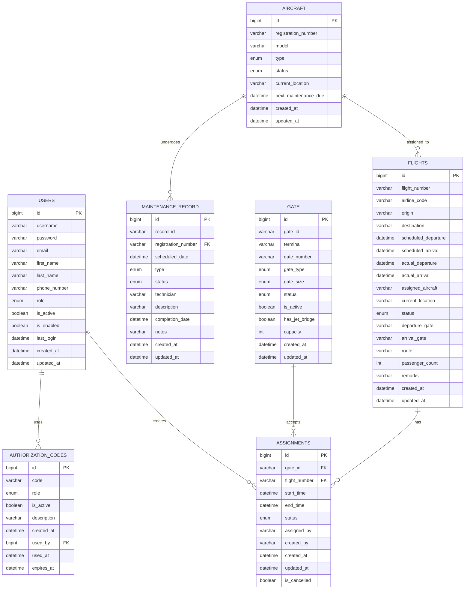
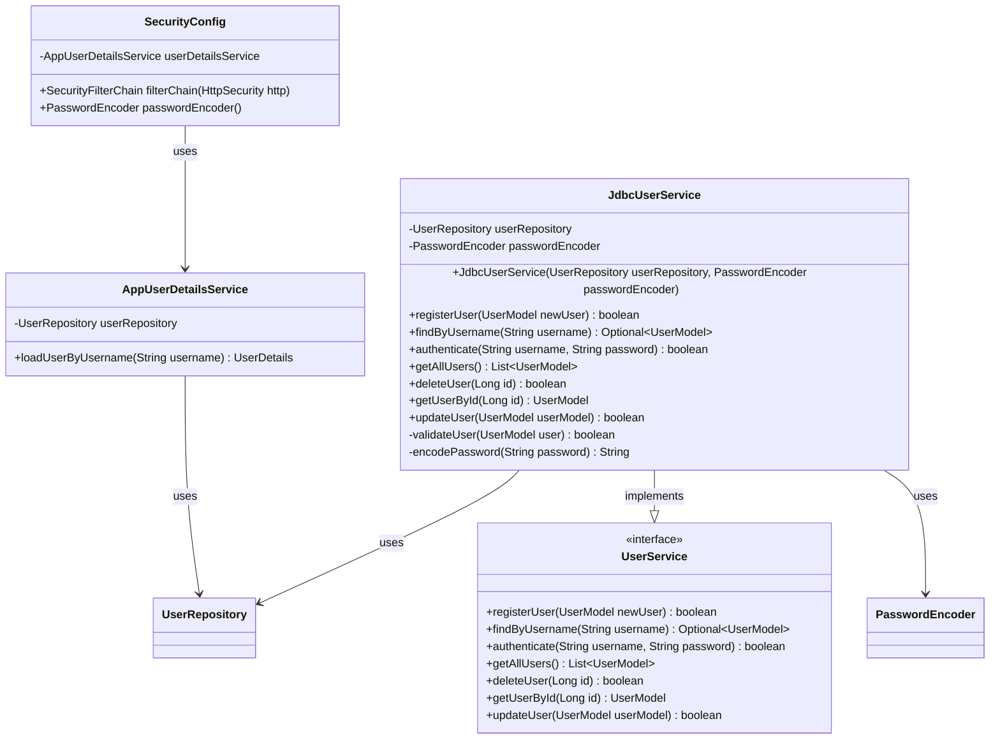
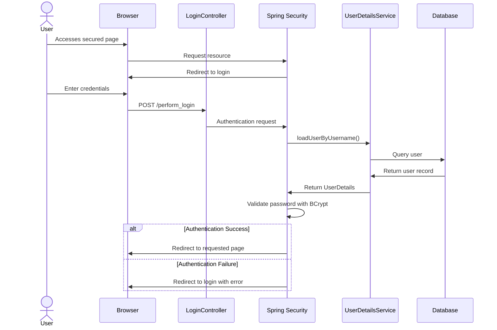
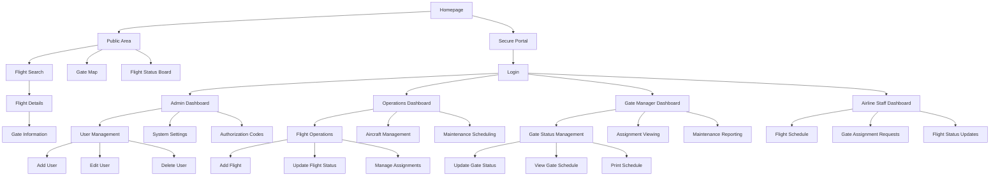

# Airport Gate Management System (AGMS)
## Design Report - Milestone 7
### CST-339: Java Enterprise Application Development

**Date:** April, 06 2025  
**Version:** 7.0  
**Author:** Owen Lindsey  
**Course:** CST-339 - Java Programming III  
**Professor:** Professor Robert Estey

---

## Executive Summary

This milestone represents a significant advancement in our Airport Gate Management System (AGMS) project, focusing on the implementation of Spring Data JDBC for robust data persistence and the integration of OpenAPI documentation. We've successfully transitioned from in-memory data storage to a fully relational database model, enabling reliable data storage, complex queries, and improved system resilience. The application now features a comprehensive data layer with clean separation of concerns, well-defined repositories, and optimized data access patterns. Additionally, we've implemented Spring Security to ensure proper authentication and authorization throughout the application, and enhanced the system with comprehensive API documentation using SpringDoc OpenAPI.

## Project Links
- [GitHub Repository](https://github.com/omniV1/CST-339/tree/main/workspaceCST-339/src/Milestone)

- [Screencast Demo](https://www.youtube.com/watch?v=46uzL9FG6i4)

- [Javadoc](https://github.com/omniV1/CST-339/tree/main/workspaceCST-339/src/Milestone/agms/docs/apidocs)


## Completed Tasks Checklist

### Database Implementation
- ✅ Created comprehensive DDL scripts for all database tables
- ✅ Implemented Spring Data JDBC repositories for all entities
- ✅ Created database connection configuration
- ✅ Set up proper database environment variables
- ✅ Implemented transaction management
- ✅ Added database migration scripts
- ✅ Configured connection pooling for performance

### Data Layer Refactoring
- ✅ Refactored User service to use JDBC repository
- ✅ Implemented Flight and Aircraft repositories
- ✅ Created Gate and Assignment repositories
- ✅ Added MaintenanceRecord repository
- ✅ Implemented AuthorizationCode repository
- ✅ Created comprehensive RowMapper implementations
- ✅ Added proper error handling for data operations

### Service Layer Enhancement
- ✅ Updated all services to use repository interfaces
- ✅ Implemented proper transaction boundaries
- ✅ Added caching for frequently accessed data
- ✅ Improved error handling and validation
- ✅ Enhanced security with database-backed authentication
- ✅ Created data-driven authorization
- ✅ Implemented audit logging for data changes
- ✅ Added comprehensive OpenAPI documentation for all endpoints
- ✅ Integrated Swagger UI for API exploration and testing

### Security Implementation
- ✅ Refactored login module to use Spring Security
- ✅ Implemented database-backed authentication
- ✅ Added role-based access control
- ✅ Secured all pages except login and registration
- ✅ Created custom UserDetailsService for database integration
- ✅ Implemented password encryption with BCrypt
- ✅ Added CSRF protection for all forms and AJAX requests
- ✅ Configured secure session management

### Business Logic Improvements
- ✅ Enhanced assignment conflict detection
- ✅ Improved maintenance scheduling
- ✅ Added comprehensive flight status management
- ✅ Created robust gate compatibility checking
- ✅ Implemented real-time schedule updates
- ✅ Added operational statistics calculation
- ✅ Enhanced dashboard data aggregation

### DevOps & Quality
- ✅ Updated Docker configuration for database
- ✅ Added database migration tools
- ✅ Created database backup procedures
- ✅ Implemented data integrity testing
- ✅ Enhanced integration testing for data layer
- ✅ Added performance monitoring for database operations
- ✅ Created database documentation


### API Documentation Implementation
- ✅ Configured SpringDoc OpenAPI integration
- ✅ Added detailed API documentation for all controllers
- ✅ Implemented proper response documentation
- ✅ Added security scheme documentation
- ✅ Created comprehensive parameter descriptions
- ✅ Added example request/response documentation
- ✅ Integrated Swagger UI for interactive API testing

## Planning Documentation

### Task Schedule & Timeline

| Task | Status | Start Date | Completion Date | Owner |
|------|--------|------------|-----------------|-------|
| Database schema design | Completed | Feb 24, 2025 | Feb 26, 2025 | Owen Lindsey |
| Database configuration | Completed | Feb 27, 2025 | Feb 28, 2025 | Owen Lindsey |
| User repository implementation | Completed | Feb 28, 2025 | Mar 1, 2025 | Owen Lindsey |
| Flight repository implementation | Completed | Mar 1, 2025 | Mar 2, 2025 | Owen Lindsey |
| Gate repository implementation | Completed | Mar 2, 2025 | Mar 3, 2025 | Owen Lindsey |
| Assignment repository implementation | Completed | Mar 3, 2025 | Mar 4, 2025 | Owen Lindsey |
| Maintenance repository implementation | Completed | Mar 4, 2025 | Mar 5, 2025 | Owen Lindsey |
| Authorization repository implementation | Completed | Mar 5, 2025 | Mar 6, 2025 | Owen Lindsey |
| Spring Security implementation | Completed | March 30, 2025 | April 1, 2025 | Owen Lindsey |
| Database authentication integration | Completed | March 30, 2025 | April 1, 2025 | Owen Lindsey |
| Page security configuration | Completed | March 30, 2025 | April 1, 2025 | Owen Lindsey |
| CSRF protection implementation | Completed |March 31, 2025| April 2, 2025 | Owen Lindsey |
| Service layer refactoring | Completed | March 31, 2025 | April 2, 2025 | Owen Lindsey |
| Integration testing | Completed | March 31, 2025 | April 3, 2025 | Owen Lindsey |
| Documentation updates | Completed | April 02, 2025 | April 3, 2025 | Owen Lindsey |

## Design Documentation

### General Technical Approach

For Milestone 7, our technical approach built upon the robust data persistence foundation established in Milestone 5, extending our system with advanced features, optimizations, and comprehensive API documentation. Our continued use of Spring Data JDBC offers several advantages over both pure JDBC and JPA/Hibernate, while our integration of SpringDoc OpenAPI provides clear and interactive documentation for all API endpoints.

Key technical decisions and implementations include:

1. **API Documentation Strategy**
   - Integrated SpringDoc OpenAPI for automated API documentation
   - Added detailed annotations for all controller endpoints
   - Implemented security scheme documentation
   - Created comprehensive parameter and response documentation
   - Added example request/response documentation
   - Integrated Swagger UI for interactive API testing

2. **Controller Documentation**
   - Added `@Tag` annotations for logical grouping of endpoints
   - Implemented `@Operation` descriptions for each endpoint
   - Added `@Parameter` documentation for all method parameters
   - Created `@ApiResponse` documentation for possible responses
   - Integrated `@SecurityRequirement` annotations for authentication

3. **OpenAPI Configuration**
   ```java
   @Configuration
   public class OpenApiConfig {
       @Bean
       public OpenAPI openAPI() {
           return new OpenAPI()
                   .info(new Info()
                           .title("AGMS API Documentation")
                           .description("API documentation for the AGMS (Application Management System)")
                           .version("v1.0.0")
                           .contact(new Contact()
                                   .name("GCU")
                                   .email("support@gcu.edu")
                                   .url("https://www.gcu.edu"))
                           .license(new License()
                                   .name("Apache 2.0")
                                   .url("https://www.apache.org/licenses/LICENSE-2.0")));
       }
   }
   ```

4. **Controller Documentation Example**
   ```java
   @Controller
   @RequestMapping("/operations")
   @Tag(name = "Flight Operations", description = "Endpoints for managing flight operations, aircraft, and gate assignments")
   @SecurityRequirement(name = "bearerAuth")
   public class FlightOperationsController {
       @Operation(
           summary = "Create new flight",
           description = "Creates a new flight in the system with the provided details"
       )
       @ApiResponses({
           @ApiResponse(responseCode = "200", description = "Flight created successfully"),
           @ApiResponse(responseCode = "400", description = "Invalid flight data"),
           @ApiResponse(responseCode = "403", description = "Access denied - Insufficient permissions")
       })
       @PostMapping("/flights/create")
       @ResponseBody
       public ResponseEntity<Map<String, Object>> createFlight(
               @Parameter(description = "Flight details", required = true)
               @RequestBody @Valid FlightModel flight) {
           // Implementation
       }
   }
   ```

## API Documentation

### OpenAPI Integration

The integration of SpringDoc OpenAPI has significantly enhanced our API documentation and testing capabilities. This section details the implementation and features of our API documentation system.

### API Documentation Implementation
- ✅ Configured SpringDoc OpenAPI integration
- ✅ Added detailed API documentation for all controllers
- ✅ Implemented proper response documentation
- ✅ Added security scheme documentation
- ✅ Created comprehensive parameter descriptions
- ✅ Added example request/response documentation
- ✅ Integrated Swagger UI for interactive API testing

### Controller Documentation Examples

#### Flight Operations Controller
```java
@Controller
@RequestMapping("/operations")
@Tag(name = "Flight Operations", description = "Endpoints for managing flight operations, aircraft, and gate assignments")
@SecurityRequirement(name = "bearerAuth")
public class FlightOperationsController {
    @Operation(
        summary = "Create new flight",
        description = "Creates a new flight in the system with the provided details"
    )
    @ApiResponses({
        @ApiResponse(responseCode = "200", description = "Flight created successfully"),
        @ApiResponse(responseCode = "400", description = "Invalid flight data"),
        @ApiResponse(responseCode = "403", description = "Access denied - Insufficient permissions")
    })
    @PostMapping("/flights/create")
    @ResponseBody
    public ResponseEntity<Map<String, Object>> createFlight(
            @Parameter(description = "Flight details", required = true)
            @RequestBody @Valid FlightModel flight) {
        // Implementation
    }
}
```

#### Gate Dashboard Controller
```java
@Controller
@RequestMapping("/gates")
@Tag(name = "Gate Management", description = "Endpoints for managing gate operations and assignments")
@SecurityRequirement(name = "bearerAuth")
public class GateDashboardController {
    @Operation(
        summary = "Get gate details",
        description = "Retrieves detailed information about a specific gate"
    )
    @ApiResponses({
        @ApiResponse(responseCode = "200", description = "Gate details retrieved successfully"),
        @ApiResponse(responseCode = "404", description = "Gate not found"),
        @ApiResponse(responseCode = "403", description = "Access denied")
    })
    @GetMapping("/{gateId}")
    @ResponseBody
    public ResponseEntity<GateModel> getGateDetails(
            @Parameter(description = "Gate identifier", required = true)
            @PathVariable String gateId) {
        // Implementation
    }
}
```

#### Airline Dashboard Controller
```java
@Controller
@RequestMapping("/airline")
@Tag(name = "Airline Operations", description = "Endpoints for airline staff to manage flight operations")
@SecurityRequirement(name = "bearerAuth")
public class AirlineDashboardController {
    @Operation(
        summary = "Submit gate change request",
        description = "Allows airline staff to submit a request for gate reassignment"
    )
    @ApiResponses({
        @ApiResponse(responseCode = "200", description = "Request submitted successfully"),
        @ApiResponse(responseCode = "400", description = "Invalid request data"),
        @ApiResponse(responseCode = "403", description = "Access denied")
    })
    @PostMapping("/gate-change-request")
    @ResponseBody
    public ResponseEntity<Map<String, Object>> submitGateChangeRequest(
            @Parameter(description = "Gate change request details", required = true)
            @RequestBody @Valid GateChangeRequestModel request) {
        // Implementation
    }
}
```

### OpenAPI Configuration
```java
@Configuration
public class OpenApiConfig {
    @Bean
    public OpenAPI openAPI() {
        return new OpenAPI()
                .info(new Info()
                        .title("AGMS API Documentation")
                        .description("API documentation for the Airport Gate Management System")
                        .version("v1.0.0")
                        .contact(new Contact()
                                .name("GCU")
                                .email("support@gcu.edu")
                                .url("https://www.gcu.edu"))
                        .license(new License()
                                .name("Apache 2.0")
                                .url("https://www.apache.org/licenses/LICENSE-2.0")))
                .addSecurityItem(new SecurityRequirement().addList("bearerAuth"))
                .components(new Components()
                        .addSecuritySchemes("bearerAuth",
                                new SecurityScheme()
                                        .type(SecurityScheme.Type.HTTP)
                                        .scheme("bearer")
                                        .bearerFormat("JWT")));
    }
}
```

### API Documentation Benefits

The integration of OpenAPI documentation provides several key benefits:

1. **Interactive Documentation**: Swagger UI provides an interactive interface for exploring and testing APIs.
2. **Standardized Documentation**: OpenAPI specifications ensure consistent documentation across all endpoints.
3. **Security Documentation**: Clear documentation of authentication and authorization requirements.
4. **Developer Experience**: Improved onboarding and integration experience for developers.
5. **API Testing**: Built-in testing capabilities through Swagger UI.
6. **Code-First Approach**: Documentation is generated from code annotations, ensuring accuracy.

### API Documentation Access

The API documentation can be accessed at the following endpoints:

- OpenAPI Documentation: `/v3/api-docs`
- Swagger UI: `/swagger-ui.html`


#### Risks

| Risk | Severity | Likelihood | Mitigation |
|------|----------|------------|------------|
| Database performance under load | Medium | Medium | Implement monitoring and tuning plan |
| Connection leaks | High | Low | Add connection validation and leak detection |
| SQL injection vulnerabilities | High | Low | Use parameterized queries and validate inputs |
| Data integrity issues | High | Low | Add constraints and validation at both DB and application layers |
| Schema evolution complexity | Medium | Medium | Implement Flyway or Liquibase for migrations |
| Session fixation attacks | High | Low | Implement session management best practices |
| Brute force login attempts | Medium | Medium | Add login attempt throttling and monitoring |

### Diagrams

#### Entity-Relationship Diagram



#### Database Schema (DDL Scripts)

Below are the key DDL scripts for our database tables:

**users Table**
```sql
CREATE TABLE users (
    id BIGINT AUTO_INCREMENT PRIMARY KEY,
    username VARCHAR(32) NOT NULL UNIQUE,
    password VARCHAR(255) NOT NULL,
    email VARCHAR(100) NOT NULL,
    first_name VARCHAR(50) NOT NULL,
    last_name VARCHAR(50) NOT NULL,
    phone_number VARCHAR(20) NOT NULL,
    role VARCHAR(20) NOT NULL,
    is_active BOOLEAN DEFAULT TRUE,
    is_enabled BOOLEAN DEFAULT TRUE,
    last_login DATETIME,
    created_at DATETIME NOT NULL,
    updated_at DATETIME NOT NULL,
    INDEX idx_users_username (username),
    INDEX idx_users_email (email),
    INDEX idx_users_role (role)
);
```

**aircraft Table**
```sql
CREATE TABLE aircraft (
    id BIGINT AUTO_INCREMENT PRIMARY KEY,
    registration_number VARCHAR(20) NOT NULL UNIQUE,
    model VARCHAR(50) NOT NULL,
    type VARCHAR(20) NOT NULL,
    status VARCHAR(20) NOT NULL,
    current_location VARCHAR(50),
    next_maintenance_due DATETIME,
    created_at DATETIME NOT NULL,
    updated_at DATETIME NOT NULL,
    INDEX idx_aircraft_registration (registration_number),
    INDEX idx_aircraft_status (status)
);
```

**flight Table**
```sql
CREATE TABLE flight (
    id BIGINT AUTO_INCREMENT PRIMARY KEY,
    flight_number VARCHAR(10) NOT NULL,
    airline_code VARCHAR(3) NOT NULL,
    origin VARCHAR(5) NOT NULL,
    destination VARCHAR(5) NOT NULL,
    scheduled_departure DATETIME NOT NULL,
    scheduled_arrival DATETIME NOT NULL,
    actual_departure DATETIME,
    actual_arrival DATETIME,
    assigned_aircraft VARCHAR(20),
    current_location VARCHAR(50),
    status VARCHAR(20) NOT NULL,
    departure_gate VARCHAR(10),
    arrival_gate VARCHAR(10),
    route VARCHAR(255),
    passenger_count INT,
    remarks VARCHAR(255),
    created_at DATETIME NOT NULL,
    updated_at DATETIME NOT NULL,
    INDEX idx_flight_number (flight_number),
    INDEX idx_flight_status (status),
    INDEX idx_flight_schedule (scheduled_departure, scheduled_arrival),
    INDEX idx_flight_aircraft (assigned_aircraft),
    CONSTRAINT fk_flight_aircraft FOREIGN KEY (assigned_aircraft) 
        REFERENCES aircraft(registration_number) ON DELETE SET NULL
);
```

**gate Table**
```sql
CREATE TABLE gate (
    id BIGINT AUTO_INCREMENT PRIMARY KEY,
    gate_id VARCHAR(10) NOT NULL UNIQUE,
    terminal VARCHAR(5) NOT NULL,
    gate_number VARCHAR(5) NOT NULL,
    gate_type VARCHAR(20) NOT NULL,
    gate_size VARCHAR(20) NOT NULL,
    status VARCHAR(20) NOT NULL,
    is_active BOOLEAN DEFAULT TRUE,
    has_jet_bridge BOOLEAN DEFAULT TRUE,
    capacity INT NOT NULL,
    created_at DATETIME NOT NULL,
    updated_at DATETIME NOT NULL,
    INDEX idx_gate_id (gate_id),
    INDEX idx_gate_terminal (terminal),
    INDEX idx_gate_status (status)
);
```

**assignment Table**
```sql
CREATE TABLE assignment (
    id BIGINT AUTO_INCREMENT PRIMARY KEY,
    gate_id VARCHAR(10) NOT NULL,
    flight_number VARCHAR(10) NOT NULL,
    start_time DATETIME NOT NULL,
    end_time DATETIME NOT NULL,
    status VARCHAR(20) NOT NULL,
    assigned_by VARCHAR(32) NOT NULL,
    created_by VARCHAR(32),
    created_at DATETIME NOT NULL,
    updated_at DATETIME NOT NULL,
    is_cancelled BOOLEAN DEFAULT FALSE,
    INDEX idx_assignment_gate (gate_id),
    INDEX idx_assignment_flight (flight_number),
    INDEX idx_assignment_time (start_time, end_time),
    INDEX idx_assignment_status (status),
    CONSTRAINT fk_assignment_gate FOREIGN KEY (gate_id) 
        REFERENCES gate(gate_id) ON DELETE CASCADE,
    CONSTRAINT fk_assignment_flight FOREIGN KEY (flight_number) 
        REFERENCES flight(flight_number) ON DELETE CASCADE
);
```

**maintenance_record Table**
```sql
CREATE TABLE maintenance_record (
    id BIGINT AUTO_INCREMENT PRIMARY KEY,
    record_id VARCHAR(36) NOT NULL UNIQUE,
    registration_number VARCHAR(20) NOT NULL,
    scheduled_date DATETIME NOT NULL,
    type VARCHAR(20) NOT NULL,
    status VARCHAR(20) NOT NULL,
    technician VARCHAR(50),
    description VARCHAR(255) NOT NULL,
    completion_date DATETIME,
    notes TEXT,
    created_at DATETIME NOT NULL,
    updated_at DATETIME NOT NULL,
    INDEX idx_maintenance_record_id (record_id),
    INDEX idx_maintenance_aircraft (registration_number),
    INDEX idx_maintenance_status (status),
    INDEX idx_maintenance_date (scheduled_date),
    CONSTRAINT fk_maintenance_aircraft FOREIGN KEY (registration_number) 
        REFERENCES aircraft(registration_number) ON DELETE CASCADE
);
```

**authorization_codes Table**
```sql
CREATE TABLE authorization_codes (
    id BIGINT AUTO_INCREMENT PRIMARY KEY,
    code VARCHAR(8) NOT NULL UNIQUE,
    role VARCHAR(20) NOT NULL,
    is_active BOOLEAN DEFAULT TRUE,
    description VARCHAR(255),
    created_at DATETIME NOT NULL,
    used_by BIGINT,
    used_at DATETIME,
    expires_at DATETIME,
    INDEX idx_auth_code (code),
    INDEX idx_auth_role (role),
    INDEX idx_auth_active (is_active),
    CONSTRAINT fk_auth_user FOREIGN KEY (used_by) 
        REFERENCES users(id) ON DELETE SET NULL
);
```

#### Class Diagrams

Below are the class diagrams for our key components:

**Repository Interfaces**

```mermaid
classDiagram
    class UserRepository {
        <<interface>>
        +findAll() List~UserModel~
        +findById(Long id) Optional~UserModel~
        +findByUsername(String username) Optional~UserModel~
        +existsByUsername(String username) boolean
        +save(UserModel user) UserModel
        +deleteById(Long id) void
        +updateLastLogin(Long userId, LocalDateTime lastLogin) void
    }
    
    class GateRepository {
        <<interface>>
        +findAll() List~GateModel~
        +findById(Long id) Optional~GateModel~
        +findByGateId(String gateId) Optional~GateModel~
        +findByTerminal(String terminal) List~GateModel~
        +findByStatus(String status) List~GateModel~
        +save(GateModel gate) GateModel
        +deleteById(Long id) void
        +existsByGateId(String gateId) boolean
        +countByStatus(String status) int
        +countAll() int
    }
    
    class FlightRepository {
        <<interface>>
        +findAll() List~FlightModel~
        +findById(Long id) Optional~FlightModel~
        +findByFlightNumber(String flightNumber) Optional~FlightModel~
        +findActiveFlights() List~FlightModel~
        +findByStatus(String status) List~FlightModel~
        +findByOrigin(String origin) List~FlightModel~
        +findByDestination(String destination) List~FlightModel~
        +findByAirlineCode(String airlineCode) List~FlightModel~
        +findByAssignedAircraft(String aircraftRegistration) List~FlightModel~
        +save(FlightModel flight) FlightModel
        +deleteById(Long id) void
        +deleteByFlightNumber(String flightNumber) boolean
        +existsByFlightNumber(String flightNumber) boolean
        +countByStatus(String status) int
        +countByStatusNotIn(List~String~ statuses) int
        +countAll() int
        +countActiveFlights() int
        +countDelayedFlights() int
    }
    
    class AssignmentRepository {
        <<interface>>
        +findAll() List~AssignmentModel~
        +findById(Long id) Optional~AssignmentModel~
        +findByGateId(String gateId) List~AssignmentModel~
        +findByFlightNumber(String flightNumber) List~AssignmentModel~
        +findByStatus(AssignmentStatus status) List~AssignmentModel~
        +findActiveAssignments() List~AssignmentModel~
        +findUpcomingAssignments() List~AssignmentModel~
        +getCurrentAndNextAssignments(String gateId) Map~String, AssignmentModel~
        +save(AssignmentModel assignment) AssignmentModel
        +deleteById(Long id) boolean
        +updateStatus(Long id, AssignmentStatus status) boolean
        +cancelAssignment(Long id) boolean
        +hasConflict(AssignmentModel assignment) boolean
        +countByStatus(AssignmentStatus status) int
        +countByGateId(String gateId) int
        +countAll() int
    }
    
    class AircraftRepository {
        <<interface>>
        +findAll() List~AircraftModel~
        +findById(Long id) Optional~AircraftModel~
        +findByRegistrationNumber(String registrationNumber) Optional~AircraftModel~
        +findByType(AircraftType type) List~AircraftModel~
        +findByStatus(String status) List~AircraftModel~
        +findAvailableAircraft() List~AircraftModel~
        +save(AircraftModel aircraft) AircraftModel
        +deleteById(Long id) void
        +updateStatus(String registrationNumber, String status, String location) boolean
        +updateMaintenanceDate(String registrationNumber, LocalDateTime maintenanceDate) boolean
        +countByStatus(String status) int
        +countAll() int
        +existsByRegistrationNumber(String registrationNumber) boolean
    }
    
    class MaintenanceRecordRepository {
        <<interface>>
        +findAll() List~MaintenanceRecord~
        +findById(Long id) Optional~MaintenanceRecord~
        +findByRecordId(String recordId) Optional~MaintenanceRecord~
        +findByRegistrationNumber(String registrationNumber) List~MaintenanceRecord~
        +findByStatus(String status) List~MaintenanceRecord~
        +findByType(String type) List~MaintenanceRecord~
        +save(MaintenanceRecord record) MaintenanceRecord
        +deleteById(Long id) void
        +deleteByRecordId(String recordId) boolean
        +updateStatus(String recordId, String status) boolean
        +countByStatus(String status) int
        +countAll() int
    }
    
    class AuthorizationCodeRepository {
        <<interface>>
        +findByCode(String code) Optional~AuthorizationCodeModel~
        +findById(Long id) Optional~AuthorizationCodeModel~
        +save(AuthorizationCodeModel code) AuthorizationCodeModel
        +deleteById(Long id) void
        +findAll() List~AuthorizationCodeModel~
        +findActiveCodesByRole(UserRole role) List~AuthorizationCodeModel~
    }
```



**Authentication and Security Classes**



**Repository Implementations**

```mermaid
classDiagram
    JdbcUserRepository --|> UserRepository : implements
    JdbcGateRepository --|> GateRepository : implements
    JdbcFlightRepository --|> FlightRepository : implements
    JdbcAssignmentRepository --|> AssignmentRepository : implements
    JdbcAircraftRepository --|> AircraftRepository : implements
    JdbcMaintenanceRecordRepository --|> MaintenanceRecordRepository : implements
    JdbcAuthorizationCodeRepository --|> AuthorizationCodeRepository : implements
    
    class JdbcUserRepository {
        -JdbcTemplate jdbcTemplate
        +JdbcUserRepository(JdbcTemplate jdbcTemplate)
        +findAll() List~UserModel~
        +findById(Long id) Optional~UserModel~
        +findByUsername(String username) Optional~UserModel~
        +existsByUsername(String username) boolean
        +save(UserModel user) UserModel
        +deleteById(Long id) void
        +updateLastLogin(Long userId, LocalDateTime lastLogin) void
        -insertUser(UserModel user) UserModel
        -updateUser(UserModel user) UserModel
        -UserRowMapper class
    }
    
    class JdbcGateRepository {
        -JdbcTemplate jdbcTemplate
        +JdbcGateRepository(JdbcTemplate jdbcTemplate)
        +findAll() List~GateModel~
        +findById(Long id) Optional~GateModel~
        +findByGateId(String gateId) Optional~GateModel~
        +findByTerminal(String terminal) List~GateModel~
        +findByStatus(String status) List~GateModel~
        +save(GateModel gate) GateModel
        +deleteById(Long id) void
        +existsByGateId(String gateId) boolean
        +countByStatus(String status) int
        +countAll() int
        -insertGate(GateModel gate) GateModel
        -updateGate(GateModel gate) GateModel
        -GateRowMapper class
    }
    
    class JdbcFlightRepository {
        -JdbcTemplate jdbcTemplate
        +JdbcFlightRepository(JdbcTemplate jdbcTemplate)
        +findAll() List~FlightModel~
        +findById(Long id) Optional~FlightModel~
        +findByFlightNumber(String flightNumber) Optional~FlightModel~
        +findActiveFlights() List~FlightModel~
        +findByStatus(String status) List~FlightModel~
        +findByOrigin(String origin) List~FlightModel~
        +findByDestination(String destination) List~FlightModel~
        +findByAirlineCode(String airlineCode) List~FlightModel~
        +findByAssignedAircraft(String aircraftRegistration) List~FlightModel~
        +save(FlightModel flight) FlightModel
        +deleteById(Long id) void
        +deleteByFlightNumber(String flightNumber) boolean
        +existsByFlightNumber(String flightNumber) boolean
        +countByStatus(String status) int
        +countByStatusNotIn(List~String~ statuses) int
        +countAll() int
        +countActiveFlights() int
        +countDelayedFlights() int
        -insertFlight(FlightModel flight) FlightModel
        -updateFlight(FlightModel flight) FlightModel
        -FlightRowMapper class
    }
    
    class JdbcAssignmentRepository {
        -JdbcTemplate jdbcTemplate
        +JdbcAssignmentRepository(JdbcTemplate jdbcTemplate)
        +findAll() List~AssignmentModel~
        +findById(Long id) Optional~AssignmentModel~
        +findByGateId(String gateId) List~AssignmentModel~
        +findByFlightNumber(String flightNumber) List~AssignmentModel~
        +findByStatus(AssignmentStatus status) List~AssignmentModel~
        +findActiveAssignments() List~AssignmentModel~
        +findUpcomingAssignments() List~AssignmentModel~
        +getCurrentAndNextAssignments(String gateId) Map~String, AssignmentModel~
        +save(AssignmentModel assignment) AssignmentModel
        +deleteById(Long id) boolean
        +updateStatus(Long id, AssignmentStatus status) boolean
        +cancelAssignment(Long id) boolean
        +hasConflict(AssignmentModel assignment) boolean
        +countByStatus(AssignmentStatus status) int
        +countByGateId(String gateId) int
        +countAll() int
        -insertAssignment(AssignmentModel assignment) AssignmentModel
        -updateAssignment(AssignmentModel assignment) AssignmentModel
        -AssignmentRowMapper class
    }
```



**Service Layer**

```mermaid
classDiagram
    class UserService {
        <<interface>>
        +registerUser(UserModel newUser) boolean
        +findByUsername(String username) Optional~UserModel~
        +authenticate(String username, String password) boolean
        +getAllUsers() List~UserModel~
        +deleteUser(Long id) boolean
        +getUserById(Long id) UserModel
        +updateUser(UserModel userModel) boolean
    }
    
    class JdbcUserService {
        -UserRepository userRepository
        +JdbcUserService(UserRepository userRepository)
        +registerUser(UserModel newUser) boolean
        +findByUsername(String username) Optional~UserModel~
        +authenticate(String username, String password) boolean
        +getAllUsers() List~UserModel~
        +deleteUser(Long id) boolean
        +getUserById(Long id) UserModel
        +updateUser(UserModel userModel) boolean
        -validateUser(UserModel user) boolean
    }
    
    JdbcUserService --|> UserService : implements
    
    class FlightOperationsService {
        <<interface>>
        +registerAircraft(AircraftModel aircraft) boolean
        +getAircraft(String registrationNumber) Optional~AircraftModel~
        +getAllAircraft() List~AircraftModel~
        +updateAircraftStatus(String registrationNumber, AircraftModel.AircraftStatus newStatus, String location) boolean
        +scheduleMaintenance(String registrationNumber, LocalDateTime maintenanceDate, String maintenanceType, String description) boolean
        +getMaintenanceRecords(String registrationNumber) List~MaintenanceRecord~
        +getAvailableAircraft() List~AircraftModel~
        +createFlight(FlightModel flight) boolean
        +createFlights(List~FlightModel~ flights) boolean
        +updateFlight(FlightModel flight) boolean
        +updateFlightStatuses(List~String~ flightNumbers, String status, String reason) boolean
        +getFlightDetails(String flightNumber) Map~String, Object~
        +getActiveFlights() List~Map~String, Object~~
        +searchFlights(String origin, String destination, String airline) List~FlightModel~
        +getOperationalStatistics() Map~String, Integer~
        +updateFlightStatus(String flightNumber, String status, String location) boolean
        +deleteFlight(String flightNumber) boolean
    }
    
    class JdbcFlightOperationsService {
        -FlightRepository flightRepository
        -AircraftRepository aircraftRepository
        -MaintenanceRecordService maintenanceRecordService
        +JdbcFlightOperationsService(FlightRepository flightRepository, AircraftRepository aircraftRepository, MaintenanceRecordService maintenanceRecordService)
        +registerAircraft(AircraftModel aircraft) boolean
        +getAircraft(String registrationNumber) Optional~AircraftModel~
        +getAllAircraft() List~AircraftModel~
        +updateAircraftStatus(String registrationNumber, AircraftModel.AircraftStatus newStatus, String location) boolean
        +scheduleMaintenance(String registrationNumber, LocalDateTime maintenanceDate, String maintenanceType, String description) boolean
        +getMaintenanceRecords(String registrationNumber) List~MaintenanceRecord~
        +getAvailableAircraft() List~AircraftModel~
        +createFlight(FlightModel flight) boolean
        +createFlights(List~FlightModel~ flights) boolean
        +updateFlight(FlightModel flight) boolean
        +updateFlightStatuses(List~String~ flightNumbers, String status, String reason) boolean
        +getFlightDetails(String flightNumber) Map~String, Object~
        +getActiveFlights() List~Map~String, Object~~
        +searchFlights(String origin, String destination, String airline) List~FlightModel~
        +getOperationalStatistics() Map~String, Integer~
        +updateFlightStatus(String flightNumber, String status, String location) boolean
        +deleteFlight(String flightNumber) boolean
        -validateFlight(FlightModel flight) boolean
    }
    
    JdbcFlightOperationsService --|> FlightOperationsService : implements
    
    class MaintenanceRecordService {
        <<interface>>
        +createMaintenanceRecord(MaintenanceRecord record) MaintenanceRecord
        +getMaintenanceRecord(String recordId) Optional~MaintenanceRecord~
        +getAllMaintenanceRecords() List~MaintenanceRecord~
        +getMaintenanceRecordsByAircraft(String registrationNumber) List~MaintenanceRecord~
        +updateMaintenanceRecord(MaintenanceRecord record) MaintenanceRecord
        +updateMaintenanceStatus(String recordId, MaintenanceRecord.MaintenanceStatus status) boolean
        +completeMaintenanceRecord(String recordId, LocalDateTime completionDate, String notes) boolean
        +deleteMaintenanceRecord(String recordId) boolean
    }
    
    class JdbcMaintenanceRecordService {
        -MaintenanceRecordRepository maintenanceRecordRepository
        +JdbcMaintenanceRecordService(MaintenanceRecordRepository maintenanceRecordRepository)
        +createMaintenanceRecord(MaintenanceRecord record) MaintenanceRecord
        +getMaintenanceRecord(String recordId) Optional~MaintenanceRecord~
        +getAllMaintenanceRecords() List~MaintenanceRecord~
        +getMaintenanceRecordsByAircraft(String registrationNumber) List~MaintenanceRecord~
        +updateMaintenanceRecord(MaintenanceRecord record) MaintenanceRecord
        +updateMaintenanceStatus(String recordId, MaintenanceRecord.MaintenanceStatus status) boolean
        +completeMaintenanceRecord(String recordId, LocalDateTime completionDate, String notes) boolean
        +deleteMaintenanceRecord(String recordId) boolean
    }
    
    JdbcMaintenanceRecordService --|> MaintenanceRecordService : implements
    
    class AssignmentService {
        <<interface>>
        +createAssignment(AssignmentModel assignment) boolean
        +getAssignmentsForGate(String gateId) List~AssignmentModel~
        +getCurrentAndNextAssignments(String gateId) Map~String, AssignmentModel~
        +updateAssignment(String gateId, Long assignmentId, AssignmentModel updated) boolean
        +deleteAssignment(String gateId, Long assignmentId) boolean
        +updateAssignmentField(String gateId, Long assignmentId, Consumer~AssignmentModel~ updater) boolean
        +getCurrentAssignments() Map~String, AssignmentModel~
        +getCurrentAssignment(String gateId) Optional~AssignmentModel~
        +isCurrentAssignment(AssignmentModel assignment) boolean
        +hasConflict(AssignmentModel assignment) boolean
    }
    
    class JdbcAssignmentService {
        -AssignmentRepository assignmentRepository
        +JdbcAssignmentService(AssignmentRepository assignmentRepository)
        +createAssignment(AssignmentModel assignment) boolean
        +getAssignmentsForGate(String gateId) List~AssignmentModel~
        +getCurrentAndNextAssignments(String gateId) Map~String, AssignmentModel~
        +updateAssignment(String gateId, Long assignmentId, AssignmentModel updated) boolean
        +deleteAssignment(String gateId, Long assignmentId) boolean
        +updateAssignmentField(String gateId, Long assignmentId, Consumer~AssignmentModel~ updater) boolean
        +getCurrentAssignments() Map~String, AssignmentModel~
        +getCurrentAssignment(String gateId) Optional~AssignmentModel~
        +isCurrentAssignment(AssignmentModel assignment) boolean
        +hasConflict(AssignmentModel assignment) boolean
    }
    
    JdbcAssignmentService --|> AssignmentService : implements
    
    class GateManagementService {
        <<interface>>
        +createGate(GateModel gate) boolean
        +getGateById(String gateId) Optional~GateModel~
        +getAllGates() List~GateModel~
        +updateGate(String gateId, GateModel gate) boolean
        +deleteGate(String gateId) boolean
        +getGatesByTerminal(String terminal) List~GateModel~
    }
    
    class JdbcGateManagementService {
        -GateRepository gateRepository
        +JdbcGateManagementService(GateRepository gateRepository)
        +createGate(GateModel gate) boolean
        +getGateById(String gateId) Optional~GateModel~
        +getAllGates() List~GateModel~
        +updateGate(String gateId, GateModel gate) boolean
        +deleteGate(String gateId) boolean
        +getGatesByTerminal(String terminal) List~GateModel~
        -validateGate(GateModel gate) boolean
        -updateGateFields(GateModel existingGate, GateModel newGate) void
    }
    
    JdbcGateManagementService --|> GateManagementService : implements
```




**Domain Model Classes (continued)**

```mermaid
classDiagram
        -String authCode
        -boolean enabled
        +getId() Long
        +getUsername() String
        +setUsername(String username) void
        +getEmail() String
        +setEmail(String email) void
        +getRole() UserRole
        +setRole(UserRole role) void
        +isActive() Boolean
        +setActive(Boolean active) void
    }
    
    class FlightModel {
        -Long id
        -String flightNumber
        -String airlineCode
        -String origin
        -String destination
        -LocalDateTime scheduledDeparture
        -LocalDateTime scheduledArrival
        -LocalDateTime actualDeparture
        -LocalDateTime actualArrival
        -String assignedAircraft
        -String currentLocation
        -FlightStatus status
        -String departureGate
        -String arrivalGate
        -String route
        -int passengerCount
        -String remarks
        +isActive() boolean
        +isDelayed() boolean
        +getFlightIdentifier() String
        +getScheduledDuration() long
    }
    
    class GateModel {
        -Long id
        -String gateId
        -String terminal
        -String gateNumber
        -GateType gateType
        -GateSize gateSize
        -GateStatus status
        -Boolean isActive
        -boolean hasJetBridge
        -List~GateFeature~ features
        -int capacity
        -LocalDateTime createdAt
        -LocalDateTime updatedAt
        +isCompatibleWith(AircraftType aircraftType) boolean
    }
    
    class AssignmentModel {
        -Long id
        -String gateId
        -String flightNumber
        -LocalDateTime startTime
        -LocalDateTime endTime
        -AssignmentStatus status
        -String assignedBy
        -LocalDateTime createdAt
        -String createdBy
        -LocalDateTime updatedAt
        -boolean cancelled
        +hasConflict(AssignmentModel other) boolean
        +isActive() boolean
        +isCancelled() boolean
        +updateStatus(AssignmentStatus newStatus) void
        +initializeTimestamps() void
    }
    
    class AircraftModel {
        -Long id
        -String registrationNumber
        -String model
        -AircraftType type
        -AircraftStatus status
        -String currentLocation
        -LocalDateTime nextMaintenanceDue
        +isAvailableForService() boolean
    }
    
    class MaintenanceRecord {
        -String recordId
        -String registrationNumber
        -LocalDateTime scheduledDate
        -MaintenanceType type
        -MaintenanceStatus status
        -String technician
        -String description
        -LocalDateTime completionDate
        -String notes
    }
    
    class AuthorizationCodeModel {
        -Long id
        -String code
        -UserRole role
        -Boolean isActive
        -String description
        -LocalDateTime createdAt
        -Long usedBy
        -LocalDateTime usedAt
        -LocalDateTime expiresAt
        +isValid() boolean
    }
    
    %% Enumerations
    class UserRole {
        <<enumeration>>
        PUBLIC
        AIRLINE_STAFF
        GATE_MANAGER
        OPERATIONS_MANAGER
        ADMIN
    }
    
    class FlightStatus {
        <<enumeration>>
        SCHEDULED
        BOARDING
        DEPARTED
        EN_ROUTE
        APPROACHING
        LANDED
        ARRIVED
        DELAYED
        CANCELLED
        DIVERTED
        COMPLETED
    }
    
    class GateStatus {
        <<enumeration>>
        AVAILABLE
        OCCUPIED
        MAINTENANCE
        CLOSED
        UNKNOWN
    }
    
    class AssignmentStatus {
        <<enumeration>>
        SCHEDULED
        IN_PROGRESS
        ACTIVE
        COMPLETED
        CANCELLED
        DELAYED
    }
    
    class AircraftType {
        <<enumeration>>
        WIDE_BODY
        NARROW_BODY
        REGIONAL_JET
    }
    
    class MaintenanceType {
        <<enumeration>>
        ROUTINE
        INSPECTION
        REPAIR
        OVERHAUL
    }
    
    class MaintenanceStatus {
        <<enumeration>>
        SCHEDULED
        IN_PROGRESS
        COMPLETED
        CANCELLED
    }
```

#### Authentication Flow Diagram



#### Sitemap Diagram



### User Interface Screenshots

#### Login Screen

*The login screen provides secure authentication using Spring Security and database validation.*

#### Admin Dashboard

*The administrative dashboard provides a comprehensive system overview with access to all management functions.*

#### User Management

*The user management interface allows administrators to view, add, edit, and delete system users.*

#### Gate Management Dashboard

*The gate management dashboard shows all gates and their current status with assignment information.*

#### Flight Operations Dashboard

*The operations dashboard displays real-time flight information and controls for flight management.*

#### Airline Staff Dashboard

*The airline staff dashboard shows flight schedules and gate assignments for airline personnel.*

## Conclusion

Milestone 7 represents a significant advancement in our Airport Gate Management System, transitioning from in-memory data structures to a robust database implementation using Spring Data JDBC with enhanced security features using Spring Security. The application now features a complete data persistence layer with clean repository interfaces, effective transaction management, and comprehensive error handling. Additionally, the integration of SpringDoc OpenAPI has significantly improved the system's documentation and API discoverability.

By adopting Spring Data JDBC over JPA/Hibernate, we've achieved a good balance between abstraction and control, gaining the benefits of Spring's infrastructure while maintaining precise control over our database interactions. The integration of Spring Security has significantly improved the application's security posture, ensuring proper authentication and authorization throughout the system. The addition of comprehensive API documentation through OpenAPI enhances the system's maintainability and usability for developers.

The security implementation ensures that:
1. All pages except for login and registration require authentication
2. Users are automatically redirected to the login page when attempting to access secured content
3. Authentication is performed against the database
4. Passwords are securely stored using BCrypt encryption
5. Different user roles have appropriate access to system functions
6. All API endpoints are properly documented with security requirements

Looking ahead to Milestone 7, we'll focus on enhancing the system with MongoDB integration for specific data components that benefit from document storage, particularly for reporting and analytics. This hybrid data approach will provide the best of both relational and document database paradigms, creating a more powerful and flexible system.

## References

1. Spring Framework Documentation: https://docs.spring.io/spring-framework/docs/current/reference/html/
2. Spring Data JDBC Documentation: https://docs.spring.io/spring-data/jdbc/docs/current/reference/html/
3. Spring Security Documentation: https://docs.spring.io/spring-security/reference/
4. SpringDoc OpenAPI Documentation: https://springdoc.org/
5. OpenAPI Specification: https://swagger.io/specification/
6. MySQL 8.0 Reference Manual: https://dev.mysql.com/doc/refman/8.0/en/
7. Maven Documentation: https://maven.apache.org/guides/
8. Docker Documentation: https://docs.docker.com/ 
