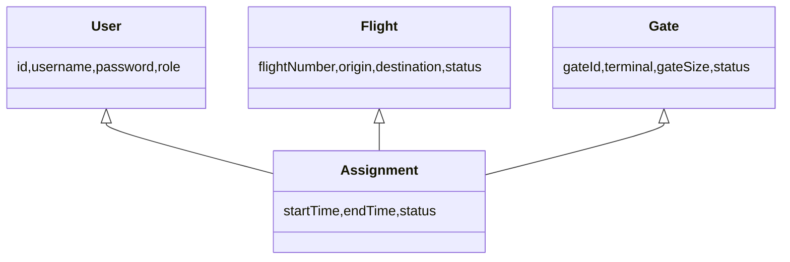
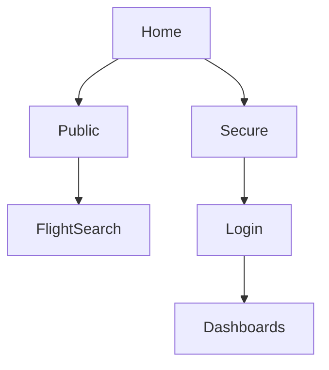

# Airport Gate Management System (AGMS)
## Design Report - Milestone 8
### CST-339: Java Enterprise Application Development

**Date:** April 06, 2025  
**Version:** 7.0  
**Author:** Owen Lindsey  
**Course:** CST-339 - Java Programming III  
**Professor:** Professor Robert Estey


## Project Links

- [GitHub Repository](https://github.com/omniV1/CST-339/tree/main/workspaceCST-339/src/Milestone)

- [Screencast Demo](https://www.youtube.com/watch?v=46uzL9FG6i4)

- [JavaDoc](https://github.com/omniV1/CST-339/tree/main/workspaceCST-339/src/Milestone/agms/docs/apidocs)
---

# Milestone 1 (Version 1.0) — January 11, 2025

## Domain Overview
The Airport Gate Management System (AGMS) addresses inefficiencies in gate utilization and flight operations by providing a real-time, web-based interface for gate assignments, status updates, and notifications.

### User Stories & Requirements
- Public users can search flights and view gate/boarding information.  
- Operations managers need real-time dashboards, conflict detection, and quick gate reassignments.  
- Gate managers schedule maintenance, update gate status, and record special conditions.  
- Airline staff view and request gate changes for their airline's flights.

## Technical Architecture
**Data Model**  
- **User**: id, credentials, role, audit fields  
- **Flight**: id, flight_number, schedule, status, assigned_aircraft  
- **Gate**: id, gate_id, terminal, gate_type/size, capacity, status  
- **Assignment**: id, gate_id, flight_number, time window, status  

**Class Diagram (UML)**  


**User Roles & Permissions**  
| Feature/Action               | Admin | Ops Manager | Gate Manager | Airline Staff | Public |
|------------------------------|:-----:|:-----------:|:------------:|:-------------:|:------:|
| View Public Flight/Gate Info |  ✓    |      ✓      |      ✓       |       ✓       |   ✓    |
| Search Flights               |  ✓    |      ✓      |      ✓       |       ✓       |   ✓    |
| Admin Dashboard              |  ✓    |      ✓      |      ✓       |       ✓       |        |
| Manage Assignments           |  ✓    |      ✓      |              |               |        |
| Manage Gates                 |  ✓    |      ✓      |      ✓       |               |        |
| Manage Flights               |  ✓    |      ✓      |              |       ✓       |        |
| View Audit Logs              |  ✓    |      ✓      |              |               |        |

**Application Sitemap**  


# Milestone 2 (Version 2.0) — January 29, 2025

## Completed Tasks Checklist
- Landing page with role-based navigation  
- Bootstrap 5 & Thymeleaf templates  
- User registration/login with authorization codes  
- Dashboards for Admin, Operations, Gate Manager, Airline Staff  
- Updated class and ER diagrams, installation & user guides

## Technical Infrastructure
- Spring MVC with Thymeleaf & Bootstrap  
- Session management & CSRF protection  

# Milestone 3 (Version 3.0) — February 23, 2025

## Completed Tasks Checklist
- Spring Beans & DI for login/registration  
- In-memory `UserService` & `AuthorizationCodeService`  
- Models: Flight, Gate, Assignment with validation  
- N-Layer architecture & SLF4J logging  
- Docker Compose & SonarQube static analysis

## Business Logic Interfaces
```java
public interface GateCompatibilityService {
    CompatibilityResult verifyCompatibility(Gate gate, AircraftType type);
}
public interface ConflictDetectionService {
    List<Conflict> detectConflicts(Assignment assignment);
}
```

# Milestone 4 (Version 4.0) — March 7, 2025

## Executive Summary
Transitioned from in-memory storage to Spring Data JDBC with MySQL:
- Comprehensive DDL scripts & Flyway migrations  
- `JdbcTemplate` repositories & RowMappers  
- Declarative transactions and HikariCP connection pooling

## Repository Pattern Example
```java
public interface EntityRepository {
    List<Entity> findAll();
    Optional<Entity> findById(Long id);
    Entity save(Entity entity);
    void deleteById(Long id);
}
@Repository
public class JdbcEntityRepository implements EntityRepository {
    private final JdbcTemplate jdbcTemplate;
    // RowMapper nested class...
}
```

## RowMapper Implementation
```java
private static class EntityRowMapper implements RowMapper<Entity> {
    public Entity mapRow(ResultSet rs, int rowNum) throws SQLException {
        Entity e = new Entity();
        e.setId(rs.getLong("id"));
        // ...
        return e;
    }
}
```

## Completed Tasks Checklist
- Database schema & DDL  
- Spring Data JDBC repositories  
- Service layer refactoring with `@Transactional`  
- Caching, error handling, audit logging  
- Integration tests & Docker DB

# Milestone 5 (Version 5.0) — March 23, 2025

## Executive Summary
Enhanced data layer, business logic, and performance:
- Optimized custom queries and caching  
- Real-time schedule updates & conflict checks  
- Operational statistics & dashboard aggregation

## Service Layer Enhancements
- Database-backed authentication and authorization codes  
- Audit logging for data changes  
- Transaction boundaries with rollback on exceptions

## Business Logic Improvements
- Enhanced assignment conflict detection  
- Maintenance scheduling workflows  
- Flight status management (active, delayed)  
- Gate compatibility checking  
- Real-time updates via polling/websocket  
- Operational metrics calculations

## DevOps & Quality
- Dockerized DB migrations & backups  
- Integration & performance tests for data integrity  
- Monitoring with Prometheus/Grafana

# Milestone 6 (Version 6.0) — April 06, 2025

## Executive Summary
Secured the application and documented APIs:
- Spring Security with BCrypt password encoding  
- Role-based access control & CSRF protection  
- SpringDoc OpenAPI integration & Swagger UI

## Security Configuration
```java
@Configuration
public class SecurityConfig {
    @Bean
    public SecurityFilterChain filterChain(HttpSecurity http) throws Exception {
        http.csrf().and().authorizeRequests()...
        return http.build();
    }
    @Bean
    public PasswordEncoder passwordEncoder() {
        return new BCryptPasswordEncoder();
    }
}
```

## OpenAPI Setup
```java
@Configuration
public class OpenApiConfig {
    @Bean
    public OpenAPI api() {
        return new OpenAPI()
            .info(new Info().title("AGMS API").version("v1"))
            .components(new Components()
                .addSecuritySchemes("bearerAuth",
                    new SecurityScheme().type(HTTP).scheme("bearer").bearerFormat("JWT")));
    }
}
```

## Controller Documentation Example
```java
@Controller
@RequestMapping("/operations")
@Tag(name="Flight Operations")
public class FlightOperationsController {
    @Operation(summary="Create new flight")
    @ApiResponses({@ApiResponse(responseCode="200",description="OK")})
    @PostMapping("/flights")
    public ResponseEntity<?> createFlight(@RequestBody FlightModel flight) { ... }
}
```

## Completed Tasks Checklist
- Spring Security & `UserDetailsService`  
- OpenAPI & Swagger UI  
- Endpoint annotations and examples

---

# Consolidated References
1. Spring Framework & Spring Data JDBC Documentation  
2. Spring Security & SpringDoc OpenAPI Documentation  
3. MySQL 8.0 Reference Manual  
4. Maven & Docker Documentation

**End of Milestone 7 Consolidated Design Report** 
