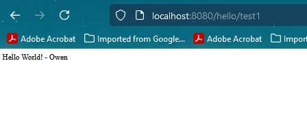
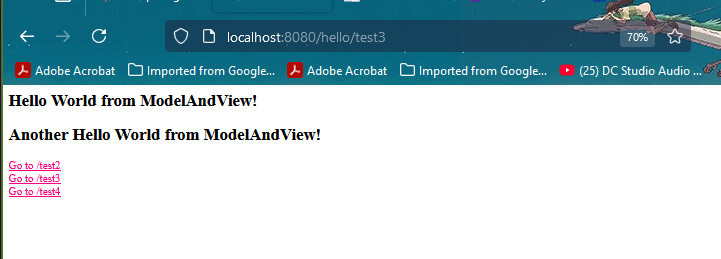
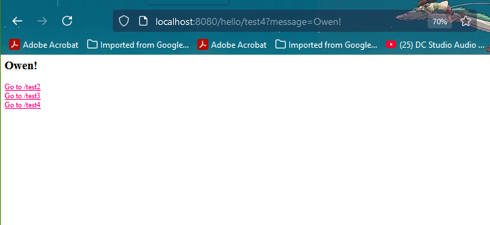
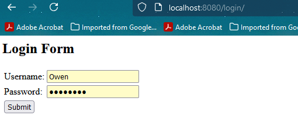
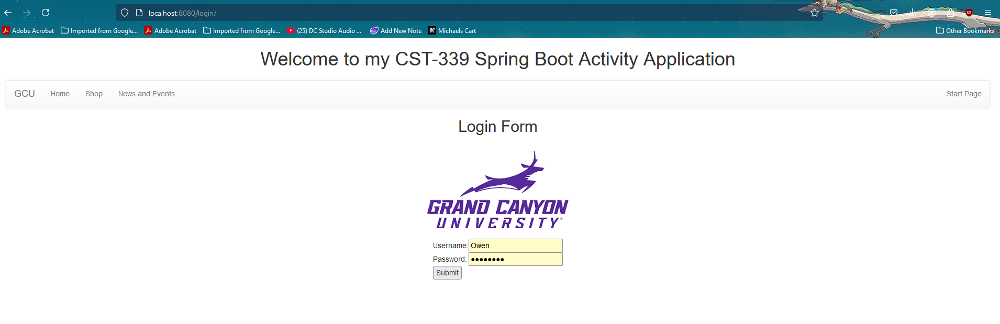
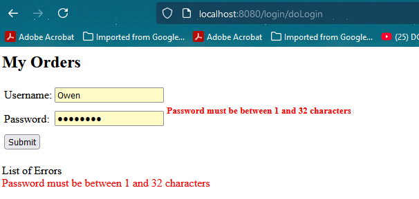
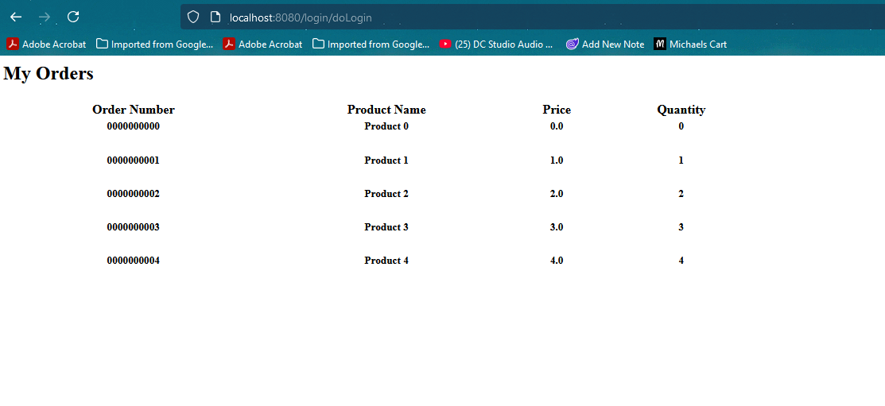
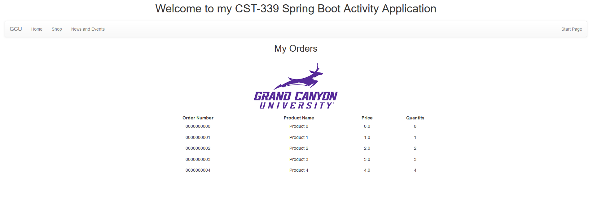
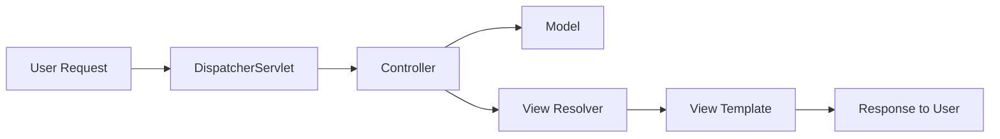

# CST-339 Activity 2 - Spring MVC Implementation

This activity demonstrates the implementation of a Spring MVC web application with various features including model-view-controller architecture, form validation, and template layouts.

## Part 1: Creating Models, Views, and Controllers

Throughout this project, I developed several web pages to demonstrate different ways Spring MVC can handle user requests and display information. Each component serves a specific purpose in showing Spring MVC's capabilities.

### Basic Response Page
My first test page at `/hello/test1` demonstrates the simplest way to send information to a browser. When users visit this page, they see a straightforward greeting: "Hello World! - Owen".

### Template-Based Pages
The second page at `/hello/test2` uses templates to display "Hello Spring MVC Framework! - Owen" and includes navigation links, showing how templates make pages both functional and user-friendly.

The third page at `/hello/test3` displays multiple messages at once, showing both "Hello World from ModelAndView!" and "Another Hello World from ModelAndView!" on the same page.

### Interactive Features
The fourth test page at `/hello/test4` introduces user interaction. When someone adds text to the web address (like localhost:8080/hello/test4?message=Owen!), the page responds by showing that text.

## Part 2: Forms and Data Validation

This section focuses on collecting and validating user information through web forms. The system not only accepts user input but also helps ensure the information is correct and complete.

### Login Form Implementation
The login page presents users with a clean, straightforward form:

After submission, the system processes their input and confirms receipt:

### Validation System
The form helps users enter correct information on their first try. When something needs fixing, users see clear messages explaining what went wrong:

### Orders Management
The orders section organizes transaction information in a structured format, tracking:
- Order numbers for unique identification
- Product details for inventory management
- Pricing for financial tracking
- Quantity for stock control

## Part 3: Page Layouts

### Consistent Design Implementation
Every page shares common design elements that make navigation intuitive and familiar. The layout includes a header with the GCU logo and main menu, with content areas that adapt based on the page's purpose.

Login Page Example:

Orders Page Example:

## Research Questions

### 1. How does Spring MVC support the MVC design pattern?

Spring MVC creates web applications by dividing responsibilities among three main parts that work together seamlessly. Think of it like a busy airport terminal: The Controller is like the air traffic control tower, coordinating all incoming and outgoing traffic and making sure everything gets to where it needs to go. The Model is like the behind-the-scenes operations - baggage handling systems, security protocols, and flight databases - processing information and maintaining the status of every flight and passenger. The View is like the terminal displays and announcement systems that travelers interact with - departure boards, gate information screens, and check-in kiosks that present information in a way that makes sense to passengers.

Information flows through the system like this:

### 2. Alternative MVC Frameworks

Two other popular ways to build web applications are Django and ASP.NET MVC:

Django (Python) approaches web development with more built-in features than Spring MVC. It's like getting a fully furnished house instead of an empty one – Django provides an administrative interface and has stronger opinions about code organization, making projects more consistent but sometimes less flexible.

ASP.NET MVC (Microsoft's approach) is deeply connected with Windows and Visual Studio. It uses its own view system called Razor instead of Thymeleaf and works especially well with other Microsoft tools. While this creates a powerful ecosystem, it might limit deployment options compared to Spring MVC's more adaptable nature.
