# CST-339 Activity 6: Spring Security Implementation Report

| Category     | Details             |
| :----------- | :------------------ |
| **Name:**      | Owen Lindsey        |
| **Instructor:**| Professor Estey     |
| **Date:**      | 04/03/2025          |
| **Course:**    | CST-339             |

---

## Introduction

This report details the implementation of various Spring Security features as part of the CST-339 Activity 6 assignment. The activity involved progressively securing a web application and its REST APIs using different authentication and authorization mechanisms, starting with an in-memory datastore, moving to a database-backed solution, implementing Basic HTTP Authentication for REST APIs, and finally integrating OAuth2 with GitHub.

---

## Part 1: Securing a Web Application Using an In-Memory Datastore

**Objective:** To introduce basic security concepts by securing a web application using Spring Security configured with an in-memory user store.

**Implementation Details:**
In this initial phase, the `spring-boot-starter-security` dependency was added to the project. A `SecurityConfig` class extending `WebSecurityConfigurerAdapter` was created to define security rules. This configuration enabled web security, specified unsecured paths (root, static resources), configured a standard login form (`/login`), and set up logout functionality (`/logout`). Crucially, it utilized `AuthenticationManagerBuilder` to configure an *in-memory authentication* provider with a single hardcoded user (`test`/`test`). The `HomeController`, `LoginController`, and `OrdersController` were adjusted to work within this security context, and the Thymeleaf templates (`home.html`, `login.html`, `common.html`) were updated to use Spring Security tags and actions (`@{/login}`, `@{/logout}`).

**Deliverables:**

| Description                     | Screenshot                                      |
| :------------------------------ | :---------------------------------------------- |
| Orders Page after successful login | 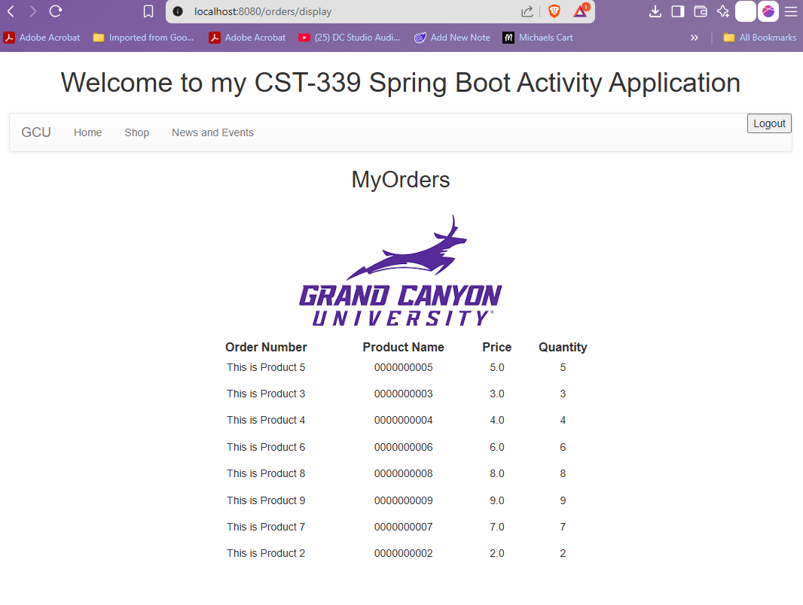 |
| Anonymous REST API `/getjson`   | 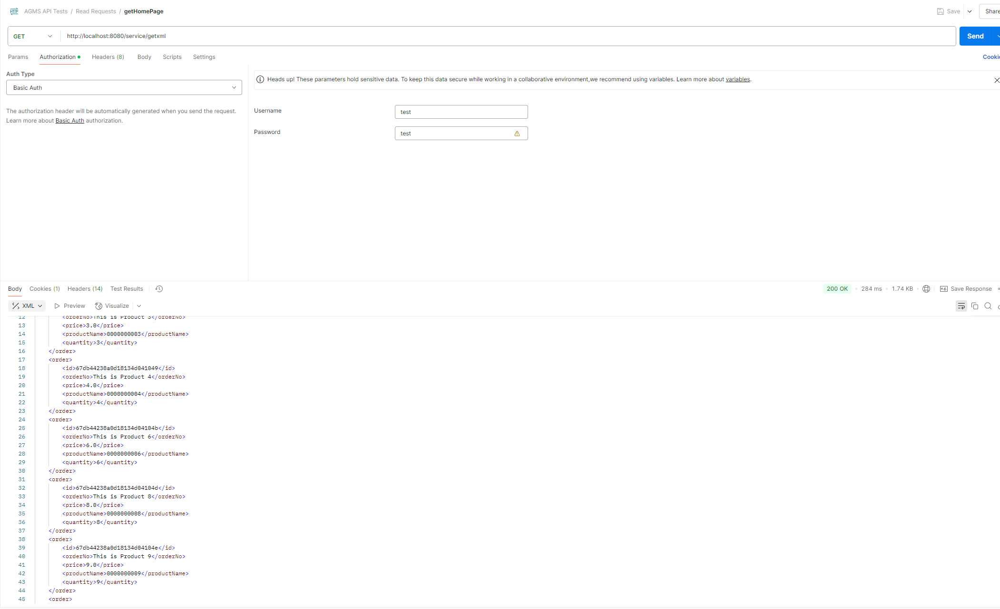  |
| Anonymous REST API `/getxml`    | 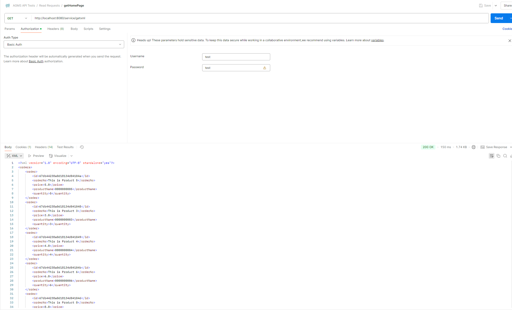    |

---

## Part 2: Securing a Web Application Using a Database

**Objective:** To enhance the security configuration by replacing the in-memory datastore with a persistent user store using MongoDB Atlas.

**Implementation Details:**
This part involved migrating user authentication from the temporary in-memory store to a persistent MongoDB database.
1.  A `users` collection was created in MongoDB Atlas.
2.  A `UserEntity` class was defined to map to the MongoDB documents, along with a `UsersRepository` extending `MongoRepository` for data access.
3.  A `UsersDataService` was implemented to interact with the repository, specifically providing a `findByUsername` method.
4.  A `UserBusinessService` implementing Spring Security's `UserDetailsService` interface was created. This service uses the `UsersDataService` to load user details during the authentication process.
5.  The `SecurityConfig` was updated to use this `UserBusinessService` and a `BCryptPasswordEncoder` for secure password handling, replacing the previous in-memory configuration. Passwords stored in the database were encrypted using `BCryptPasswordEncoder`.

**Deliverables:**

| Description                                       | Screenshot                                      |
| :------------------------------------------------ | :---------------------------------------------- |
| Orders Page after login with database credentials | 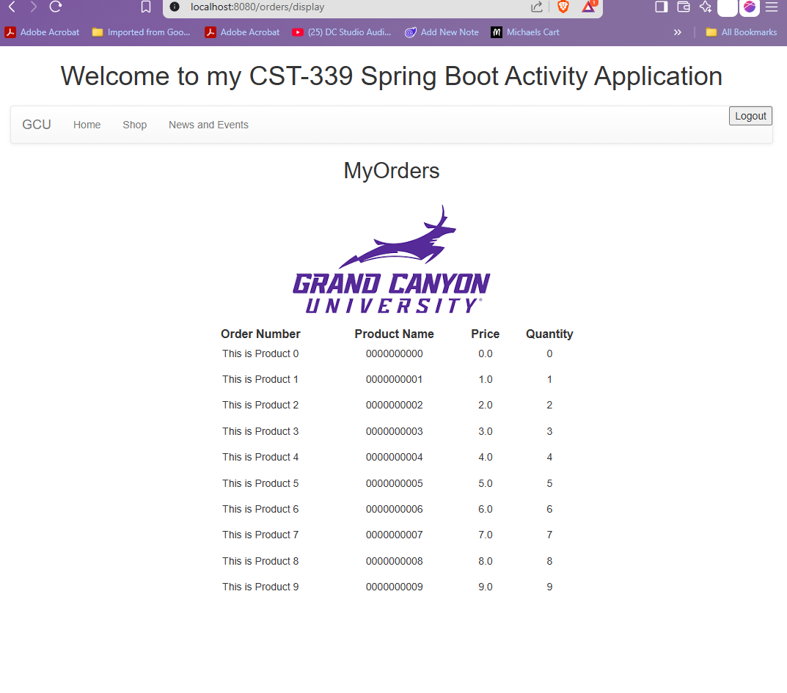 |
| Anonymous REST API `/getjson` (still unsecured) | 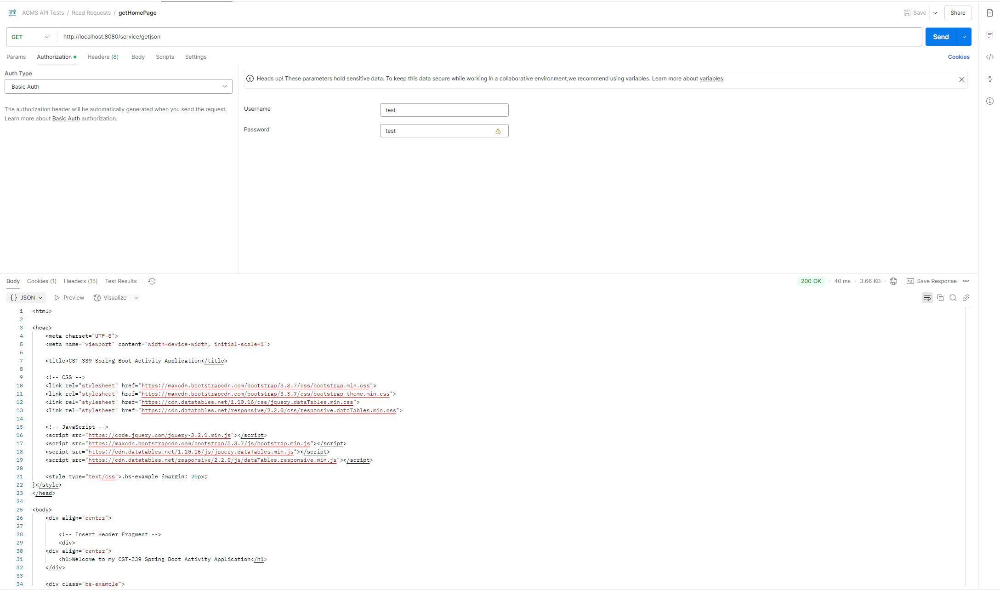  |
| Anonymous REST API `/getxml` (still unsecured)  | 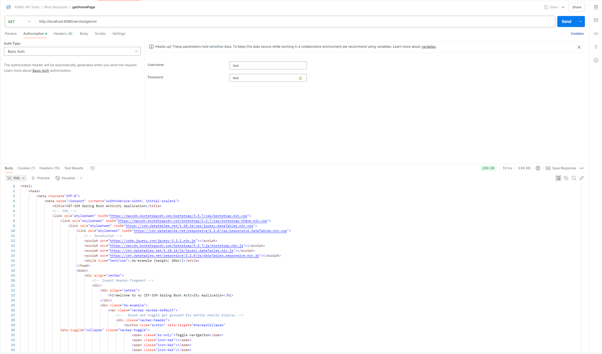    |

---

## Part 3: Securing REST APIs Using Basic HTTP Authentication

**Objective:** To secure the application's RESTful web services (`/service/**`) using Basic HTTP Authentication.

**Implementation Details:**
The focus shifted to securing the REST API endpoints (`/getjson`, `/getxml`) previously left open. The `SecurityConfig` was modified to:
1.  Remove `/service/**` from the list of paths ignored by security (`.antMatchers("/service/**").permitAll()` was removed or modified).
2.  Explicitly configure security for paths matching `/service/**`, requiring authentication.
3.  Enable Basic HTTP Authentication (`.httpBasic()`) specifically for these API endpoints.
This ensures that accessing `/service/getjson` or `/service/getxml` now requires valid credentials sent via the HTTP `Authorization` header, typically tested using tools like Postman.

**Deliverables:**

| Description                                                 | Screenshot                                        |
| :---------------------------------------------------------- | :------------------------------------------------ |
| Postman: `/getjson` API Response with **Valid** Credentials | 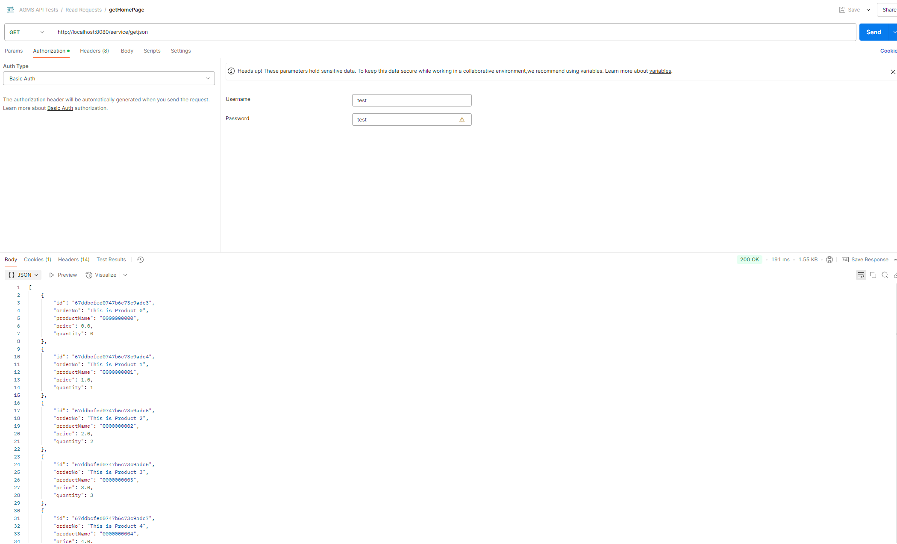 |
| Postman: `/getxml` API Response with **Valid** Credentials  | 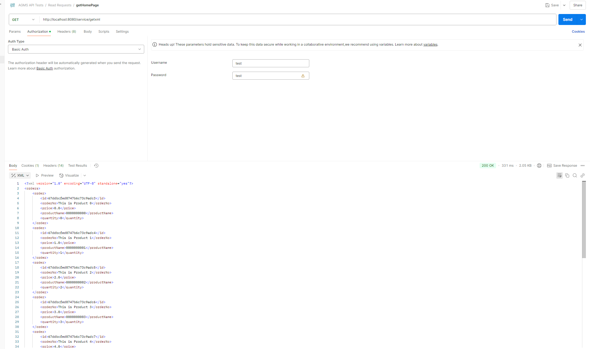   |
| _Note: Screenshots for invalid credentials were requested but are not present in the provided file list._ | _N/A_                                             |

---

## Part 4: Securing REST APIs Using OAuth2 Authentication

**Objective:** To implement OAuth2 authentication using GitHub as the identity provider to secure a REST API endpoint.

**Implementation Details:**
This part involved creating a new Spring Boot project (`topic6-4`) and configuring it for OAuth2.
1.  An OAuth application was registered on GitHub to obtain a `Client ID` and `Client Secret`.
2.  The project's `pom.xml` was updated with necessary dependencies, including `spring-security-oauth2-autoconfigure`.
3.  A simple REST controller (`MyService`) with a test endpoint (`/service/test`) was created, accepting `java.security.Principal` to access authenticated user details.
4.  A `SecurityConfig` class was added, annotated with `@EnableOAuth2Sso`, to enable OAuth2 Single Sign-On and configure security rules (permitting root, login, callback, error paths, and requiring authentication for others).
5.  The `application.properties` file was configured with the GitHub OAuth2 `Client ID`, `Client Secret`, and relevant endpoints.
Accessing `/service/test` now redirects the user to GitHub for authentication before granting access to the API.

**Deliverables:**

| Description                                     | Screenshot                                           |
| :---------------------------------------------- | :--------------------------------------------------- |
| GitHub OAuth Consent/Login Screen               | 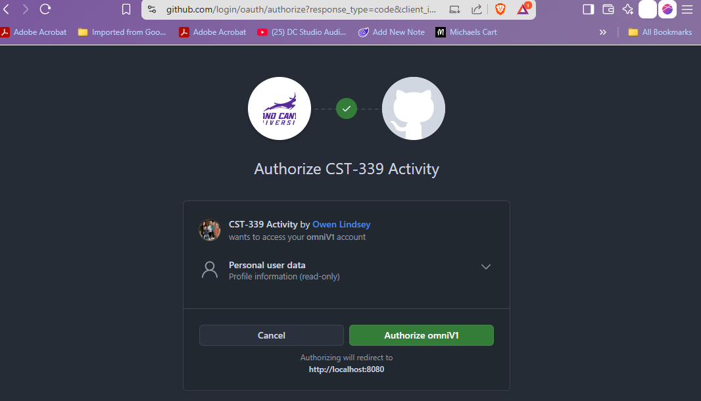 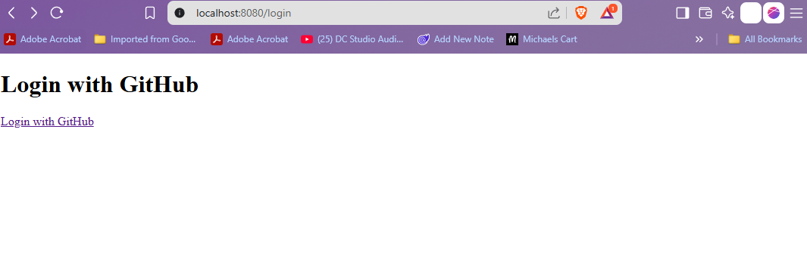 |
| API Response after successful GitHub Authentication | 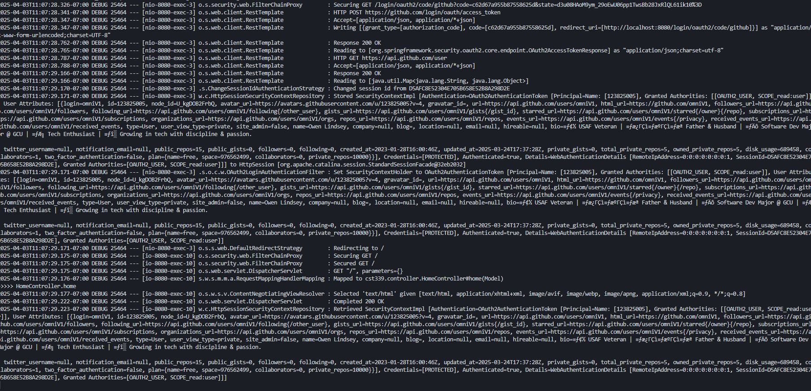 |

---

## Research Questions

### 1. Forms Based Authentication

> **Forms Based Authentication** is a standard web security mechanism where user authentication is handled via an HTML form.
>
> **How it works:**
> 1.  An unauthenticated user requests a protected resource.
> 2.  The server redirects the user to a custom HTML login page (the form).
> 3.  The user submits their credentials (e.g., username and password) through the form.
> 4.  The server receives the credentials, typically via an HTTP POST request.
> 5.  The server validates the credentials against a user store (database, LDAP, in-memory, etc.).
> 6.  If valid, the server establishes a session for the user (often using cookies) and redirects them to the originally requested resource or a default landing page.
> 7.  If invalid, the server usually redisplays the login form with an error message.
>
> **Importance of using Spring Security vs. Custom Framework:**
> Developing a custom security framework is complex and prone to errors. Using a mature framework like Spring Security is crucial because:
> *   **Security Best Practices:** It incorporates proven security patterns and protects against common vulnerabilities (CSRF, session fixation, timing attacks, etc.) out-of-the-box. Keeping up with evolving threats is handled by the framework maintainers.
> *   **Reduced Development Time:** Provides pre-built components for authentication, authorization, password encoding, session management, and more, saving significant development effort.
> *   **Standardization & Integration:** Offers standard implementations and integrates seamlessly with other Spring projects and various authentication protocols (LDAP, OAuth2, SAML, etc.).
> *   **Extensibility:** While providing robust defaults, it remains highly customizable to fit specific application needs.
> *   **Community & Support:** Benefits from a large community, extensive documentation, and regular updates.

### 2. Basic HTTP Authentication

> **Basic HTTP Authentication** is a simple challenge-response authentication scheme defined in the HTTP protocol specification (RFC 7617).
>
> **How it works:**
> 1.  A client requests a resource that requires authentication.
> 2.  The server denies the request with a `401 Unauthorized` status code and includes a `WWW-Authenticate: Basic realm="<realm>"` header in the response. The `<realm>` typically describes the protected area.
> 3.  The client prompts the user for a username and password (or retrieves stored credentials).
> 4.  The client concatenates the username and password with a colon (`username:password`).
> 5.  This string is then encoded using Base64.
> 6.  The client resends the original request, this time including an `Authorization: Basic <base64-encoded-credentials>` header.
> 7.  The server decodes the credentials, validates them against its user store for the specified realm, and grants access if they are correct.
>
> **How it helps secure REST APIs:**
> *   **Simplicity:** It's very easy to implement on both client and server sides as it's part of the HTTP standard.
> *   **Statelessness:** Each request carries the authentication information, making it suitable for stateless REST APIs where maintaining server-side sessions might be undesirable.
> *   **Wide Compatibility:** Supported by virtually all HTTP clients, servers, and development tools (like Postman, curl).
> *   **Gateway/Proxy Friendly:** Can often be handled by intermediate proxies or API gateways.
>
> **Crucial Limitation:** Basic Authentication **does not provide confidentiality**. The credentials are only obscured by Base64 encoding, which is easily reversible. Therefore, it **must always** be used over a secure (HTTPS/TLS) connection to prevent credentials from being intercepted in plain text.

---