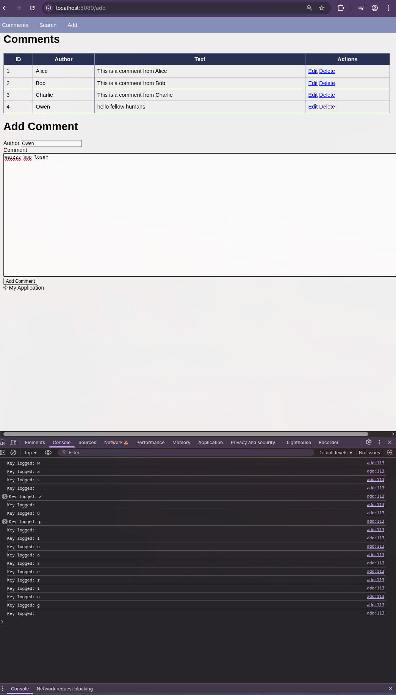
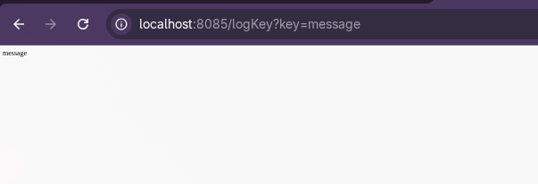
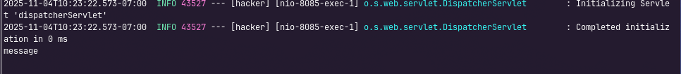
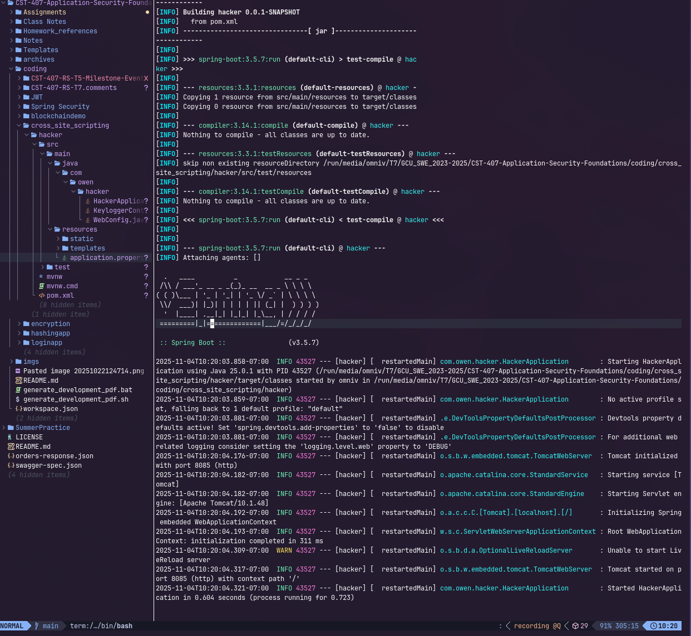
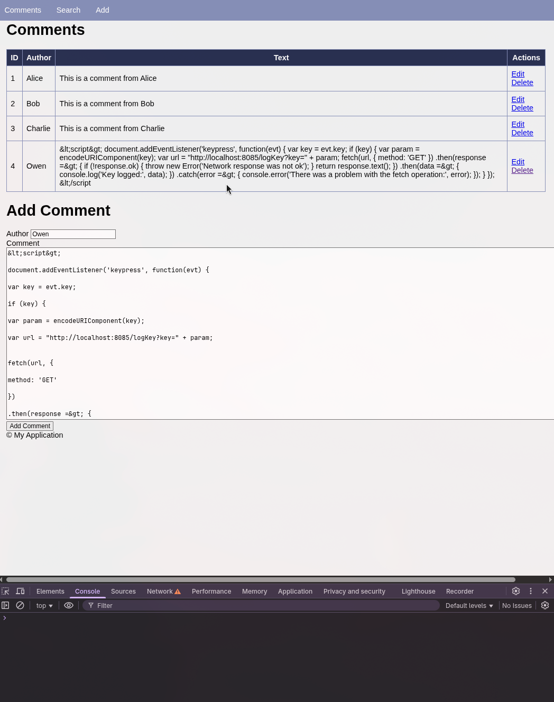

<div style="display:flex; flex-direction:column; justify-content:center; align-items:center; height:100vh; text-align:center;">
  <h1>Cross-Site Script Injection Demonstration</h1>
  <h2>Owen Lindsey</h2>
  <h2>Professor Sluiter, Shad</h2>
  <h2>CST-407</h2>
  <h2>Grand Canyon University</h2>
</div>

### **Overview**

This activity recreates a stored cross-site scripting (XSS) exploit to capture keystrokes from a vulnerable comments page and then demonstrates the remediation steps that harden the view layer against script injection. A Spring Boot listener application at `localhost:8085` records each keypress sent by the malicious payload while the legitimate application (`coding/CST-407-RS-T7.comments`) is running on port 8080. Evidence from both the browser and the listener verifies the attack flow, and updated output from the victim application confirms that user-generated content is now HTML-escaped.

### **Summary of Key Concepts**

Stored XSS abuses persistent inputs (such as comment fields) to inject JavaScript that executes in every visitor's browser; by wiring a Spring Boot listener (`coding/cross_site_scripting/hacker/src/main/java/com/owen/hacker/KeyloggerController.java`) to receive the encoded keystrokes, the exercise highlighted how easily credentials can be exfiltrated, and the fix reinforced the importance of server-side validation, Thymeleaf's `th:text` auto-escaping, and strict content handling to neutralize untrusted markup.


### **Exploit Setup**

- Built a dedicated listener service that maps `/logKey` and appends each keypress to a client-specific log file (`keylog_<ip>.txt`), confirming receipt in the application console (`System.out.print(key)`).
- Enabled permissive CORS in `WebConfig` so the malicious script can call the listener from the victim origin during the proof of concept.
- Captured the resulting keystroke log at `coding/cross_site_scripting/hacker/keylog_0_0_0_0_0_0_0_1.txt`, which aggregates the characters transmitted by the injected payload.
- Left the victim-side template (`coding/CST-407-RS-T7.comments/src/main/resources/templates/comments.html`) intentionally unescaped during the exploit to mimic the stored XSS flaw, then switched the cell to `th:text` during mitigation.

```text
messagewas zzzzzz upp loasering im hearre to steal your einformation EnterEnterEnter
```


### **Stored XSS Execution**

The malicious payload is saved in the application's comments table and echoes back through the unescaped view. Once rendered, the script binds to the `keypress` event and issues a `fetch` request to the listener for every character typed by unsuspecting users.

**Figure 1: Keylogger Injected Through Comment Form**  
  
*Browser console shows the injected script reporting keystrokes in real time as the victim types into the comment form.*

<div style="page-break-before: always;"></div>

### **Listener Telemetry**

End-to-end validation includes the HTTP response, server console output, and the Spring Boot process log that confirm the payload is reaching the hacker service without hindrance.

**Figure 2: Listener Endpoint Echo**  
  
*Direct GET request to `/logKey` demonstrates the listener returning the captured character, matching the payload's fetch requests.*

**Figure 3: Console Logging of Captured Keys**  
  
*Spring Boot console prints each keypress as it is received from the injected script, verifying keylogger persistence.*

**Figure 4: Listener Application Running**  
  
*Maven build output confirms the listener application is compiled and serving on port 8085, ready to aggregate keystrokes.*

<div style="page-break-before: always;"></div>

### **Mitigation Evidence**

After hardening the view layer with safe rendering (`th:text`) inside `coding/CST-407-RS-T7.comments/src/main/resources/templates/comments.html`, the same comment now displays as escaped text, preventing the browser from executing injected JavaScript.

**Figure 5: Escaped Comment After Fix**  
  
*Script tags are rendered as plain text within the comments table, demonstrating that the payload is neutralized instead of executed.*