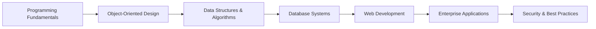

# 🎓 Software Engineering Portfolio | Grand Canyon University (2023–2025)

<div align="center">


</div>

> **A comprehensive collection of software engineering coursework, projects, and milestones showcasing full-stack development, algorithms, systems programming, and secure coding practices.**

## 🚀 Portfolio Overview

This repository represents two years of intensive software engineering education at Grand Canyon University, featuring **13 courses** spanning foundational programming to enterprise-level development. From building desktop applications in C# to deploying microservices with Spring Boot, this portfolio demonstrates mastery across the full technology stack.

### 🎯 Core Competencies Demonstrated
- **Full-Stack Web Development** → REST APIs, MVC patterns, database integration
- **Object-Oriented Programming** → Design patterns, inheritance, polymorphism 
- **Systems Programming** → Operating systems, concurrency, memory management
- **Database Engineering** → SQL/NoSQL design, optimization, data modeling
- **Security Engineering** → Secure coding, vulnerability assessment, cryptography
- **Algorithms & Data Structures** → Recursion, searching/sorting, complexity analysis

### 📊 Portfolio Statistics
- **Languages**: C#, Java, Python, JavaScript/TypeScript, C, SQL
- **Frameworks**: .NET Core, Spring Boot, Angular, React, Express.js
- **Databases**: SQL Server, MySQL, MongoDB
- **Projects**: 25+ major assignments, 8 milestone projects
- **Lines of Code**: 50,000+ across all repositories

## Directory Index (by course)

- **AIT-104-Data-mining-machine-learning**: Intro ML and data analysis with Python/pandas.
  - Contents: Jupyter notebooks (linear modeling), weekly learning notes, CSV datasets (`AAPL.csv`, `PLTR.csv`).
  - Highlights: Linear modeling notebooks and curated study notes.

- **CST-150-C#1**: C# I fundamentals with WinForms.
  - Contents: `Milestone_Fall2023` WinForms app with forms (`frmIntro`, `frmCurrentInventory`) and supporting classes.
  - Highlights: Inventory management milestone (WinForms).

- **CST-180-Python**: Python basics and assignments.
  - Contents: Class notes (md/pdf), homework (e.g., `PopulationSimulation`), templates for document generation.

- **CST-201-algorithims-data-structures**: Algorithms and data structures in C#.
  - Contents: Topics 1–5 source trees, documentation per topic, and notes.
  - Highlights: String matching, searching/sorting topics, and applied exercises.

- **CST-239-Java2**: Java II OOP and application development.
  - Contents: Activities and multi‑part milestone work; documentation and presentations.
  - Highlights: Later milestones (6–7) with larger application builds.

- **CST-250-C#2**: C# II with OOP, recursion, file I/O, and GUI basics.
  - Contents:
    - Activities: `AnimalClasses` (inheritance/interfaces), `ChessBoardConsoleApp` and `ChessBoardGuiApp` (WinForms), `TextFileDataAccessDemo` (file I/O), `Activity3_Recursion` (CountToOne, Factorial, GCD, Knight’s Tour).
    - Milestone: Minesweeper (console and WinForms GUI) with flood fill, flags, and high scores.
  - Highlights: Minesweeper GUI milestone; chessboard movement logic; recursion exercises.

- **CST-321-Operating-system-fundamentals**: OS concepts and systems programming in C.
  - Contents: `src` C projects and shell scripts; extensive documentation and notes.
  - Read more: `CST-321-Operating-system-fundamentals/README.md`.

- **CST-326-Written-Verbal-Communication-SWE**: Professional communication for SWE.
  - Contents: `CineScopeProduction` (.NET/razor project) and course PDFs.

- **CST-339-Java3**: Enterprise Java (Spring, Maven, MongoDB, Security, Microservices).
  - Contents: Large `workspaceCST-339` with labs and milestone; documentation by topic.
  - Read more: `CST-339-Java3/README.md`.

- **CST-345-Database-Design**: Relational/NoSQL database design and applications.
  - Contents: SQL exercises, Windows/.NET database apps, MongoDB apps, milestone docs.
  - Highlights: MongoMusicApp, Cst‑345 Milestone 2 and 4.

- **CST-350-C#3**: ASP.NET Core MVC, authentication, sessions, and web development in C#.
  - Contents: Topic folders, documentation, and `CST-350-Milestone` web app.
  - Read more: `CST-350-C#3/Readme.md`.

- **CST-391-Web_dev**: JavaScript/TypeScript full‑stack (Node/Express, Angular).
  - Contents: `src` for activities and milestone; `docs` for screenshots/design.
  - Read more: `CST-391-Web_dev/readme.md`.

- **CST-407-Application-Security-Foundations**: AppSec foundations and secure coding.
  - Contents: Assignments, Java coding exercises, security docs and images.
  - Read more: `CST-407-Application-Security-Foundations/README.md`.

- **SummerPractice**: Self‑directed practice and side projects across C#, Java, TS.
  - Contents: `AerospaceAPI`, language‑specific practice folders, and notes.
  - Read more: `SummerPractice/README.md`.

## 🏆 Featured Project Highlights

### 🎮 Minesweeper Suite (CST-250)
**Technologies**: C#, WinForms, Recursion Algorithms  
Complete implementation featuring dynamic bomb placement, flood-fill algorithms, GUI with flagging system, timer, and persistent high scores.  
📁 `CST-250-C#2/Code/Milestone/src/MinesweeperGui/`

### 🌐 GameCube E-Commerce Platform (CST-391)
**Technologies**: Node.js, Express, Angular, React, MySQL  
Full-stack web application with REST API backend, dual frontend implementations, complete CRUD operations, and comprehensive API documentation.  
📁 `CST-391-Web_dev/src/Milestone/`

### 🏢 Enterprise Web Application (CST-339)
**Technologies**: Spring Boot, Spring Security, MongoDB, Maven  
Microservices architecture with authentication, service discovery, API gateway patterns, and enterprise security practices.  
📁 `CST-339-Java3/src/Milestone/`

### 🔐 Security Assessment Suite (CST-407)
**Technologies**: Java, Cryptography, Vulnerability Analysis  
Hands-on implementation of secure coding practices, threat modeling, and cryptographic protocols with vulnerability assessments.  
📁 `CST-407-Application-Security-Foundations/`

### 💾 Database Management Systems (CST-345)
**Technologies**: SQL Server, MongoDB, .NET, ADO.NET  
Comprehensive database design projects featuring normalized schemas, complex queries, and NoSQL document modeling.  
📁 `CST-345-Database-Design/`

## 🛠️ Getting Started

### Quick Start Guide
```bash
# Clone the repository
git clone <repository-url>
cd GCU_SWE_2023-2025

# Navigate to any course folder
cd CST-250-C#2

# Follow course-specific README for setup
```

### Development Environment Setup
- **C#/.NET**: Visual Studio 2022+ or `dotnet` CLI
- **Java**: IntelliJ IDEA or Eclipse with Maven/Gradle
- **JavaScript/TypeScript**: VS Code with Node.js 18+
- **Python**: Jupyter Notebook or VS Code with Python 3.10+
- **Database**: SQL Server, MySQL, or MongoDB as needed

Each course folder contains a detailed README with specific setup instructions and dependencies.

## 📂 Repository Structure

```
📦 GCU_SWE_2023-2025
├── 🤖 AIT-104-Data-mining-machine-learning/
├── 💻 CST-150-C#1/
├── 🐍 CST-180-Python/
├── 🔢 CST-201-algorithims-data-structures/
├── ☕ CST-239-Java2/
├── 🎯 CST-250-C#2/
├── 🖥️ CST-321-Operating-system-fundamentals/
├── 📝 CST-326-Written-Verbal-Communication-SWE/
├── 🏭 CST-339-Java3/
├── 🗄️ CST-345-Database-Design/
├── 🌐 CST-350-C#3/
├── 🚀 CST-391-Web_dev/
├── 🔒 CST-407-Application-Security-Foundations/
└── ☀️ SummerPractice/
```

## 🎯 Learning Journey Progression



## 🤝 Connect & Collaborate

Interested in discussing any of these projects or potential collaboration opportunities? Feel free to explore the codebase and reach out!

---

**📧 Contact**: [Your Email]  
**🎓 Institution**: Grand Canyon University  
**📅 Program Duration**: 2023 - 2025  
**🎯 Degree**: Bachelor of Science in Software Engineering

> *"Code is like humor. When you have to explain it, it's bad."* – Cory House

---
<div align="center">

**⭐ Star this repository if you find it helpful!**


</div>
