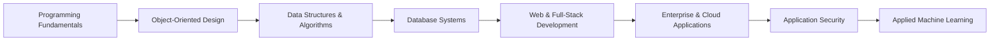

<!-- =========================================================== -->
<!--                          HERO                               -->
<!-- =========================================================== -->

<div align="center">

# Software Engineering Portfolio

#### Grand Canyon University &nbsp;·&nbsp; Class of 2026

<sub><i>A multi-year archive of software engineering coursework, milestone projects, and post-graduation work.</i></sub>

<br />


<br />

<sub><b>LANGUAGES</b></sub>


<sub><b>FRAMEWORKS &nbsp;&amp;&nbsp; PLATFORMS</b></sub>


<sub><b>DATA &nbsp;&amp;&nbsp; ML</b></sub>


</div>

<br />

<hr />

<!-- =========================================================== -->
<!--                       SNAPSHOT                              -->
<!-- =========================================================== -->

<table>
<tr>
<td valign="top" width="50%">

### Overview

A curated archive of coursework, milestone projects, and independent work completed during my Bachelor of Science in Software Engineering at Grand Canyon University.

The repository spans foundational programming, full-stack development, systems and database engineering, secure coding, and applied machine learning — alongside post-graduation projects that continue the work.

</td>
<td valign="top" width="50%">

### At a Glance

| | |
| --- | --- |
| **Degree** | B.S. Software Engineering |
| **Focus** | Software Engineering &nbsp;+&nbsp; Applied AI |
| **Institution** | Grand Canyon University |
| **Program** | 2023 – 2026 |
| **Scope** | 18 courses &nbsp;+&nbsp; independent projects |
| **Status** | Graduated, 2026 |

</td>
</tr>
</table>

<hr />

<!-- =========================================================== -->
<!--                        CONTENTS                             -->
<!-- =========================================================== -->

## Table of Contents

1. [Core Competencies](#core-competencies)
2. [Coursework](#coursework)
3. [Independent &amp; Post-Graduation Projects](#independent--post-graduation-projects)
4. [Featured Milestones](#featured-milestones)
5. [Getting Started](#getting-started)
6. [Repository Layout](#repository-layout)
7. [Learning Progression](#learning-progression)
8. [License](#license)

<hr />

<!-- =========================================================== -->
<!--                   CORE COMPETENCIES                         -->
<!-- =========================================================== -->

## Core Competencies

<table>
<tr>
<td valign="top" width="50%">

- **Full-stack development** — REST APIs, MVC, typed frontends, server-rendered views
- **Object-oriented design** — interfaces, inheritance, polymorphism, design patterns
- **Algorithms &amp; data structures** — searching, sorting, recursion, complexity analysis
- **Database engineering** — relational schema design, NoSQL modeling, query optimization

</td>
<td valign="top" width="50%">

- **Systems programming** — operating system concepts, concurrency, low-level C
- **Application security** — secure coding, threat modeling, cryptography fundamentals
- **Cloud &amp; enterprise patterns** — microservices, service discovery, deployment
- **Applied machine learning** — regression, statistical learning, neural networks, NLP

</td>
</tr>
</table>

<hr />

<!-- =========================================================== -->
<!--                       COURSEWORK                            -->
<!-- =========================================================== -->

## Coursework

<details open>
<summary><b>Software Engineering Core</b> &nbsp;·&nbsp; 14 courses</summary>

<br />

| Course | Topic | Notes |
| --- | --- | --- |
| [`CST-150-C#1`](./CST-150-C%231/) | C# I — Fundamentals &amp; WinForms | Inventory management milestone (WinForms). |
| [`CST-180-Python`](./CST-180-Python/) | Python | Class notes, homework, simulation work. |
| [`CST-201-algorithims-data-structures`](./CST-201-algorithims-data-structures/) | Algorithms &amp; Data Structures | Searching, sorting, string matching across five topic trees. |
| [`CST-239-Java2`](./CST-239-Java2/) | Java II — OOP &amp; Application Development | Multi-part milestones and presentations. |
| [`CST-250-C#2`](./CST-250-C%232/) | C# II — OOP, Recursion, File I/O, GUI | Minesweeper milestone (console + WinForms); chess board logic; recursion exercises. |
| [`CST-321-Operating-system-fundamentals`](./CST-321-Operating-system-fundamentals/) | OS Fundamentals | Systems programming in C with shell scripting. |
| [`CST-323-Cloud-Computing`](./CST-323-Cloud-Computing/) | Cloud Computing | Spring-based services, deployment exercises, SQL fixtures. |
| [`CST-323-PairPrograming`](./CST-323-PairPrograming/) | Pair Programming (CST-323) | Collaborative engineering practice. |
| [`CST-326-Written-Verbal-Communication-SWE`](./CST-326-Written-Verbal-Communication-SWE/) | Technical Communication | `CineScopeProduction` (.NET / Razor) and written deliverables. |
| [`CST-339-Java3`](./CST-339-Java3/) | Enterprise Java | Spring Boot, Spring Security, MongoDB, microservices. |
| [`CST-345-Database-Design`](./CST-345-Database-Design/) | Database Design | Relational and NoSQL applications; MongoMusicApp. |
| [`CST-350-C#3`](./CST-350-C%233/) | ASP.NET Core MVC | Authentication, sessions, milestone web app. |
| [`CST-391-Web_dev`](./CST-391-Web_dev/) | Full-Stack Web Development | Node / Express / Angular / React e-commerce milestone. |
| [`CST-407-Application-Security-Foundations`](./CST-407-Application-Security-Foundations/) | Application Security | Secure coding exercises and threat-modeling deliverables. |

</details>

<details>
<summary><b>Applied AI Coursework</b> &nbsp;·&nbsp; 4 courses</summary>

<br />

| Course | Topic | Notes |
| --- | --- | --- |
| [`AIT-104-Data-mining-machine-learning`](./AIT-104-Data-mining-machine-learning/) | Data Mining &amp; ML | Linear modeling notebooks; financial datasets (AAPL, PLTR). |
| [`AIT-110-Stat-Learning-Theory`](./AIT-110-Stat-Learning-Theory/) | Statistical Learning Theory | Class notes and assignments. |
| [`AIT-204-Deep-Learning`](./AIT-204-Deep-Learning/) | Deep Learning | Notebooks, code, and supporting documentation. |
| [`AIT-204-pair-programing`](./AIT-204-pair-programing/) | Deep Learning Pair Work | Linear regression, CNN, RNN, NLP, tuning workspaces. |

</details>

<sub>Each course directory contains its own README or documentation where available — see the linked <code>README.md</code> inside each folder for setup and run instructions.</sub>

<hr />

<!-- =========================================================== -->
<!--          INDEPENDENT & POST-GRADUATION PROJECTS             -->
<!-- =========================================================== -->

## Independent &amp; Post-Graduation Projects

<table>
<tr>
<td valign="top" width="50%">

#### `SummerPractice/`
<sub><kbd>C#</kbd> <kbd>Java</kbd> <kbd>TypeScript</kbd> <kbd>Python</kbd> <kbd>.NET</kbd> <kbd>React</kbd></sub>

Ongoing self-directed practice across multiple languages, plus a full-stack `AerospaceAPI` (ASP.NET Core + React + Tailwind) and a growing set of algorithm exercises in Python.

</td>
<td valign="top" width="50%">

#### `Porfolio/`
<sub><kbd>Vite</kbd> <kbd>React</kbd> <kbd>TypeScript</kbd></sub>

Personal portfolio site with project showcases, attributions, and an embedded resume section. Deployed via Vercel.

</td>
</tr>
<tr>
<td valign="top" width="50%">

#### `iron_palace-/`
<sub><kbd>Vite</kbd> <kbd>React</kbd> <kbd>TypeScript</kbd> <kbd>Docker</kbd></sub>

Vite/React TypeScript application with a Dockerized API and frontend. An exploratory full-stack build.

</td>
<td valign="top" width="50%">

#### `2025-advent-of-code/`
<sub><kbd>Python</kbd></sub>

Solutions to the 2025 Advent of Code, primarily in Python with a web visualization for select days.

</td>
</tr>
<tr>
<td colspan="2" valign="top">

#### `agent-quality-system/`
<sub><kbd>Python</kbd> <kbd>MCP</kbd> <kbd>NLP</kbd> <kbd>SonarQube</kbd></sub>

Research and prototyping work on an agent-based code-quality system — NLP and classifier training, SonarQube comparison harness, MCP server integration, reporting tooling, and end-to-end demo pipelines.

</td>
</tr>
</table>

<hr />

<!-- =========================================================== -->
<!--                  FEATURED MILESTONES                        -->
<!-- =========================================================== -->

## Featured Milestones

<table>
<tr>
<td valign="top" width="50%">

#### Minesweeper Suite
<sub><kbd>CST-250</kbd> <kbd>C#</kbd> <kbd>WinForms</kbd> <kbd>Recursion</kbd></sub>

Full implementation featuring dynamic mine placement, flood-fill expansion, flagging, timer, and persistent high scores. Both console and GUI variants.

<sub><code>CST-250-C#2/Code/Milestone/src/MinesweeperGui/</code></sub>

</td>
<td valign="top" width="50%">

#### GameCube E-Commerce Platform
<sub><kbd>CST-391</kbd> <kbd>Node.js</kbd> <kbd>Express</kbd> <kbd>Angular</kbd> <kbd>React</kbd> <kbd>MySQL</kbd></sub>

A full-stack web application with a REST API, two parallel frontend implementations, full CRUD, and API documentation.

<sub><code>CST-391-Web_dev/src/Milestone/</code></sub>

</td>
</tr>
<tr>
<td valign="top" width="50%">

#### Enterprise Spring Application
<sub><kbd>CST-339</kbd> <kbd>Spring Boot</kbd> <kbd>Spring Security</kbd> <kbd>MongoDB</kbd></sub>

Microservices architecture with authentication, service discovery, and API gateway patterns.

<sub><code>CST-339-Java3/src/Milestone/</code></sub>

</td>
<td valign="top" width="50%">

#### Application Security Suite
<sub><kbd>CST-407</kbd> <kbd>Java</kbd> <kbd>Cryptography</kbd></sub>

Secure coding exercises, threat modeling, and applied cryptographic protocols with vulnerability assessments.

<sub><code>CST-407-Application-Security-Foundations/</code></sub>

</td>
</tr>
<tr>
<td colspan="2" valign="top">

#### Database Design Projects
<sub><kbd>CST-345</kbd> <kbd>SQL Server</kbd> <kbd>MongoDB</kbd> <kbd>.NET</kbd> <kbd>ADO.NET</kbd></sub>

Normalized relational schemas, complex queries, NoSQL document modeling, and full database-backed .NET applications.

<sub><code>CST-345-Database-Design/</code></sub>

</td>
</tr>
</table>

<hr />

<!-- =========================================================== -->
<!--                      GETTING STARTED                        -->
<!-- =========================================================== -->

## Getting Started

```bash
git clone <repository-url>
cd GCU_SWE_2023-2025
cd <course-or-project-folder>
```

Each subdirectory contains its own README or build configuration with setup and run instructions.

### Development Environment

<table>
<tr><th align="left">Stack</th><th align="left">Tooling</th></tr>
<tr><td><b>C# / .NET</b></td><td>Visual Studio 2022 or the <code>dotnet</code> CLI</td></tr>
<tr><td><b>Java</b></td><td>IntelliJ IDEA or Eclipse with Maven</td></tr>
<tr><td><b>JavaScript / TypeScript</b></td><td>Node.js 18+, npm, VS Code</td></tr>
<tr><td><b>Python</b></td><td>Python 3.10+, Jupyter, virtualenv or conda</td></tr>
<tr><td><b>Databases</b></td><td>SQL Server, MySQL, or MongoDB as required by the project</td></tr>
</table>

<hr />

<!-- =========================================================== -->
<!--                    REPOSITORY LAYOUT                        -->
<!-- =========================================================== -->

## Repository Layout

```
GCU_SWE_2023-2025/
│
├── Coursework — Software Engineering
│   ├── CST-150-C#1/
│   ├── CST-180-Python/
│   ├── CST-201-algorithims-data-structures/
│   ├── CST-239-Java2/
│   ├── CST-250-C#2/
│   ├── CST-321-Operating-system-fundamentals/
│   ├── CST-323-Cloud-Computing/
│   ├── CST-323-PairPrograming/
│   ├── CST-326-Written-Verbal-Communication-SWE/
│   ├── CST-339-Java3/
│   ├── CST-345-Database-Design/
│   ├── CST-350-C#3/
│   ├── CST-391-Web_dev/
│   └── CST-407-Application-Security-Foundations/
│
├── Coursework — Applied AI
│   ├── AIT-104-Data-mining-machine-learning/
│   ├── AIT-110-Stat-Learning-Theory/
│   ├── AIT-204-Deep-Learning/
│   └── AIT-204-pair-programing/
│
└── Independent Projects
    ├── SummerPractice/
    ├── Porfolio/
    ├── iron_palace-/
    ├── 2025-advent-of-code/
    └── agent-quality-system/
```

<hr />

<!-- =========================================================== -->
<!--                  LEARNING PROGRESSION                       -->
<!-- =========================================================== -->

## Learning Progression


```mermaid
graph LR
    A[Programming Fundamentals] --> B[Object-Oriented Design]
    B --> C[Data Structures & Algorithms]
    C --> D[Database Systems]
    D --> E[Web & Full-Stack Development]
    E --> F[Enterprise & Cloud Applications]
    F --> G[Application Security]
    G --> H[Applied Machine Learning]
```

<hr />

<!-- =========================================================== -->
<!--                          LICENSE                            -->
<!-- =========================================================== -->

## License

Released under the terms of the included [LICENSE](./LICENSE). Coursework remains the intellectual product of the author; any reuse should respect the academic integrity policies of the relevant institution.

<br />

<div align="right">
<sub>
<b>Grand Canyon University</b> &nbsp;·&nbsp; B.S. Software Engineering &nbsp;·&nbsp; 2023 – 2026
</sub>
</div>
